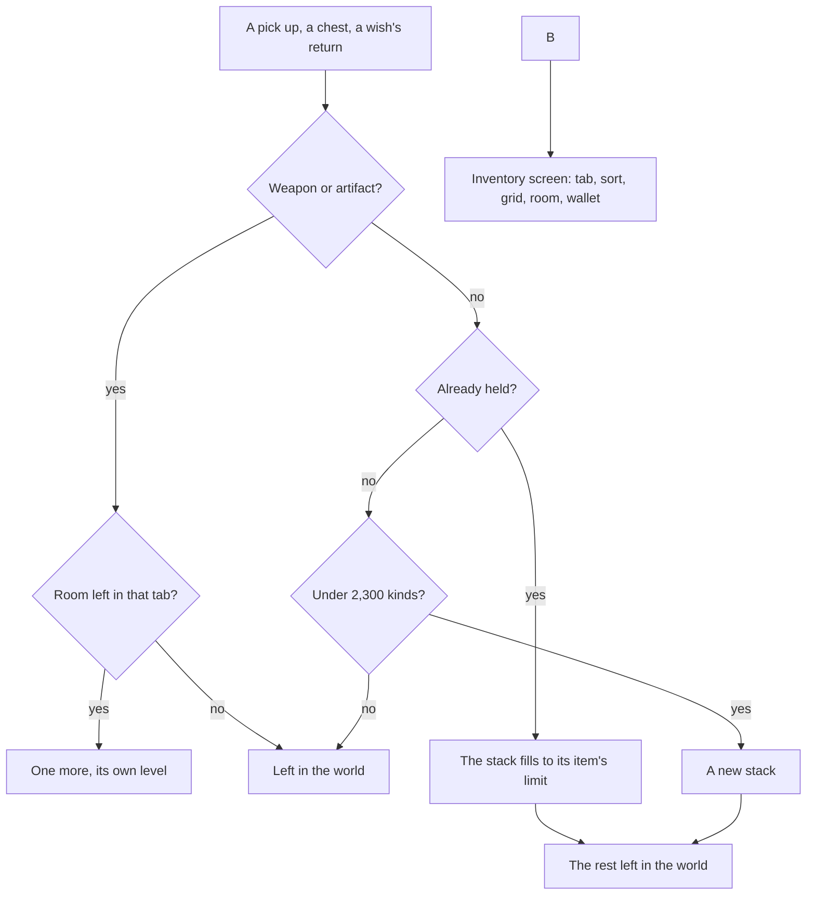

# Inventory

This page builds on [interaction](/docs/proposals/genshin/interaction), whose pick ups fill the bag. The game keeps everything the player carries in one bag of nine tabs, opened with B, and keeps its currencies beside it. Every count and limit here is the game's, as the wiki documents it.

## Decisions

- **The game's nine tabs, in its order.** Weapons, Artifacts, Character Development Items, Food, Materials, Gadget, Quest, Precious Items and Furnishings. Each tab's name is the game's own text (`ITEM_WEAPON` to `ITEM_FURNITURE`), so the bag reads in any of its languages.
- **Items stack to their own limit.** Most stop at 9,999. Ores and experience materials hold 99,999, food and the common bosses' drops 2,000, consumable gadgets 99, and reusable gadgets and most quest items one. The limit is the item's own, carried with it. Weapons and artifacts never stack: each is one, with its own level.
- **The bag's room is the game's.** It holds 2,000 weapons, 2,400 artifacts and 2,600 furnishings, and 2,300 kinds of everything else, counted by kind and not by quantity.
- **What does not fit stays where it was.** A pick up adds what the stack and the bag have room for and reports the rest, which stays in the world. The game's full-bag hint then shows ("No space left in Inventory").
- **Each tab sorts as the game's does.** Weapons and artifacts sort by Level or Quality, ascending or descending, the two choices the game's sort offers. Furnishings run from the oldest obtained to the newest, and gadgets and quest items from the highest quality down. The other tabs keep the game's own order of its items, which the item carries as its rank.
- **The currencies.** Mora, Primogems and Genesis Crystals are held outside the tabs. Intertwined Fate, Acquaint Fate, Masterless Starglitter and Masterless Stardust are Precious Items. Each is a count in one wallet, named by the game's own text. Primogems buy either Fate at 160 each, as the wish screen and the shop offer.
- **Nothing is bought with money.** Genesis Crystals are the game's paid currency, bought only by topping up, and Primogems and Fates are sold for money too. Nothing here takes a payment, so the wallet's Genesis Crystals stay at none and every Primogem is earned in the world.
- **The screen opens on B.** It is an entry in the screens' screen kinds and shortcut map, beside every other screen. It shows the tabs across its head, the open tab's grid of items with their counts and rarity, the tab's room in the game's own wording ("Weapons 12/2000"), and the wallet's counts.

## How it works



## Scope and order

**Today:** the world holds nothing a player carries.

**This adds, in order:**

1. **The bag's state.** The tabs, items, stacks, room and sorting as pure functions over a list of items, each tested.
2. **The wallet.** The seven currencies and Fates bought with Primogems.
3. **The screen's structure.** A `genshin-interface` screen drawing the tabs, the grid, the room and the wallet, its words handed in, opened on B through the screens' screen kind.

## What this does not propose

- **The items themselves.** Every item's name, rarity, limit and rank comes with the page that puts it in the world.
- **Using, destroying and equipping items.** Food heals a party the world does not have, and equipping needs the character screen.
- **The screen's look.** Its sizes, colours and the tabs' icons are measured and traced in the [recreation passes](/docs/proposals/genshin/recreation-passes).
- **Topping up.** No payment of any kind.

## Key files

| File                                              | Role after the change                         |
| :------------------------------------------------ | :-------------------------------------------- |
| `packages/genshin-text/src/models/GameTextKey.ts` | Gains the tabs', sorts' and currencies' names |

New files:

```text
packages/genshin-world/src/models/inventory/ItemCategory.ts
packages/genshin-world/src/models/inventory/InventoryItem.ts
packages/genshin-world/src/models/inventory/Currency.ts
packages/genshin-world/src/services/inventory/constants.ts
packages/genshin-world/src/services/inventory/addInventoryItem.ts
packages/genshin-world/src/services/inventory/sortInventoryItems.ts
packages/genshin-interface/src/components/InventoryScreen/Index.vue
```

## Sources

- [Inventory](https://genshin-impact.fandom.com/wiki/Inventory), Genshin Impact Wiki: the nine categories and what each holds, the stack limits, the 2,300 kinds, the weapons', artifacts' and furnishings' room, each tab's order and the full-bag hint.
- [Primogem](https://genshin-impact.fandom.com/wiki/Primogem), Genshin Impact Wiki: either Fate for 160 Primogems.
- [Genesis Crystal](https://genshin-impact.fandom.com/wiki/Genesis_Crystal), Genshin Impact Wiki: the paid currency, bought only by topping up and converted to Primogems one for one.
- [Controls](https://genshin-impact.fandom.com/wiki/Controls), Genshin Impact Wiki: the inventory on B.
