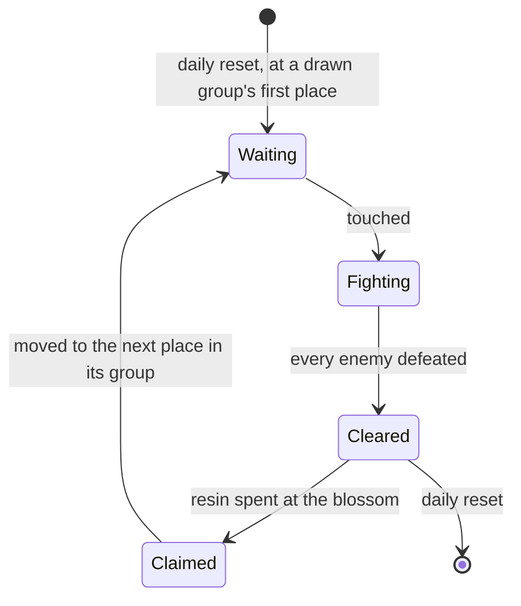

# Ley line outcrops

Ley line outcrops are the open world's resin challenges: a column of light at a known place, enemies when touched, and a blossom that gives Character EXP materials or Mora when claimed. They are where a player levels characters and earns Mora, so the character screen's Level Up and every page that spends Mora lean on them. They wait on [Original Resin](/docs/proposals/genshin/original-resin), whose claim they spawn, on the [Adventure Rank](/docs/proposals/genshin/adventure-rank) that opens them and sets their level, and on the [character kits](/docs/proposals/genshin/character-kits) that fight them.

## Decisions

- **One of each kind in each region.** Every region holds one Blossom of Revelation, which gives Character EXP materials, and one Blossom of Wealth, which gives Mora; both give Adventure EXP and Companionship EXP.
- **Opened by rank.** In Mondstadt and Liyue, Revelation opens at Adventure Rank 8 and Wealth at 12; every other region opens both at 18, once one of its Statues of The Seven is activated. `BlossomRefreshExcelConfigData` holds each kind's conditions, which the run reads.
- **Touched, fought, revealed.** Touching an outcrop spawns its region's enemies at the World Level's level, within its fight radius. Once every one is defeated the Ley Line Blossom appears, and its reward is the resin claim. The enemies drop what they always drop.
- **Moved on by the game's own groups.** `BlossomGroupsExcelConfigData` holds every place an outcrop can stand, the group (section) it belongs to and the places it moves to next (`nextCampIdVec`), and `BlossomSectionOrderExcelConfigData` each region's groups. At the daily reset each kind's group is drawn at random from its region's, by the world's seeded random source, and the kind starts at that group's first place. A claimed outcrop moves to the next place in its group, or the one after when the other kind stands there. One cleared but unclaimed stays where it is until the reset, and nothing moves meanwhile.
- **Rewards by World Level.** How many materials, how much Mora and how much Companionship EXP a claim gives follows the World Level, from the claim's reward rows and the wiki's tables.

## How it works

## Scope and order

**Today:** enemies stand in camps placed by region data; nothing spawns them on a touch, and nothing gives Character EXP materials.

**This adds, in order:**

1. **An outcrop's challenge and blossom**, in Mondstadt first.
2. **The groups' moves and the daily reset.**
3. **The kinds' ranks and statue conditions**, and each region's own outcrops alongside it.

## Data and measures

- **Read from the game's tables:** `BlossomGroupsExcelConfigData`, `BlossomSectionOrderExcelConfigData`, `BlossomRefreshExcelConfigData`, `BlossomOpenExcelConfigData` and `BlossomChestExcelConfigData`, with the claims' reward rows.
- **Placed by the spawned places:** the table names each place by the game's scene group, which runs on its servers, so each place is the official map's outcrop mark fitted into the world ([spawned places](/docs/proposals/genshin/spawned-places)).
- **Read from the wiki:** each region's enemies at an outcrop, and what each World Level's claim gives.

## Key files

| File                                                                   | Role after the change                              |
| :--------------------------------------------------------------------- | :------------------------------------------------- |
| `packages/genshin-world/src/models/world/RegionData.ts`                | Gains the region's outcrop places                  |
| `packages/genshin-world/src/models/enemy/EnemyCamp.ts`                 | An outcrop's enemies, as a camp spawned on a touch |
| `packages/genshin-world/src/components/World/Enemies/Index.vue`        | Spawns an outcrop's camp when it is touched        |
| `packages/genshin-world/src/services/enemy/computeEnemyRespawnTime.ts` | Shares the daily reset the outcrops start over at  |

## Sources

- [Ley Line Outcrops](https://genshin-impact.fandom.com/wiki/Ley_Line_Outcrops), Genshin Impact Wiki: the two kinds and their rewards, the ranks that open them in each region, enemies by region at the World Level, the blossom for 20 resin, a claimed outcrop moving within its group, one cleared but unclaimed staying until the reset, and rewards by World Level.
- [Daily Reset](https://genshin-impact.fandom.com/wiki/Daily_Reset), Genshin Impact Wiki: the outcrops' places drawn afresh with each day's reset.
- [AnimeGameData](https://gitlab.com/Dimbreath/AnimeGameData), the community's per-patch dump: the blossom groups with their next places, the sections' order, and each kind's conditions.
