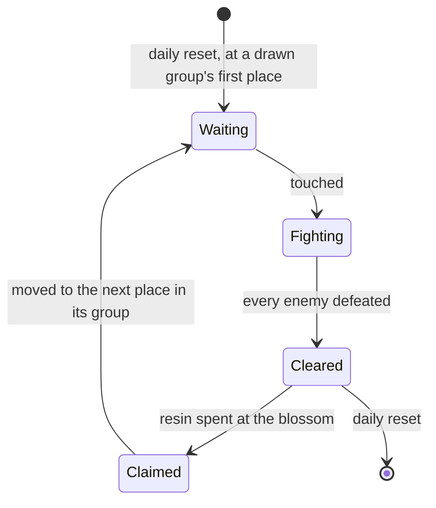

# Ley line outcrops

Ley line outcrops are the open world's resin challenges: a column of light at a known place, enemies when touched, and a blossom that gives Character EXP materials or Mora when claimed. They are where a player levels characters and earns Mora, so the character screen's Level Up and every page that spends Mora lean on them. They wait on [Original Resin](/docs/proposals/genshin/original-resin), whose claim they spawn, on the [Adventure Rank](/docs/proposals/genshin/adventure-rank) that opens them and sets their level, and on the [character kits](/docs/proposals/genshin/character-kits) that fight them.

The rules are [built](/docs/genshin/ley-line-outcrops), and that page lists them. This proposal keeps what is unbuilt: the touch, the fight, the reveal, the claim and its rewards.

## Decisions

- **Touched, fought, revealed.** Touching an outcrop spawns its region's enemies at the World Level's level, within its fight radius. Once every one is defeated the Ley Line Blossom appears, and its reward is the resin claim. The enemies drop what they always drop.
- **Rewards by World Level.** How many materials, how much Mora and how much Companionship EXP a claim gives follows the World Level, from the claim's reward rows and the wiki's tables.
- **Cleared but unclaimed stays until the reset.** One cleared but unclaimed stays where it is until the daily reset, and nothing moves meanwhile.

## How it works

## Scope and order

**Today:** the rules are built, but no outcrop is placed, so enemies stand in camps placed by region data, nothing spawns them on a touch, and nothing gives Character EXP materials.

**This adds, in order:**

1. **An outcrop's challenge and blossom**, in Mondstadt first: its place from the spawned places, the touch, the fight, the reveal and the claim.
2. **The reset and the states**: the transitions in the diagram, and the daily reset that starts each kind over, wired to the built draw and move.
3. **The regions the dump does not yet cover**: Fontaine, Natlan and Snezhnaya, whose sections are not in the section order table, and Nod-Krai, which the refresh rows do not name.
4. **Rewards by World Level**, once a table names the claims' reward ids.

## Data and measures

- **Read from the game's tables:** the claims' reward rows and the chest rows' reward ids, which the dump's reward table does not hold.
- **Placed by the spawned places:** the table names each place by the game's scene group, which runs on its servers, so each place is the official map's outcrop mark fitted into the world ([spawned places](/docs/proposals/genshin/spawned-places)).
- **Read from the wiki:** each region's enemies at an outcrop, and what each World Level's claim gives.

## Key files

| File                                                                   | Role after the change                              |
| :--------------------------------------------------------------------- | :------------------------------------------------- |
| `packages/genshin-world/src/models/world/RegionData.ts`                | Gains the region's outcrop places                  |
| `packages/genshin-world/src/models/enemy/EnemyCamp.ts`                 | An outcrop's enemies, as a camp spawned on a touch |
| `packages/genshin-world/src/components/World/Enemies/Index.vue`        | Spawns an outcrop's camp when it is touched        |
| `packages/genshin-world/src/services/enemy/computeEnemyRespawnTime.ts` | Shares the daily reset the outcrops start over at  |

## Sources

- [Ley Line Outcrops](https://genshin-impact.fandom.com/wiki/Ley_Line_Outcrops), Genshin Impact Wiki: the enemies by region at the World Level, the claims' rewards by World Level, and a claimed outcrop moving within its group. The page was not reachable when this proposal was last checked.
- [Daily Reset](https://genshin-impact.fandom.com/wiki/Daily_Reset), Genshin Impact Wiki: the outcrops' places drawn afresh with each day's reset.
- [AnimeGameData](https://github.com/DimbreathBot/AnimeGameData), the community's per-patch dump: the chest rows' reward ids, which the dump's reward table does not hold.
