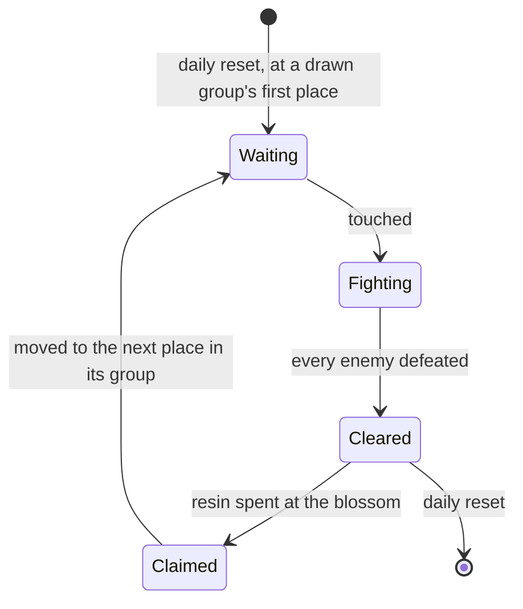

# Ley line outcrops

Ley line outcrops are the open world's resin challenges: a column of light at a known place, enemies when touched, and a blossom that gives Character EXP materials or Mora when claimed. They are where a player levels characters and earns Mora, so the character screen's Level Up and every page that spends Mora lean on them. They wait on [Original Resin](/docs/proposals/genshin/original-resin), whose claim they spawn, on the [Adventure Rank](/docs/proposals/genshin/adventure-rank) that opens them and sets their level, and on the [character kits](/docs/proposals/genshin/character-kits) that fight them.

The rules are [built](/docs/genshin/ley-line-outcrops). This proposal keeps what is unbuilt: the touch, the fight, the reveal, the claim and its rewards.

## Decisions

- **Touched, fought, revealed.** Touching an outcrop spawns its region's enemies at the World Level's level, within its fight radius. Once every one is defeated the Ley Line Blossom appears, and its reward is the resin claim. The enemies drop what they always drop.
- **Rewards by World Level, from the reward previews.** Each ley line refresh row lists pairs under the dump's key `JPGLLPBPBJF`, each a `RewardPreviewExcelConfigData` id (`FMAGCHDDAIB`) and an id the client holds no row for (`NELKDGFGBEI`, the server's own). The previews, in the row's order, are World Level 0 upward: Mondstadt's Wealth row lists nine (4101 and 4103 to 4110, `摩拉玩法_11级` to `_56级`) paying 12,000, 20,000, 28,000, 36,000, 44,000 and 52,000 Mora, then 60,000, and its Revelation row 7 to 8 Wanderer's Advice with 3 to 4 Adventurer's Experience at World Level 0, as the wiki's table gives each World Level. The last preview stands for every World Level past the list, so World Level 9 claims World Level 8's, the wiki's 60,000 from World Level 6 on. Each preview also counts 100 Adventure EXP and the Companionship EXP (10, 15 or 20); the claim leaves both to the resin and the grant, as [Original Resin](/docs/proposals/genshin/original-resin) decides.
- **Cleared but unclaimed stays until the reset.** One cleared but unclaimed stays where it is until the daily reset, and nothing moves meanwhile.

## How it works

## Scope and order

**Today:** the rules are built, but no outcrop is placed, so enemies stand in camps placed by region data, nothing spawns them on a touch, and nothing gives Character EXP materials.

**This adds, in order:**

1. **The claims' rewards by World Level.** `scripts/src/models/genshinAssets/leyLine/ExcelBlossomRefreshRow.ts` gains the row's `JPGLLPBPBJF` list, each entry's `FMAGCHDDAIB` (the preview id) and `NELKDGFGBEI` (the server's id, not read) named in comments by what they hold, as the `genshin-parity` skill models an obfuscated field. `toLeyLineRegions.ts` gives each kind rule `worldLevelRewards: RewardItem[][]`, one per preview id in the row's order, each the preview's items through `scripts/src/services/genshinAssets/rewards/toPreviewItems.ts`, and `writeLeyLineTables.ts` reads `RewardPreviewExcelConfigData` beside the three blossom tables. `packages/genshin-world/src/models/leyLine/OutcropKindRule.ts` gains the field and its schema (`rewardItemSchema`), and `packages/genshin-world/src/services/leyLine/computeOutcropClaimRewards.ts` takes a rule's row at a World Level, the last row for a World Level past the list. `pnpm -C scripts genshin:assets outcrops` rewrites the existing region slices under `packages/genshin-world/src/data/leyLine/regions/`, so no new data file is added. Tests: `scripts/src/services/genshinAssets/leyLine/toLeyLineRegions.test.ts` gains a refresh row listing two previews and asserts its kind's two reward rows; `packages/genshin-world/src/services/leyLine/computeOutcropClaimRewards.test.ts` asserts that World Level 0 takes the first row and World Level 9 the last of nine.
2. **The reset and the states**: the transitions in the diagram as `packages/genshin-world/src/services/leyLine/advanceOutcrop.ts` over an `OutcropStage` model (waiting, fighting, cleared), a claim moving the outcrop on with `computeNextOutcropPlace` and the daily reset starting each open kind over with `drawOutcropPlace`, tested transition by transition.
3. **An outcrop's challenge and blossom**, in Mondstadt first: the touch, the fight, the reveal and the claim through Original Resin's `claimBlossom`, its draw `computeOutcropClaimRewards`' row. Each place is a scene group of the game's, so its position waits on the scene group export the other machine is making; its enemies are each place's in the wiki's `Ley Line Outcrop Table` rows on the Ley Line Outcrops page, read through the persona's `readWikiPageText`.
4. **The regions the dump does not yet cover**: Fontaine, Natlan and Snezhnaya, whose sections are not in the section order table, and Nod-Krai, which the refresh rows do not name.

## Data and measures

- **Read from the game's tables:** the claims' rewards by World Level, from the `RewardPreviewExcelConfigData` rows each refresh row lists, which the dump holds.
- **Placed by the scene groups:** the table names each place by the game's scene group, so each place's position is its group's in the scene group export the other machine is making. The official map's 262 Ley Line Blossom marks carry no group id to join a place to, so they check the placed groups rather than place them ([spawned places](/docs/proposals/genshin/spawned-places)).
- **Read from the wiki:** each region's enemies at an outcrop, and what each World Level's claim gives.

## Key files

| File                                                                   | Role after the change                              |
| :--------------------------------------------------------------------- | :------------------------------------------------- |
| `packages/genshin-world/src/models/world/RegionData.ts`                | Gains the region's outcrop places                  |
| `packages/genshin-world/src/models/enemy/EnemyCamp.ts`                 | An outcrop's enemies, as a camp spawned on a touch |
| `packages/genshin-world/src/components/World/Enemies/Index.vue`        | Spawns an outcrop's camp when it is touched        |
| `packages/genshin-world/src/services/enemy/computeEnemyRespawnTime.ts` | Shares the daily reset the outcrops start over at  |

## Sources

- [Ley Line Outcrops](https://genshin-impact.fandom.com/wiki/Ley_Line_Outcrops), Genshin Impact Wiki: the enemies by region at the World Level, the claims' rewards by World Level, and a claimed outcrop moving within its group. The page was not reachable when this proposal was last checked.
- [Daily Reset](https://genshin-impact.fandom.com/wiki/Daily_Reset), Genshin Impact Wiki: the outcrops' places drawn afresh with each day's reset.
- [AnimeGameData](https://github.com/DimbreathBot/AnimeGameData), the community's per-patch dump: the chest rows' reward ids, which the dump's reward table does not hold.
