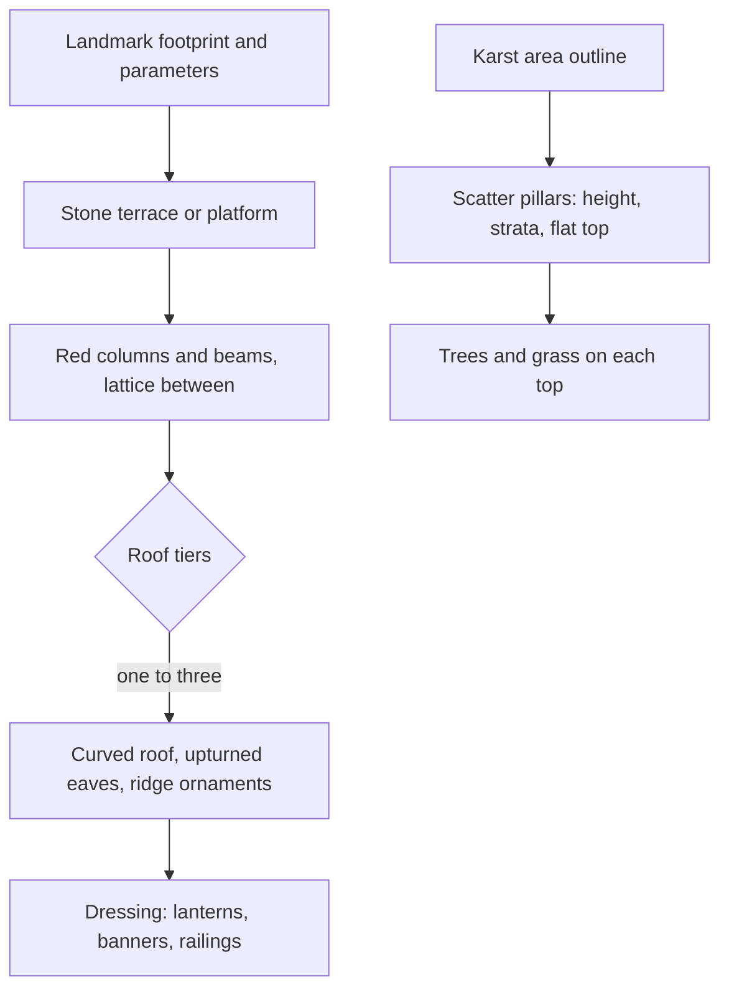

# Liyue

This region is built on [terrain](/docs/genshin/terrain) and its [shapes](/docs/proposals/genshin/terrain-shapes), [vegetation](/docs/proposals/genshin/vegetation), [water](/docs/proposals/genshin/water), [sky and time](/docs/genshin/sky-and-time) and [weather](/docs/proposals/genshin/weather), authored by the [reference board](/docs/proposals/genshin/reference-board)'s method. Liyue is the nation of the Geo Archon, its culture drawn from traditional China and its fantasy. Its land is vertical. Karst pillars rise from plains and from clouds, stone spears stand in the sea where an archon is said to have pinned a god, and the harbour city is built in tiers up its cliff. Much of what makes Liyue is exactly what a heightfield cannot hold, so this region is where the terrain's rule of meshes on top of the heights is used most.

## Decisions

- **Karst and stone forests are meshes.** Jueyun Karst's pillars, Huaguang Stone Forest, Guyun Stone Forest's spears in the sea, and the sea stacks are generated rock meshes: layered strata, eroded vertical faces, flat tops carrying trees and grass. They are placed as landmarks or scattered by rule within their area's outline, and they rise from a heightfield that keeps only the ground between them.
- **A sea of clouds.** Around Jueyun Karst and the high peaks, a layer of stepped cloud sits below the summits, drawn with the [sky](/docs/genshin/sky-and-time)'s cloud material on a flat layer at a set height.
- **A warm, golden palette.** Ochre and grey rock, jade-green water, golden ginkgo and autumn maples, and red and gold architecture. Glaze lilies, silk flowers and qingxin on the peaks are scattered by biome. Dihua Marsh is reed beds and shallow water.
- **The Liyue building kit.**
  - a stone terrace or platform base
  - red-lacquered columns and beams, with lattice panels between them
  - a curved roof with upturned eaves in one, two or three tiers, tiled with ridge ornaments
  - dressing: lanterns, banners, railings

  Liyue Harbor is a set of landmarks on authored stepped streets up the cliff, with its wharves below. Wangshu Inn is a tower on a rock pillar. Qingce Village is terraced paddies of still water around a great tree.

- **The Chasm is a layer.** The surface Chasm is a vast open-pit mine with scaffolding, lifts and ruins in the heightfield and its meshes. The underground mines are their own layer in the [world map](/docs/proposals/genshin/world-map), dark except for the lamps and the glowing ore.
- **Chenyu Vale is tea and mist.** It has terraced tea slopes, waterfalls, low mist in the valley, and villages in white walls with dark tiles and stepped gables.

## How it works



## Areas

The catalogue holds Liyue's areas as the game names them: Bishui Plain, Minlin, Lisha, Qiongji Estuary, Mt. Laixin, the Sea of Clouds, The Chasm, The Chasm: Underground Mines, and Chenyu Vale's Upper Vale and Southern Mountain. Subareas include Liyue Harbor, Wangshu Inn, Qingce Village, Jueyun Karst, Huaguang Stone Forest, Guyun Stone Forest, Mt. Tianheng, Mt. Hulao, Mt. Aocang, Qingyun Peak, Stone Gate, Dihua Marsh, Luhua Pool, Lingju Pass, Tianqiu Valley, Guili Plains, Yaoguang Shoal, Cuijue Slope, Mingyun Village, Yilong Wharf, Nantianmen, The Chasm's Maw and The Glowing Narrows.

## Build order

1. **Bishui Plain** from Stone Gate to Wangshu Inn, the way the game enters Liyue.
2. **Liyue Harbor**, matched landmark by landmark.
3. **Minlin with Jueyun Karst**, where the karst meshes and the sea of clouds first appear, then **Qingce Village**.
4. **Lisha and Qiongji Estuary**, including Guyun Stone Forest.
5. **The Chasm**, surface and underground.
6. **Chenyu Vale**, then the rest in the catalogue's order.

## Capture checklist

Stone Gate, Wangshu Inn from the bridge, Liyue Harbor from the sea and from the top of the steps, a harbour street, Jueyun Karst from within the sea of clouds, Qingce Village's terraces, Guyun Stone Forest from the water, the Chasm's rim, and a Chenyu Vale village.

## Key files

| File                                                      | Role after the change                               |
| :-------------------------------------------------------- | :-------------------------------------------------- |
| `packages/genshin-engine/src/noise/createSimplexNoise.ts` | The detail noise and the strata of the karst meshes |

New files:

```text
apps/web/public/genshin/liyue.json
packages/genshin-engine/src/kits/liyue/   ← building, karst and stone-forest generators
```

## Sources

- [Liyue](https://genshin-impact.fandom.com/wiki/Liyue), [The Chasm](https://genshin-impact.fandom.com/wiki/The_Chasm) and [Chenyu Vale](https://genshin-impact.fandom.com/wiki/Chenyu_Vale), Genshin Impact Wiki: Liyue's areas and subareas, the Chasm above ground and below, and Chenyu Vale.
- [The setting of Genshin Impact](https://en.wikipedia.org/wiki/Teyvat), Wikipedia: Liyue drawn from traditional Chinese culture, and Chenyu Vale's Huizhou architecture.
- [Map](https://genshin-impact.fandom.com/wiki/Map), Genshin Impact Wiki: the Chasm's underground mines unlocked as a map of their own, hence a layer.
