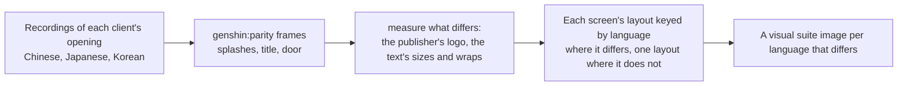

# Localized opening

The opening already speaks the reader's language: its words come from [game text](/docs/genshin/game-text) in all fifteen languages, and its [title splash](/docs/genshin/title-splash) draws each language's client's logo. Its other pictures and its layouts do not: the screens are measured off recordings of the English client and one Japanese one, and the Chinese, Japanese and Korean clients may sit their words differently and show their own publisher's logo.

## How it would work

- **Recordings are the references.** A public recording of each client's opening, found before any of the game is recorded by hand, gives the logo, its place and how the screens differ, the way the English and Japanese recordings already do ([parity](/docs/genshin/parity)).
- **A layout differs only where a recording shows it.** Every language reuses the English measures unless its own recording differs, and the visual suite gains an image only for a language that does.
- **The opening already knows the language.** It takes the reader's language for the title splash, so a screen whose layout differs reads the same prop.
- **A localized reference is compared in its client's words.** A reference naming a `language` in its props has the parity page load that language's text for the screen ([parity](/docs/genshin/parity)). The mainland's health notice, 7 to 12 seconds into its launch recording (`captures/bili-av532052219.mp4`, its logo at 3 to 6 seconds and its door at 12 to 17), is the reference `health-notice-mainland`, already compared in its own words (its row in the parity reference snapshot).

## Scope

- **Next: the Japanese and Korean openings, from public clips.** Two public recordings are the references until the owed `opening-japanese.mkv` and `opening-korean.mkv` re-measure them, and they do not wait on them:
  - the Japanese PC client's launch, [【原神】PCとiPhone13ProMaxの起動時間比較](https://www.youtube.com/watch?v=57d2PwbOdr0) (51 seconds): `pnpm -C scripts genshin:parity clip https://www.youtube.com/watch?v=57d2PwbOdr0 --from 0 --to 51 --name opening-japanese`;
  - the Korean client's login at night, [원신 임팩트 - 로그인 화면 (야간)](https://www.youtube.com/watch?v=HFxhJB_N4Nk) (105 seconds): `pnpm -C scripts genshin:parity clip https://www.youtube.com/watch?v=HFxhJB_N4Nk --from 0 --to 105 --name opening-korean`.

  Each is read a frame a second with `genshin:parity frames`, the builder picking from the images the seconds where the publisher splash, the title splash, the health notice and the door stand whole, and taking each with `genshin:parity frame <capture> --at <second> --name <reference>`. A clip that turns out to show a phone or another client's language is replaced by the next result of `ytsearch10:原神 起動 PC` or `ytsearch10:원신 로그인 화면 PC`. Each frame becomes a `ParityReferenceMap` entry named for its screen and language (`title-splash-japanese`, `health-notice-korean`, `login-interface-door-japanese`), with `props: { language: "Japanese" }` or `"Korean"` as `health-notice-mainland` has. `ParityReferenceMap.test.ts` proves each names a screen with a fixture, and each compare is queued as a `[page]` item for the user's eyes.

- The publisher splash where a client shows a different publisher's logo.
- The health notice and login screen's layout where a recording shows a difference.
- The mainland's door with its prompt. Its reference `login-interface-door-mainland` is registered at 15.5 seconds, the first of the 12 to 17 second stills with the prompt whole, and its whole-frame compare waits in the [roadmap](/docs/genshin/roadmap)'s compute queue.
- The Japanese and Korean layouts, keyed by language only on a screen whose compare above reads a mean further off than the English reference's own row in the parity reference snapshot.

## Key files

| File                                                               | Role after the change                            |
| :----------------------------------------------------------------- | :----------------------------------------------- |
| `packages/genshin-world/src/components/Splash/Publisher/Index.vue` | The publisher's logo per client where it differs |
| `packages/genshin-world/parity/screens.visual.ts`                  | An image per language whose screen differs       |
