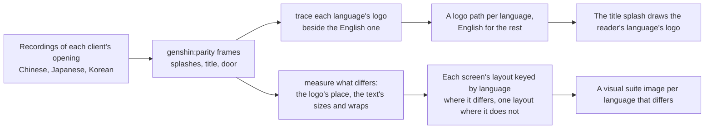

# Localized opening

The opening already speaks the reader's language: its words come from [game text](/docs/genshin/game-text) in all fifteen languages. Its pictures do not. The title splash draws one logo, traced from the English artwork (`TitleLogoPath`), and the screens' layouts are measured off recordings of the English client and one Japanese one. The Chinese, Japanese and Korean clients show their own title logos, and their opening and login screens sit their words differently, so a reader in those languages sees an English opening under their own words.

## How it would work

- **Recordings are the references.** A public recording of each client's opening, found before any of the game is recorded by hand, gives the logo, its place and how the screens differ, the way the English and Japanese recordings already do ([parity](/docs/genshin/parity)).
- **A logo is traced, never shipped.** Each language's logo is traced to vectors as the English one was, so no image of the game's rides along ([derived assets](/docs/genshin/derived-assets)).
- **A layout differs only where a recording shows it.** Every language reuses the English measures unless its own recording differs, and the visual suite gains an image only for a language that does.
- **The opening already knows the language.** The title splash takes `gameText` like every screen of the opening that shows a word, so the logo is chosen from the same language without a second prop.

## Scope

- The title splash's logo in Chinese, Japanese and Korean, and the English logo for every other language.
- The publisher splash where a client shows a different publisher's logo.
- The health notice and login screen's layout where a recording shows a difference.
- Not the welcome's greeting, which [pre-login text](/docs/proposals/genshin/pre-login-text) owns.

## Key files

| File                                                               | Role after the change                                      |
| :----------------------------------------------------------------- | :--------------------------------------------------------- |
| `packages/genshin-world/src/services/splash/TitleLogoPath.ts`      | One traced logo path per language that has its own         |
| `packages/genshin-world/src/components/Splash/Title/Index.vue`     | Draws the reader's language's logo, placed as its client's |
| `packages/genshin-world/src/components/Splash/Publisher/Index.vue` | The publisher's logo per client where it differs           |
| `packages/genshin-world/parity/screens.visual.ts`                  | An image per language whose screen differs                 |
