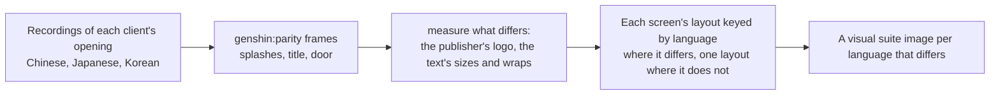

# Localized opening

The opening already speaks the reader's language: its words come from [game text](/docs/genshin/game-text) in all fifteen languages, and its [title splash](/docs/genshin/title-splash) draws each language's client's logo. Its other pictures and its layouts do not: the screens are measured off recordings of the English client and one Japanese one, and the Chinese, Japanese and Korean clients may sit their words differently and show their own publisher's logo.

## How it would work

- **Recordings are the references.** A public recording of each client's opening, found before any of the game is recorded by hand, gives the logo, its place and how the screens differ, the way the English and Japanese recordings already do ([parity](/docs/genshin/parity)).
- **A layout differs only where a recording shows it.** Every language reuses the English measures unless its own recording differs, and the visual suite gains an image only for a language that does.
- **The opening already knows the language.** It takes the reader's language for the title splash, so a screen whose layout differs reads the same prop.

## Scope

- The publisher splash where a client shows a different publisher's logo.
- The health notice and login screen's layout where a recording shows a difference.
- Not the welcome's greeting, which [pre-login text](/docs/proposals/genshin/pre-login-text) owns.

## Key files

| File                                                               | Role after the change                            |
| :----------------------------------------------------------------- | :----------------------------------------------- |
| `packages/genshin-world/src/components/Splash/Publisher/Index.vue` | The publisher's logo per client where it differs |
| `packages/genshin-world/parity/screens.visual.ts`                  | An image per language whose screen differs       |
