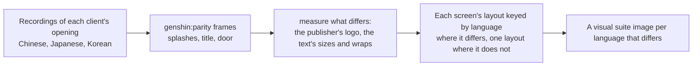

# Localized opening

The opening already speaks the reader's language: its words come from [game text](/docs/genshin/game-text) in all fifteen languages, and its [title splash](/docs/genshin/title-splash) draws each language's client's logo. Its other pictures and its layouts do not: the screens are measured off recordings of the English client and one Japanese one, and the Chinese, Japanese and Korean clients may sit their words differently and show their own publisher's logo.

## How it would work

- **Recordings are the references.** A public recording of each client's opening, found before any of the game is recorded by hand, gives the logo, its place and how the screens differ, the way the English and Japanese recordings already do ([parity](/docs/genshin/parity)).
- **A layout differs only where a recording shows it.** Every language reuses the English measures unless its own recording differs, and the visual suite gains an image only for a language that does.
- **The opening already knows the language.** It takes the reader's language for the title splash, so a screen whose layout differs reads the same prop.
- **A localized reference is compared in its client's words.** A reference naming a `language` in its props has the parity page load that language's text for the screen ([parity](/docs/genshin/parity)). The mainland's health notice, 7 to 12 seconds into its launch recording (`captures/bili-av532052219.mp4`, its logo at 3 to 6 seconds and its door at 12 to 17), is the reference `health-notice-mainland`, already compared in its own words (its row in the parity reference snapshot).

## Scope

- **Done: the Japanese PC client's health notice.** Its reference `health-notice-japanese` is the public recording's frame at 30 seconds (`yt-57d2PwbOdr0-opening-japanese.mp4`, clipped by `genshin:parity clip`), whole in its own words, scored over a region clear of the PC watermark and the recorder's icons. Its compare is a `[page]` item on the roadmap for the user's eyes.
- **Done: the mainland's door with its prompt.** Its reference `login-interface-door-mainland` is the launch recording's frame at 15.5 seconds, the first of the 12 to 17 second stills with the prompt whole, scored over the whole frame, its rating included; its score is its row in the parity reference snapshot.
- **Not in any public clip.** Searches for each client's PC launch found none: the Japanese clip shows the PC client's title only as its iPhone capture, and no Japanese PC splash or door. The Korean clip (`yt-HFxhJB_N4Nk-opening-korean.mp4`, 720 high) is the account login form for all 105 seconds. A 2020 Korean PC gameplay video (`yt-4zVvDgStMWQ`, 1080 high) opens on a title card and cuts to the world, with no splash, notice or door. So `title-splash-japanese`, `publisher-splash-japanese`, the Korean launch's stages and both clients' door stages wait on `japanese-launch.mkv` and `korean-launch.mkv` in the roadmap's Recordings owed list.

- The publisher splash where a client shows a different publisher's logo.
- The health notice and login screen's layout where a recording shows a difference.
- The Japanese and Korean layouts, keyed by language only on a screen whose compare above reads a mean further off than the English reference's own row in the parity reference snapshot.

## Key files

| File                                                               | Role after the change                            |
| :----------------------------------------------------------------- | :----------------------------------------------- |
| `packages/genshin-world/src/components/Splash/Publisher/Index.vue` | The publisher's logo per client where it differs |
| `packages/genshin-world/parity/screens.visual.ts`                  | An image per language whose screen differs       |
