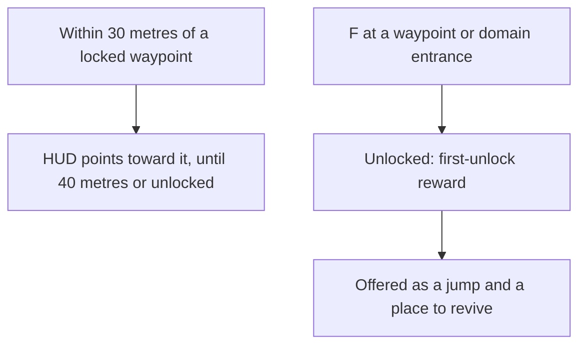

# Map unlocking

The statues' unlocking is built: a Statue of The Seven is resonated with on F, fills its area in on the map and the minimap, and is then a jump and a place to revive ([map unlocking](/docs/genshin/map-unlocking)). What is left is the rest of the game's places. They wait on the [exploring](/docs/proposals/genshin/exploring) proposal, which makes Teleport Waypoints a landmark kind and lands a jump at the game's own arrival point, and on the [interaction](/docs/proposals/genshin/interaction) prompts a waypoint and a domain are unlocked through.

## Decisions

- **Reached, then unlocked.** A Teleport Waypoint or a domain's entrance is unlocked by interacting with it, as the statues are. A few unlock with a quest's step instead, which names them.
- **Its first unlock is rewarded.** Each one's Adventure EXP and Primogems are its row in `TransPointRewardConfigData`, given once.
- **A waypoint the game hides stays hidden.** A waypoint the game hides until a further step stays hidden until that step.
- **A locked waypoint is pointed to near.** Within 30 metres of a locked waypoint, the HUD points toward it; past 40 metres, or once it is unlocked, the pointer goes, as the wiki gives the two distances.

## How it works

## Scope and order

**Built:** the statues' unlocking, the filled areas, and the jumps and revives filtered to what is unlocked ([map unlocking](/docs/genshin/map-unlocking)).

**This adds, in order:**

1. **Teleport Waypoints and domains unlocked**, once exploring places waypoints in region data and the prompt list offers them.
2. **Their first-unlock rewards**, once each waypoint is matched to its row.
3. **The pointer to a near locked waypoint**, in the HUD.

## Data and measures

- **Read from the game's tables:** `TransPointRewardConfigData` (about three hundred rows, about two hundred and fifty of them in scene 3, keyed by scene and point id) and `RewardExcelConfigData` for each reward id's items. The tables are fetched from the community's dump into the game's text directory and not committed. The table's reward ids run from 220310 to 220314: 220310 gives 10 Adventure EXP, 220311, 220313 and 220314 give 50 Adventure EXP and 5 Primogems, and 220312 gives 5 Primogems and 20 of item 101692, which the two currencies do not name and is left out until its item is read. Each field's name is the table's own (`playerExp` for Adventure EXP, `hcoin` for Primogems), not checked in game.
- **Matched by the scene points:** each scene 3 row's point id is a point of the text dump's `scene3_point.json`, all of them in one category, so a waypoint's row is found once exploring matches its point to its landmark.
- **Measured:** the unlock's animation and how long it holds the player, measured off a recording like the jump's fade ([roadmap](/docs/genshin/roadmap), recordings owed).

## Key files

| File                                                         | Role after the change                                    |
| :----------------------------------------------------------- | :------------------------------------------------------- |
| `packages/genshin-world/src/composables/useJumpLandmarks.ts` | Keeps the waypoints among the jumps once they are fitted |
| `packages/genshin-world/src/services/map/constants.ts`       | `JUMP_LANDMARK_KINDS` gains the waypoint                 |
| `packages/genshin-world/src/components/Hud/Screen/Index.vue` | Points toward a near locked waypoint                     |

## Sources

- [Teleport Waypoint](https://genshin-impact.fandom.com/wiki/Teleport_Waypoint), Genshin Impact Wiki: waypoints unlocked by interacting, their first unlock's Adventure EXP and Primogems, statues and domains acting as waypoints, only unlocked ones as respawn points, locked ones shown once their area is lit, the pointer within 30 metres gone past 40, and quest unlocks.
- [AnimeGameData](https://github.com/DimbreathBot/AnimeGameData), the community's per-patch dump: the transport points' reward table.
