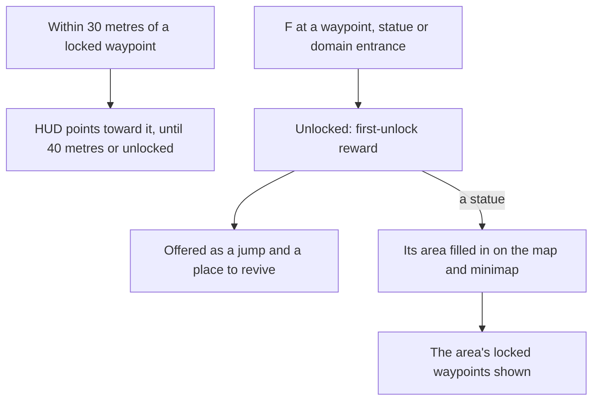

# Map unlocking

The map and its jumps are built ([map](/docs/genshin/map)), and every statue is a jump from the start. In the game nothing is: the map is blank until a statue fills in its area, and a place is a jump only once it is unlocked. This page is that unlocking. It waits on the [exploring](/docs/proposals/genshin/exploring) proposal, which makes Teleport Waypoints a landmark kind and lands a jump at the game's own arrival point, and on the [interaction](/docs/proposals/genshin/interaction) prompts a waypoint is unlocked through.

## Decisions

- **Reached, then unlocked.** A Teleport Waypoint, a Statue of The Seven or a domain's entrance is unlocked by interacting with it, as the game unlocks one. A few unlock with a quest's step instead, which names them.
- **Its first unlock is rewarded.** Each one's Adventure EXP and Primogems are its row in `TransPointRewardConfigData`, given once.
- **Only what is unlocked is a jump.** The map's jump list and marks offer only unlocked places, and a party that falls returns to the nearest unlocked waypoint, as [party](/docs/proposals/genshin/party)'s game over revives there.
- **A statue fills in its area.** Resonating with a Statue of The Seven the first time fills in its area on the map, as each statue lights one area ([world map](/docs/genshin/world-map)). Until then the area is blank on the map and the minimap alike, and its locked waypoints are hidden; after, they show as locked. A waypoint the game hides until a further step stays hidden until that step.
- **A locked waypoint is pointed to near.** Within 30 metres of a locked waypoint, the HUD points toward it; past 40 metres, or once it is unlocked, the pointer goes, as the wiki gives the two distances.
- **Kept with the player's progress**, as each place's unlock and each area filled in.

## How it works

## Scope and order

**Today:** every statue is a jump from the start, and the map draws every area it knows.

**This adds, in order:**

1. **Unlocked places**, kept with the player's progress, the jumps filtered to them.
2. **The statues filling in their areas**, on the map and the minimap.
3. **Waypoints' unlock and rewards**, once exploring places them.
4. **The pointer to a near locked waypoint**, in the HUD.

## Data and measures

- **Read from the game's tables:** `TransPointRewardConfigData` for each place's first-unlock reward, and the scene points for which waypoints a quest unlocks.
- **Measured:** the unlock's animation and how long it holds the player, off a recording, as the jump's fade is.

## Key files

| File                                                           | Role after the change                               |
| :------------------------------------------------------------- | :-------------------------------------------------- |
| `packages/genshin-world/src/composables/useJumpLandmarks.ts`   | Keeps only the unlocked places as jumps             |
| `packages/genshin-world/src/components/Map/Drawing/Index.vue`  | Draws an area only once its statue fills it in      |
| `packages/genshin-world/src/components/Map/Overlay/Index.vue`  | Shows a filled-in area's locked waypoints as locked |
| `packages/genshin-world/src/components/Hud/Screen/Index.vue`   | Points toward a near locked waypoint                |
| `packages/genshin-world/src/services/map/computeAreaLabels.ts` | Names only the areas filled in                      |

## Sources

- [Teleport Waypoint](https://genshin-impact.fandom.com/wiki/Teleport_Waypoint), Genshin Impact Wiki: waypoints unlocked by interacting, their first unlock's Adventure EXP and Primogems, statues and domains acting as waypoints, only unlocked ones as respawn points, locked ones shown once their area is lit, the pointer within 30 metres gone past 40, and quest unlocks.
- [Statue of The Seven](https://genshin-impact.fandom.com/wiki/Statue_of_The_Seven), Genshin Impact Wiki: a statue filling in its area of the map when first resonated with, revealing the area's locked waypoints.
- [AnimeGameData](https://gitlab.com/Dimbreath/AnimeGameData), the community's per-patch dump: the transport points' reward table.
