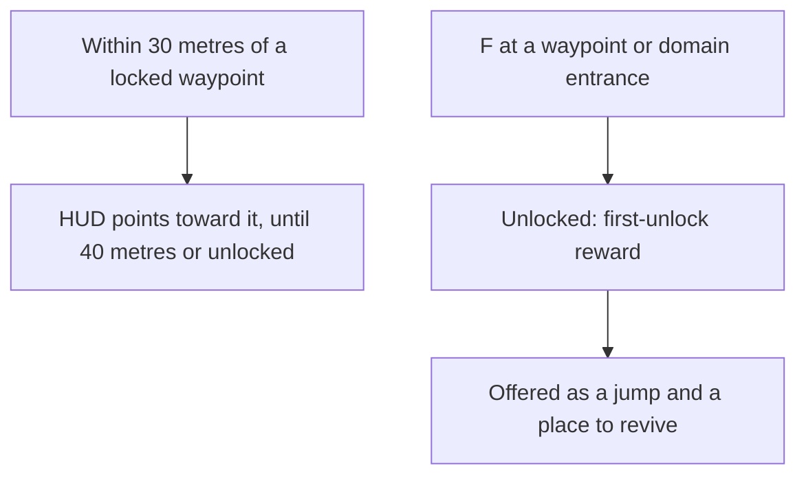

# Map unlocking

The statues' unlocking is built, as the [map unlocking](/docs/genshin/map-unlocking) page records. What is left is the rest of the game's places. They wait on the [exploring](/docs/proposals/genshin/exploring) proposal, which makes Teleport Waypoints a landmark kind and lands a jump at the game's own arrival point, and on the [interaction](/docs/proposals/genshin/interaction) prompts a waypoint and a domain are unlocked through.

## Decisions

- **Reached, then unlocked.** A Teleport Waypoint or a domain's entrance is unlocked by interacting with it, as the statues are. A few unlock with a quest's step instead, which names them.
- **Its first unlock is rewarded.** Each one's Adventure EXP and Primogems are its row in `TransPointRewardConfigData`, given once.
- **A waypoint the game hides stays hidden.** A waypoint the game hides until a further step stays hidden until that step.
- **A locked waypoint is pointed to near.** Within 30 metres of a locked waypoint, the HUD points toward it; past 40 metres, or once it is unlocked, the pointer goes, as the wiki gives the two distances.
- **The pointer points to every locked jump landmark, so it is built before the waypoints.** The wiki gives the pointer for a locked Teleport Waypoint, and a Statue of The Seven is a waypoint too, so the rule reads the locked jump landmarks: it points to the statues today and takes the waypoints once [exploring](/docs/proposals/genshin/exploring) adds them to `JUMP_LANDMARK_KINDS`, with no change of its own.
- **The pointer is the game's navigation mark, drawn on the HUD.** It is the mark at the landmark's place on screen, held at the screen's edge with its arrow turned toward the landmark while the landmark is out of view. Its look is read from a public clip of a waypoint being reached, and its comparison waits on the user's eyes.

## How it works

## Scope and order

**Built:** the statues' unlocking, the filled areas, and the jumps and revives filtered to what is unlocked ([map unlocking](/docs/genshin/map-unlocking)).

**This adds, in order:**

1. **The pointer to a near locked jump landmark.** Add `packages/genshin-world/src/services/map/findPointedLandmark.ts`: given the locked jump landmarks, the character's ground point and the id pointed to last, it keeps that landmark while it is still locked and within `NAVIGATION_POINTER_HIDE_DISTANCE` (40 metres), and otherwise takes the nearest locked one within `NAVIGATION_POINTER_SHOW_DISTANCE` (30 metres), both added to `services/map/constants.ts`, undefined where none is. `components/World/Session/Index.vue` runs it from `jumpLandmarks` less `unlockedLandmarkIds` whenever the map camera moves, and hands the landmark to the HUD, which draws it in `packages/genshin-world/src/components/Hud/Navigation/Index.vue`: the mark at the landmark's projected screen point, held at the screen's edge with its arrow turned toward it when it is out of view. Its look comes from the public clip `ay49p0gLFT8` ("How to unlock Glutov Underground teleport waypoint", 23 seconds): `pnpm -C scripts genshin:parity clip https://www.youtube.com/watch?v=ay49p0gLFT8 --from 0 --to 23 --name waypoint-pointer`, then `genshin:parity frames` over it, the builder reading the frames for one with the pointer in view and taking it into `references/waypoint-pointer/` with `genshin:parity frame <capture> --name waypoint-pointer --at <second>`. The mark's size and colour are provisional constants, and its comparison is queued for the user's eyes. Test: `packages/genshin-world/src/services/map/findPointedLandmark.test.ts`, asserting that a locked landmark 29 metres away is pointed to and one 31 metres away is not, that a pointed one stays at 39 metres and goes at 41, and that an unlocked one is never pointed to.
2. **Teleport Waypoints and domains unlocked**, once exploring places waypoints in region data and the prompt list offers them.
3. **Their first-unlock rewards**, once each waypoint is matched to its row by its point id. The open world's rows are written and the statues' first unlock pays its Primogems; a statue's Adventure EXP is paid by the [Adventure Rank](/docs/proposals/genshin/adventure-rank)'s first step, and the waypoints' wait on step 2.

**Not here:** the achievements `TRIGGER_UNLOCK_TRANS_POINT` and `TRIGGER_UNLOCK_AREA` rows count unlocks, and the achievements proposal wires them as their pages land. The wiki says "Brush of a Thousand Winds" is every Teleport Waypoint in Mondstadt except those of Dragonspine, Windrest Peak and the Temple of Space, so a watcher needs each waypoint's region as well as its point. An area trigger names the game's own area ids, which no catalogue area holds yet.

## Data and measures

- **Read from the game's tables:** `TransPointRewardConfigData` (about three hundred rows, about two hundred and fifty of them in scene 3, keyed by scene and point id) and `RewardExcelConfigData` for each reward id's items. They are fetched as the [game data formats](/docs/genshin/game-data-formats) page describes, and not committed; `pnpm -C scripts genshin:assets trans-points` writes the scene 3 rows, each joined to its reward's Adventure EXP and Primogems, into the world's generated folder. The table's reward ids run from 220310 to 220314: 220310 gives 10 Adventure EXP, 220311, 220313 and 220314 give 50 Adventure EXP and 5 Primogems, and 220312 gives 5 Primogems and 20 of item 101692, which the two currencies do not name and is left out until its item is read. Each field's name is the table's own (`playerExp` for Adventure EXP, `hcoin` for Primogems), not checked in game.
- **Matched by the scene points:** each scene 3 row's point id is a point of the text dump's `scene3_point.json`, all of them in one category, so a waypoint's row is found once exploring matches its point to its landmark.
- **Measured:** the unlock's animation and how long it holds the player, measured off a recording like the jump's fade ([roadmap](/docs/genshin/roadmap), recordings owed).

## Key files

| File                                                         | Role after the change                                    |
| :----------------------------------------------------------- | :------------------------------------------------------- |
| `packages/genshin-world/src/composables/useJumpLandmarks.ts` | Keeps the waypoints among the jumps once they are fitted |
| `packages/genshin-world/src/services/map/constants.ts`       | `JUMP_LANDMARK_KINDS` gains the waypoint                 |
| `packages/genshin-world/src/components/Hud/Screen/Index.vue` | Points toward a near locked waypoint                     |

## Sources

- [Teleport Waypoint](https://genshin-impact.fandom.com/wiki/Teleport_Waypoint), Genshin Impact Wiki: waypoints unlocked by interacting, their first unlock's Adventure EXP and Primogems, statues and domains acting as waypoints, only unlocked ones as respawn points, locked ones shown once their area is lit, the pointer within 30 metres gone past 40, and quest unlocks.
- [AnimeGameData](https://github.com/DimbreathBot/AnimeGameData), the community's per-patch dump: the transport points' reward table.
