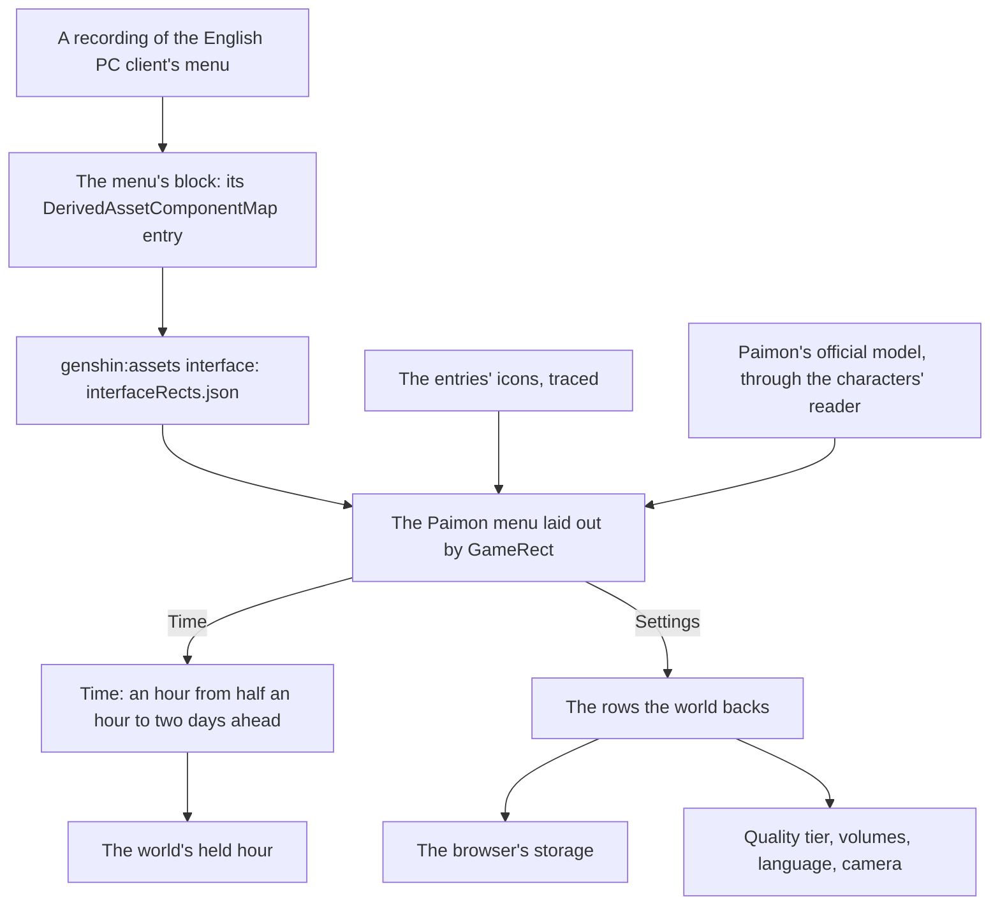

# Menu screens

This page builds on [screens](/docs/genshin/screens), where the Paimon menu's shell, its pause of the world and its entries are built, on [characters](/docs/proposals/genshin/characters), whose reader draws Paimon beside the menu, and on the [HUD](/docs/proposals/genshin/hud), whose Paimon button opens it. What the shell lacks is the game's own look: its layout is a stand-in, its entries carry no icons, Paimon does not float beside it, and its side bar's Time and Settings open placeholders.

## Decisions

- **Time is the game's own control of the clock.** Its screen sets an hour at least half an hour ahead of the current one and at most two days on, never back, as the game allows. It writes the hour the world's clock is held to. It replaces [exploring](/docs/proposals/genshin/exploring)'s clock control once it lands, so the world keeps one control of the hour, and that control is the game's.
- **Settings shows only the rows the world has.** Each row the world backs is laid out with the game's name, range and default. Graphics Quality is the renderer's quality tier. Volume, Music Volume and SFX Volume run from 1 to 10 over the music's player and the sound effects. Game Language offers the fifteen languages of [game text](/docs/genshin/game-text). The camera sensitivities and default distance belong to the follow camera. Settings are kept in the browser, as the game keeps its settings per device. A row the world does not back is left out, never drawn disabled.
- **Paimon is drawn as a character is.** She appears to the right of the menu with her idle animations, as the game shows her. She is read from her official model and drawn by [characters](/docs/proposals/genshin/characters)' reader and toon material, her motion fitted to the game's own clips, so nothing of the game's files ships.
- **Measured like the login, in the game's words.** Each screen is a component of the `Menu` section in the world package, laid out by its RectTransform tree through `GameRect`. Its blocks are found and fitted as the HUD's are. Its entry icons are traced into paths of our own, and it is compared over a recording of the English PC client. The shell's stand-in sizes and colours give way to the fitted rects, and its labels stay the `GameTextKey`s they are.

## How it works



## Scope and order

**Today:** the Paimon menu's shell opens over the world on Escape, a pad's Start or a lost pointer lock, holds the world, and lists every entry the game has in its order, an unbuilt screen's disabled. Its layout is a stand-in, and Time and Settings open placeholders.

**This adds, in order:**

1. **The references.** Recordings of the menu, Time and Settings in the English PC client at 1080 high, published ones first. Each screen's block, its component entry and its fitted rects come with them.
2. **The Paimon menu measured**, its entries' icons traced, and Paimon beside it.
3. **Time.**
4. **Settings**, its rows wired to what each sets.

## What this does not propose

- **The screens of features the world lacks**, among them the shop, the events, the battle pass, co-op, friends, mail and notices, and the Miliastra Wonderland's functions. Their entries stay disabled until each is built.
- **The shortcut wheel.** It offers the same screens as the menu and earns its place once the menu holds enough of them to choose from; its binding is read already.
- **The agent console's entries.** Where the console's sessions are reached from in the game's style is the console's rebuild, its own page.

## Key files

| File                                                                    | Role after the change                                       |
| :---------------------------------------------------------------------- | :---------------------------------------------------------- |
| `packages/genshin-world/src/components/Menu/Paimon/Index.vue`           | Laid out by the fitted rects, its icons drawn, Paimon by it |
| `packages/genshin-engine/src/renderer/QualityTierSettingsMap.ts`        | The tiers the Graphics Quality row chooses between          |
| `packages/genshin-text/src/models/GameTextKey.ts`                       | Gains every label of Time and Settings                      |
| `scripts/src/services/genshinAssets/shared/DerivedAssetComponentMap.ts` | Gains each screen's block and roots                         |
| `scripts/src/services/genshinParity/shared/ParityReferenceMap.ts`       | Gains each screen's recordings                              |

New files:

```text
packages/genshin-world/src/components/Menu/Paimon/Index.fixture.ts
packages/genshin-world/src/components/Menu/Paimon/Index.reference.ts
packages/genshin-world/src/components/Menu/Time/Index.vue
packages/genshin-world/src/components/Menu/Time/Index.fixture.ts
packages/genshin-world/src/components/Menu/Settings/Index.vue
packages/genshin-world/src/components/Menu/Settings/Index.fixture.ts
packages/genshin-world/src/data/menu/interfaceRects.json
```

## Sources

- [Paimon Menu](https://genshin-impact.fandom.com/wiki/Paimon_Menu), Genshin Impact Wiki: the menu's profile, contents and side bar, and Paimon floating to its right.
- [Time](https://genshin-impact.fandom.com/wiki/Time), Genshin Impact Wiki: one in-game minute a second, the Time option advancing from half an hour to two days ahead, and the clock paused in the menu but not in photo mode.
- [Settings](https://genshin-impact.fandom.com/wiki/Settings), Genshin Impact Wiki: the graphics quality, the volumes from 1 to 10, the fifteen game languages and the camera's rows, and settings kept per device.
- [Shortcut Wheel](https://genshin-impact.fandom.com/wiki/Shortcut_Wheel), Genshin Impact Wiki: the wheel's entries, the same screens as the menu's.

## Open questions

- **What does the profile card show?** The game's card holds a nickname, a signature, the Adventure Rank, the World Level, a birthday, an avatar, a namecard and a UID. The world has no player profile, and the page can be played signed out. Should the card show the signed-in account's name and avatar with every other row left out, or be left out entirely until the world has a profile?
- **What if no official model of Paimon is found?** Paimon beside the menu is drawn from her official model, as characters are. If HoYoverse's packs hold none, should the menu ship without her, or wait until one is published?
