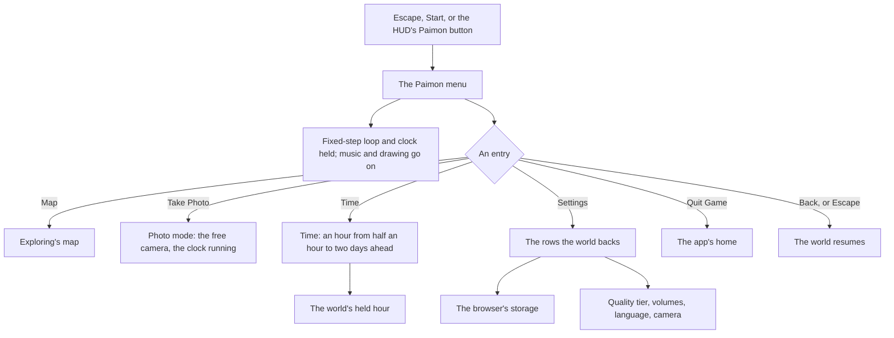

# Menu screens

This page builds on [characters](/docs/proposals/genshin/characters), whose reader draws Paimon beside the menu, and on the [HUD](/docs/proposals/genshin/hud), whose Paimon button opens it. The Paimon menu is the game's pause menu: a profile card, a grid of contents and a side bar of actions, with Paimon appearing to the right of the screen. Every screen of the game that is not play is reached from it.

## Decisions

- **It pauses as the game's does.** Escape, Start on a controller, or the HUD's Paimon button opens it in the open world. While it is open the world screen stops advancing its fixed-step loop and its clock, as the game pauses its simulation and its time. The music plays on and the world keeps drawing, as the game's particles and soundtrack carry on. The world screen's existing pause, which stops drawing frames for something covering the world, is a different thing and stays the opening's.
- **An entry appears once its screen exists.** The game adds entries to the menu as a player's Adventure Rank rises, so a menu without an entry is one the game itself shows. The first build holds these:
  - **Map** in the contents, opening [exploring](/docs/proposals/genshin/exploring)'s map, which M also opens.
  - **Back** on the side bar, closing the menu.
  - **Take Photo**, the [follow camera](/docs/proposals/genshin/follow-camera)'s photo mode.
  - **Time** and **Settings**, the two screens below.
  - **Quit Game**, which leaves the world for the app's home. The browser's equivalent of closing the game is leaving its page.

  Shop, Wish, Events, Battle Pass, Co-Op, Friends, Mail, Notices and the rest wait on features the world does not have.

- **Time is the game's own control of the clock.** Its screen sets an hour at least half an hour ahead of the current one and at most two days on, never back, as the game allows. It writes the hour the world's clock is held to. It replaces [exploring](/docs/proposals/genshin/exploring)'s clock control once it lands, so the world keeps one control of the hour, and that control is the game's.
- **Settings shows only the rows the world has.** Each row the world backs is laid out with the game's name, range and default. Graphics Quality is the renderer's quality tier. Volume, Music Volume and SFX Volume run from 1 to 10 over the music's player and the sound effects. Game Language offers the fifteen languages of [game text](/docs/genshin/game-text). The camera sensitivities and default distance belong to the follow camera. Settings are kept in the browser, as the game keeps its settings per device. A row the world does not back is left out, never drawn disabled.
- **Paimon is drawn as a character is.** She appears to the right of the menu with her idle animations, as the game shows her. She is read from her official model and drawn by [characters](/docs/proposals/genshin/characters)' reader and toon material, her motion fitted to the game's own clips, so nothing of the game's files ships.
- **Measured like the login, in the game's words.** Each screen is a component of the `Menu` section in the world package, laid out by its RectTransform tree through `GameRect`. Its blocks are found and fitted as the HUD's are. Its entry icons are traced into paths of our own, and it is compared over a recording of the English PC client. Every label is a `GameTextKey` of the game's own text, never typed by hand, so the menu reads in any of the game's languages.
- **Reachable without a pointer.** Each entry is a focusable button carrying its label. The keyboard walks the contents and the side bar, and Escape or Back closes the menu.

## How it works



## Scope and order

**Today:** nothing over the world opens a menu. The agent console's pause menu is hidden with the console.

**This adds, in order:**

1. **The references.** Recordings of the menu, Time and Settings in the English PC client at 1080 high, published ones first. Each screen's block, its component entry and its fitted rects come with them.
2. **The Paimon menu**, with its pause and the entries above, and Paimon beside it.
3. **Time.**
4. **Settings**, its rows wired to what each sets.

## What this does not propose

- **The entries of features the world lacks**, among them the shop, wishes, events, the battle pass, co-op, friends, mail, notices, the inventory, quests, characters and party setup, and the Miliastra Wonderland's functions.
- **The shortcut wheel.** It offers the same screens as the menu and earns its place once the menu holds enough of them to choose from.
- **The agent console's entries.** Where the console's sessions are reached from in the game's style is the console's rebuild, its own page.

## Key files

| File                                                                    | Role after the change                                               |
| :---------------------------------------------------------------------- | :------------------------------------------------------------------ |
| `packages/genshin-world/src/components/World/Screen/Index.vue`          | Opens the menu, and holds its loop and clock while the menu is open |
| `packages/genshin-engine/src/renderer/QualityTierSettingsMap.ts`        | The tiers the Graphics Quality row chooses between                  |
| `packages/genshin-text/src/models/GameTextKey.ts`                       | Gains every label of the menu and its screens                       |
| `scripts/src/services/genshinAssets/shared/DerivedAssetComponentMap.ts` | Gains each screen's block and roots                                 |
| `scripts/src/services/genshinParity/shared/ParityReferenceMap.ts`       | Gains each screen's recordings                                      |

New files:

```text
packages/genshin-world/src/components/Menu/Paimon/Index.vue
packages/genshin-world/src/components/Menu/Paimon/Index.fixture.ts
packages/genshin-world/src/components/Menu/Paimon/Index.reference.ts
packages/genshin-world/src/components/Menu/Time/Index.vue
packages/genshin-world/src/components/Menu/Time/Index.fixture.ts
packages/genshin-world/src/components/Menu/Settings/Index.vue
packages/genshin-world/src/components/Menu/Settings/Index.fixture.ts
packages/genshin-world/src/data/menu/interfaceRects.json
```

## Sources

- [Paimon Menu](https://genshin-impact.fandom.com/wiki/Paimon_Menu), Genshin Impact Wiki: the menu's profile, contents and side bar, entries added as Adventure Rank rises, the pause of everything but particles and music, and Paimon floating to its right.
- [Time](https://genshin-impact.fandom.com/wiki/Time), Genshin Impact Wiki: one in-game minute a second, the Time option advancing from half an hour to two days ahead, and the clock paused in the menu but not in photo mode.
- [Settings](https://genshin-impact.fandom.com/wiki/Settings), Genshin Impact Wiki: the graphics quality, the volumes from 1 to 10, the fifteen game languages and the camera's rows, and settings kept per device.
- [Controls](https://genshin-impact.fandom.com/wiki/Controls), Genshin Impact Wiki: the menu on Escape and on a controller's Start.
- [Shortcut Wheel](https://genshin-impact.fandom.com/wiki/Shortcut_Wheel), Genshin Impact Wiki: the wheel's entries, the same screens as the menu's.

## Open questions

- **What does the profile card show?** The game's card holds a nickname, a signature, the Adventure Rank, the World Level, a birthday, an avatar, a namecard and a UID. The world has no player profile, and the page can be played signed out. Should the card show the signed-in account's name and avatar with every other row left out, or be left out entirely until the world has a profile?
- **What if no official model of Paimon is found?** Paimon beside the menu is drawn from her official model, as characters are. If HoYoverse's packs hold none, should the menu ship without her, or wait until one is published?
