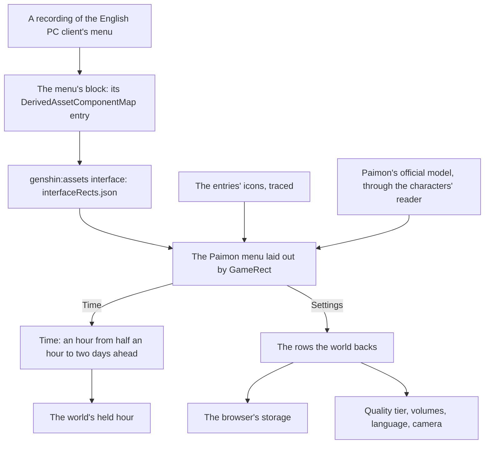

# Menu screens

This page builds on [screens](/docs/genshin/screens), where the Paimon menu's shell, its pause of the world and its entries are built, on [characters](/docs/proposals/genshin/characters), whose reader draws Paimon beside the menu, and on the [HUD](/docs/genshin/hud), whose Paimon button opens it. What the shell lacks is the game's own look: its layout is a stand-in, its entries carry no icons, Paimon does not float beside it, and its side bar's Time and Settings open placeholders.

## Decisions

- **Time is the game's own control of the clock.** Its screen sets an hour at least half an hour ahead of the current one and at most two days on, never back, as the game allows. It writes the hour the world's clock is held to, the world screen's `heldMinutes`. It is the world's one control of the hour, and that control is the game's: no clock control of the world's own is drawn.
- **Settings shows only the rows the world has.** Each row the world backs is laid out with the game's name, range and default. Graphics Quality is the renderer's quality tier. Volume, Music Volume and SFX Volume run from 1 to 10 over the music's player and the sound effects. Game Language offers the fifteen languages of [game text](/docs/genshin/game-text). The camera sensitivities and default distance belong to the follow camera. Settings are kept in the browser, as the game keeps its settings per device. A row the world does not back is left out, never drawn disabled.
- **Paimon is drawn as a character is.** She appears to the right of the menu with her idle animations, as the game shows her. She is read from her official model and drawn by [characters](/docs/proposals/genshin/characters)' reader and toon material, her motion fitted to the game's own clips, so nothing of the game's files ships.
- **Paimon waits for an official model.** If HoYoverse's published packs hold no Paimon model, the menu ships without her: she is decoration, and the menu works whole without her. Characters are drawn only from official models, so no stand-in is made, and she is added once an official model is published.
- **Community and Feedback are drawn disabled, Training Guide is not drawn.** The still draws Community and Feedback as entries, so they keep their tiles disabled; the world opens no page of their own. Training Guide is in no still the references hold, so it stays out of the contents while its screen remains in the model.
- **The profile card shows what the world backs.** Signed in, it shows the account's name and avatar; signed out, the game's default name, Traveler. Adventure Rank and World Level join it with the [Adventure Rank](/docs/proposals/genshin/adventure-rank) proposal's system, and the signature, namecard, birthday and UID each join when the system behind it lands.
- **Measured like the login, in the game's words.** Each screen is a component of the `Menu` section in the world package, laid out by its RectTransform tree through `GameRect`. Its blocks are found and fitted as the HUD's are. Its entry icons are traced into paths of our own, and it is compared over a recording of the English PC client. The shell's stand-in sizes and colours give way to the fitted rects, and its labels stay the `GameTextKey`s they are.

## How it works



## Scope and order

**Built:** the references, the Paimon menu's layout and icons, the Graphics tab's header, and the quit prompt Quit Game opens. The Paimon menu is measured at 5.35% over its side bar and panel (FLIP 0.2237), its frame icons traced at three times the still's pixels; the header is 2.01%. The prompt is drawn at a provisional scale, unscored until its whole frame is recorded. The as-built state is in [screens](/docs/genshin/screens).

**Still open, in order:**

1. **Time**, once its recording lands: its layout and its hour control, which sets the held hour.
2. **Settings' body**: the Graphics Quality row's choices and the store its value is kept in, the Audio tab, and the rows' colours over the blurred world the page has no copy of.
3. **The quit prompt's scale**, once `menu-quit-prompt.mkv` lands: its layout is fitted to the whole frame, which the wiki's 799 by 475 crop cannot give.
4. **Paimon's portrait and the profile card's values**, once their sources are settled.

## What this does not propose

- **The screens of features the world lacks**, among them the shop, the events, the battle pass, co-op, friends, mail and notices, and the Miliastra Wonderland's functions. Their entries stay disabled until each is built.
- **The shortcut wheel.** It offers the same screens as the menu and earns its place once the menu holds enough of them to choose from; its binding is read already.
- **The agent console's entries.** Where the console's sessions are reached from in the game's style is the console's rebuild, its own page.

## Key files

| File                                                                    | Role after the change                                       |
| :---------------------------------------------------------------------- | :---------------------------------------------------------- |
| `packages/genshin-world/src/components/Menu/Paimon/Index.vue`           | Laid out by the fitted rects, its icons drawn, Paimon by it |
| `packages/genshin-engine/src/renderer/QualityTierSettingsMap.ts`        | The tiers the Graphics Quality row chooses between          |
| `packages/genshin-text/src/models/GameTextKey.ts`                       | Gains every label of Time and Settings                      |
| `scripts/src/services/genshinAssets/shared/DerivedAssetComponentMap.ts` | Gains each screen's block and roots                         |
| `scripts/src/services/genshinParity/shared/ParityReferenceMap.ts`       | Gains each screen's recordings                              |

New files:

```text
packages/genshin-world/src/components/Menu/Paimon/Index.fixture.ts
packages/genshin-world/src/components/Menu/Paimon/Index.reference.ts
packages/genshin-world/src/components/Menu/Time/Index.vue
packages/genshin-world/src/components/Menu/Time/Index.fixture.ts
packages/genshin-world/src/components/Menu/Settings/Index.vue
packages/genshin-world/src/components/Menu/Settings/Index.fixture.ts
packages/genshin-world/src/data/menu/interfaceRects.json
```

## Sources

- [Paimon Menu](https://genshin-impact.fandom.com/wiki/Paimon_Menu), Genshin Impact Wiki: the menu's profile, contents and side bar, and Paimon floating to its right.
- [Time](https://genshin-impact.fandom.com/wiki/Time), Genshin Impact Wiki: one in-game minute a second, the Time option advancing from half an hour to two days ahead, and the clock paused in the menu but not in photo mode.
- [Settings](https://genshin-impact.fandom.com/wiki/Settings), Genshin Impact Wiki: the graphics quality, the volumes from 1 to 10, the fifteen game languages and the camera's rows, and settings kept per device.
- [Shortcut Wheel](https://genshin-impact.fandom.com/wiki/Shortcut_Wheel), Genshin Impact Wiki: the wheel's entries, the same screens as the menu's.
