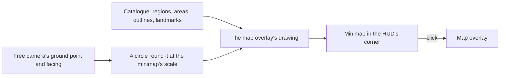

# Minimap

This page builds on [exploring](/docs/proposals/genshin/exploring), whose map overlay draws the catalogue, and the [world map](/docs/genshin/world-map) it draws from. The game keeps a small map in the corner of its HUD the whole time a person is in the world, so they know where they stand without opening the full map. The world screen has no HUD yet; the minimap is its first piece.

## Decisions

- **One drawing of the catalogue, two views.** The minimap draws what the map overlay draws, the catalogue's regions, areas, outlines and landmarks, through the same drawing, cut to a circle round the camera and scaled to the game's minimap. A second drawing of the same data would drift from the first the day either changes.
- **Measured from the game's HUD.** Its size and place on the screen, its rim, whether it turns with the camera or keeps north up, the facing marker at its centre and its icons are read off a reference of the game's world HUD in the reader's language, as every screen is (the `genshin-parity` skill). Nothing is drawn from memory of the game.
- **The camera stands in for the character.** Until a character walks, the minimap's centre is the free camera's ground point and its marker the camera's facing; the character takes its place when it arrives, with no change to the minimap.
- **A HUD component of its own.** It is `Hud/Minimap` in the world package, props in and events out, and the world screen places it; clicking it opens the map overlay, and M still does.
- **Reachable without the world.** Its icons carry the landmarks' names for a screen reader, and opening the map from it is a button.

## How it works



## Scope

**Today:** the world screen has no HUD, and the only map is the overlay exploring adds.

**This adds:**

1. **A reference of the world HUD**, recorded or found, that the minimap is measured from.
2. **The minimap**, on the overlay's drawing, with its fixture and approved image.

## Key files

New files:

```text
packages/genshin-world/src/components/Hud/Minimap/Index.vue
packages/genshin-world/src/components/Hud/Minimap/Index.fixture.ts
packages/genshin-world/src/components/Hud/Minimap/Index.reference.ts
```

## Sources

- The game's world HUD, from a public recording or a clip the user records, named in `ParityReferenceMap`.
