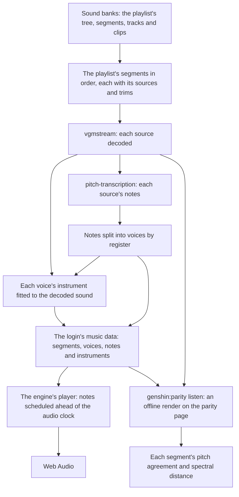

# Music

The login screen plays music, and ours is silent. This page re-derives that music the way [scene derivation](/docs/proposals/genshin/scene-derivation) re-derives a scene. The game's audio is a reference, read locally from the installed game and never shipped. What ships is ours: the playlist's structure, the notes, each instrument's fitted parameters, and a synthesizer that plays them. The login comes first, and the same tools later serve every other piece of the game's music.

## What is established

- **The game keeps its audio in Wwise packages.** `GenshinImpact_Data/StreamingAssets/AudioAssets` holds Audiokinetic Wwise's packages (`.pck`). The `Banks` packages hold the sound banks, whose hierarchy says what plays when. The `Music` packages hold the music's sounds, a couple of thousand of them, each named only by a number. A sound is Wwise's own Vorbis, which vgmstream decodes. The readers are built: `parseAudioPackageHeader`, `readSoundBankMusicObjects` and `parseMusicHierarchy` read each track's clips, each segment's length and cues, and each playlist's tree ([game data formats](/docs/genshin/game-data-formats)).
- **The login's music is found, and it is exact.** `genshin:assets music` matches a recording against every music sound by its pitch classes, window by window ([derived assets](/docs/genshin/derived-assets)). Over a four-minute recording of the login's title, two sounds hold every window, each with its offset advancing in step with the recording. Their segments sit in one playlist. Its tree is a continuous sequence that loops forever: a first piece of 104 seconds, a silent segment of about ten seconds, a second piece of about 93 seconds with its last two and a quarter seconds trimmed, and the rest again. That predicts the recording's handoffs to a tenth of a second.
- **The transcription carries the music.** Spotify's Basic Pitch hears about a thousand notes in the first piece and about six hundred in the second. Rendered as plain tones, their pitch classes agree with the game's audio frame by frame at between eight and nine tenths, on a scale where an unrelated track scores about three tenths. The pieces sit in A minor and C major, with no sharps. A spectrogram shows three layers: a sustained bass struck every few seconds, a moving middle line, and a melody above it, played with rubato, so the transcription's own timings stand rather than a grid.

## Decisions

- **Nothing of the game's audio ships.** No sound, sample or recording of the game's enters the repository or a build, in any format. The structure, the notes and the instruments' parameters are written by our own fits, as the scene's kits are, and the browser synthesizes the sound. A transcription is a re-derivation in the same sense a traced logo is: our own data, measured from the reference.
- **The structure is exact.** Segment lengths, trims, the rest between pieces and the playlist's order come from the sound banks, never from a recording. A recording measures only what the banks do not hold.
- **The notes are measured.** The score is the game's own decoded audio transcribed by [pitch-transcription](/docs/pitch-transcription), our absorption of Basic Pitch. A recording is never transcribed when the game's sound is to hand, since a recording carries the interface's sounds and a codec's losses.
- **Every instrument is fitted, never chosen.** A voice's harmonics, envelope and level are measured from the game's audio at its own notes: each harmonic's amplitude against the fundamental, the time to its peak, the level it settles to, how fast it settles, and how fast it fades after the note ends, each the median over the voice's notes. A value with no measurement behind it is not shipped, as on every screen.
- **Voices by register first.** The first fit splits the notes into a low, a middle and a high voice at fixed pitches, matching the spectrogram's three layers, so each register gets one fitted timbre. Telling instruments apart within a register — a harp from a piano in the same octave — needs a separation of its own, and waits until the listening score says register is the largest loss.
- **Our own synthesizer, in the engine.** Web Audio plays each note as an oscillator over its instrument's harmonics, through a gain that follows its envelope. A player schedules notes a couple of seconds ahead of the audio clock and loops the playlist. It is game-agnostic, so it belongs in `genshin-engine`; the login's score and instruments are the world's data.
- **Measured by a listening score, approved by ear.** `genshin:parity listen` renders our music offline on the parity page, through the same player the login uses, and scores each segment against the game's decoded sound. Two numbers come back: the pitch-class agreement, and a spectral distance in decibels per band, which charges timbre and loudness. The report is committed beside the parity scores. The session cannot hear; the numbers say what changed, and the user's ears say whether it sounds right.
- **It starts with the reader's first click.** The game plays its music as the login appears. A browser refuses to start sound before the page is clicked, so ours starts on the first click — the title's own — and follows the game's playlist from its start.

## How it works

## Build order

1. **The fit.** A step of `genshin:assets fit` resolves the login's playlist from the banks, decodes its sources, transcribes them, splits the voices and fits their instruments, and writes the login's music data into the world package. It is `pitch-transcription`'s first consumer, so `scripts` takes the package and TensorFlow.js with it.
2. **The player.** The engine's instrument, note and segment types and its player, with the login's music played from a component of the login screen that renders nothing.
3. **The listening score.** `genshin:parity listen`, its committed report and its toolbox row.
4. **The passes the score orders.** Reverb, the room the game's mix is heard in; instruments separated within a register; and the dynamics within a note the median envelope flattens. Each is taken only when the score ranks it the largest loss.

## What this does not propose

- **Sound effects.** The door's opening, the clicks and the wind are sounds rather than music, and each is a page of its own when its turn comes.
- **Streaming or caching the game's audio**, in development or anywhere else. The parity page reads the decoded sound only to score against it, as the witness reads the exports.

## Key files

| File                                                             | Role after the change                                       |
| :--------------------------------------------------------------- | :---------------------------------------------------------- |
| `scripts/src/services/genshinAssets/parseMusicHierarchy.ts`      | The sound banks' music read: tracks, segments and playlists |
| `scripts/src/services/genshinAssets/matchGameMusic.ts`           | Which music sound a recording plays                         |
| `scripts/src/services/genshinAssets/DerivedAssetComponentMap.ts` | The login's playlist named beside its roots                 |
| `packages/genshin-world/src/components/Login/Screen/Index.vue`   | Where the login's music plays                               |

## Sources

- [Wwise SoundBank and package formats](https://github.com/bnnm/wwiser), bnnm's wwiser — the reference parser for Wwise's banks, read to confirm the track's clips and the playlist's items, field by field, at the banks' version.
- [vgmstream](https://github.com/vgmstream/vgmstream) — the decoder for Wwise's Vorbis, pinned in the scripts' cache.
- [Autoplay guide for media and Web Audio APIs](https://developer.mozilla.org/en-US/docs/Web/Media/Guides/Autoplay), MDN — why sound waits for the reader's first click.
