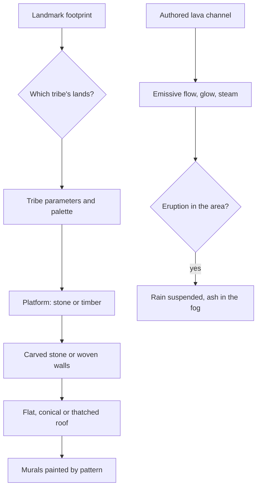

# Natlan

This region is built on [terrain](/docs/proposals/genshin/terrain), [vegetation](/docs/proposals/genshin/vegetation), [water](/docs/proposals/genshin/water), [sky and time](/docs/genshin/sky-and-time) and [weather](/docs/proposals/genshin/weather), authored by the [reference board](/docs/proposals/genshin/reference-board)'s method. Natlan is the nation of the Pyro Archon, its culture drawn from pre-Columbian America, sub-Saharan Africa and Oceania. It lies beyond the west side of Sumeru's desert and is shaped by volcanism: hot springs, lava fields and a great volcano. Its people are six tribes living beside dragons, and each tribe's lands look distinct. This is the region where one kit takes the most variants.

## Decisions

- **Volcanism as material and light.** Lava is an emissive flow material on authored channels, with its glow in bloom and light spilling on the rock around it. Basalt and ash are ground layers. Steam rises from vents and springs. Eruptions are an area weather that suspends rain, as the game's volcano does.
- **Six tribes, one kit, six variants.** The Natlan kit builds on:
  - a stone or timber platform
  - walls of carved stone or woven panels
  - flat, conical or thatched roofs
  - murals and graffiti painted by pattern

  Each tribe is a set of parameters and a palette:
  - the People of the Springs: waterfalls and pools
  - the Flower-Feather Clan: bright canyon colours
  - the Scions of the Canopy: high trees
  - the Children of Echoes: canyon terraces
  - the Collective of Plenty: markets and forges
  - the Masters of the Night-Wind: dark forest

  They are tuned per tribe against the board's captures.

- **A saturated palette.** Red rock, orange and gold flowers, turquoise springs and green canopy, painted with the strongest grade of any region.
- **Landmarks.** The Stadium of the Sacred Flame, Ochkanatlan, Coatepec Mountain, the Ancient Sacred Mountain and the tribes' halls are landmark-tier.

## How it works



## Areas

The catalogue holds Natlan's areas as the game names them: Toyac Springs, Tequemecan Valley, Coatepec Mountain, Basin of Unnumbered Flames, Tezcatepetonco Range, Quahuacan Cliff, the Ancient Sacred Mountain, Atocpan, Easybreeze Holiday Resort and Ochkanatlan. Subareas include each tribe's lands, from "People of the Springs" to "Masters of the Night-Wind", the Stadium of the Sacred Flame, Tecoloapan Bay, Ameyalco Waters, Colorfall Cliffs, Sulfurous Veins, Huitztli Hill, Teticpac Peak, Fallingstar Fields, the Ancestral Temple, Easybreeze Market and Castle Joquiratto.

## Build order

1. **Toyac Springs** and the People of the Springs, where the game enters Natlan.
2. **The Stadium of the Sacred Flame** and the nearby tribes.
3. **Coatepec Mountain** and the lava fields, then each tribe's lands in turn.
4. **Ochkanatlan**, then the rest in the catalogue's order.

## Capture checklist

Toyac Springs' pools and falls, each tribe's central settlement, the Stadium of the Sacred Flame, Coatepec Mountain from a distance, a lava field at night, Colorfall Cliffs, and a painted mural up close.

## Key files

| File                                                      | Role after the change                                   |
| :-------------------------------------------------------- | :------------------------------------------------------ |
| `packages/genshin-engine/src/noise/createSimplexNoise.ts` | The detail noise of the volcanic ground and the canyons |

New files:

```text
apps/web/public/genshin/natlan.json
packages/genshin-engine/src/kits/natlan/   ← the tribe-variant building kit, murals, lava channels
```

## Sources

- [Natlan](https://genshin-impact.fandom.com/wiki/Natlan), Genshin Impact Wiki: west of Sumeru's desert, hot springs from volcanic activity, six tribes, and its areas and subareas.
- [Weather](https://genshin-impact.fandom.com/wiki/Weather), Genshin Impact Wiki: rain interrupted by the volcano's eruptions and resuming afterward.
- [The setting of Genshin Impact](https://en.wikipedia.org/wiki/Teyvat), Wikipedia: Natlan drawn from pre-Columbian America, sub-Saharan Africa and Oceania.
