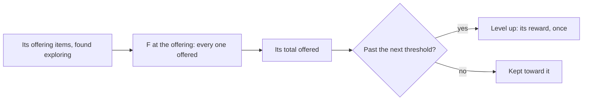

# Offering systems

Beside the Statues of The Seven, many areas keep an offering of their own: the Frostbearing Tree in Dragonspine, the Sacred Sakura on Narukami Island, the Lumenstone Adjuvant in the Chasm's mines, Vanarana's Tree of Dreams, the Amrita Pool, the Fountain of Lucine, the Votive Rainjade, Tona's Flame and the Throne of the Primal Fire in Natlan, the Temple of Space's Memory Core and Snezhnaya's Shadow Realm Analyzer. Each takes items found exploring its place and gives rewards for levels, as a statue does for Oculi. They are one rule over different items, so this page is that rule; it waits on the [Statues of The Seven](/docs/proposals/genshin/statues-of-the-seven), whose levelling it shares.

## Decisions

- **Everything is offered at once.** Interacting with the offering takes every one of its offering items the bag holds, rather than one at a time as a statue takes Oculi.
- **Levels at thresholds, each with its reward.** The offering rises a level for each threshold its total offered passes, and gives each level's reward once: a level's items, its gadget's blueprints, its Primogems and whatever else the wiki lists for that offering. Each offering's thresholds and rewards are read from its table where the dump holds one, and from the wiki's page of it where it does not.
- **Its items are found exploring its place.** Each offering's items stand at the [spawned places](/docs/proposals/genshin/spawned-places) or come from its region's quests, as the wiki lists for each.
- **What a level unlocks is its region's.** A level that changes the place itself, such as a stronger Lumenstone Adjuvant, belongs to its region's page, which reads the offering's level.
- **One offering at a time, as its region is built.** Each is written with its region, on this rule.

## How it works

## Scope and order

**Today:** no offering stands in the world.

**This adds, in order:**

1. **The rule**, with the Frostbearing Tree, Dragonspine being Mondstadt's.
2. **Each region's offerings**, with its region.

## Data and measures

- **Read from the game's tables and the wiki:** each offering's items, thresholds and rewards.
- **Placed by the spawned places:** where each offering's items stand.

## Key files

| File                                                                           | Role after the change                     |
| :----------------------------------------------------------------------------- | :---------------------------------------- |
| `packages/genshin-world/src/services/interaction/computeInteractionPrompts.ts` | Lists an offering in reach to offer to    |
| `packages/genshin-world/src/services/inventory/addInventoryItem.ts`            | The bag the offering items are taken from |
| `packages/genshin-world/src/models/world/LandmarkKind.ts`                      | Gains the offering                        |

## Sources

- [Offering System](https://genshin-impact.fandom.com/wiki/Offering_System), Genshin Impact Wiki: each region's offerings, every item offered at once unlike a statue, and each one's levels and rewards.
