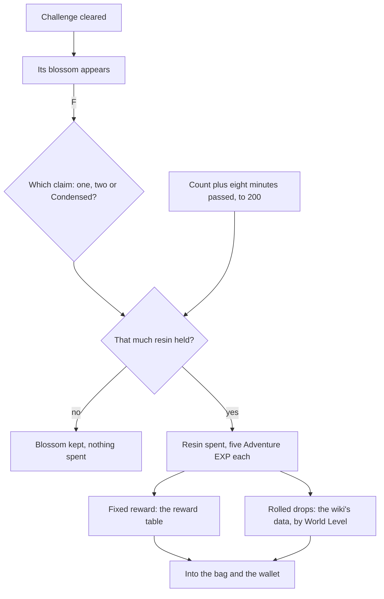

# Original Resin

The game lets anyone clear a ley line outcrop, a domain or a boss as often as they like, but the reward is claimed only by spending Original Resin. This page is that resin and that claim, which every resin-priced challenge shares: each challenge's own page spawns what is claimed, and this page claims it. It builds on the [inventory](/docs/genshin/inventory)'s wallet and on the [Adventure Rank](/docs/proposals/genshin/adventure-rank), whose EXP and World Level a claim reads.

## Decisions

- **One every eight minutes, to 200.** Resin regenerates by one every eight minutes while below 200, and stops at it. It is kept as the count and the moment it last changed, and read as that count plus the eight minutes passed since, so it fills while the page is closed as the game's fills while offline, with no timer running.
- **Past the cap only by hand.** Fragile Resin restores 60, and so do Primogems, up to six times a day at 50, 100, 100, 150, 200 and 200, Primogems the world gives and never sells. Refilled resin may pass 200, to 2,000 at most. Nothing is bought with money.
- **The claim, per challenge.** A cleared challenge leaves its blossom: a [ley line outcrop](/docs/proposals/genshin/ley-line-outcrops)'s Ley Line Blossom, a [domain](/docs/proposals/genshin/domains)'s Petrified Tree or a [boss](/docs/proposals/genshin/bosses)'s Trounce Blossom. F on it offers the claim at the challenge's price: 20 resin for a ley line or a domain, or 40 for two claims at once, or one Condensed Resin for three; 40 for a normal boss; and 30 for a weekly boss's first three claims a week, 60 after. A challenge cleared but not claimed gives nothing.
- **Condensed Resin holds 60.** It is crafted from 60 Original Resin at the crafting bench ([crafting](/docs/proposals/genshin/crafting)), at most five held, and claims three rewards at a ley line or a domain but never at a boss.
- **Five Adventure EXP a resin.** Every resin spent on a claim gives five Adventure EXP; resin crafted into Condensed Resin gives none until the Condensed Resin is spent.
- **Fixed rewards are read, rolled drops are the wiki's.** A claim's fixed reward is its `rewardId` in the game's reward table. What a claim rolls, its artifacts, materials and their counts, is drawn on a server whose drop tables the client never receives, so it is the wiki's drop data, as the [enemies](/docs/genshin/enemies)' drops already are. Both scale by the World Level or the domain's level the claim was made at.

## How it works

## Scope and order

**Today:** the wallet counts Mora, Primogems, the Fates and the wish's returns; bosses drop nothing and nothing spends resin.

**This adds, in order:**

1. **Original Resin**, its regeneration and its count on the map, where the game shows it.
2. **The claim**, with the first challenge that spawns a blossom.
3. **Refills**, from Fragile Resin and Primogems.
4. **Condensed Resin**, with the crafting bench.

## Data and measures

- **Read from the game's tables:** each claim's `rewardId` rows of `RewardExcelConfigData`, and the blossoms' rows of `BlossomChestExcelConfigData` for the ley lines' and bosses' claims.
- **Read from the wiki:** each challenge's rolled drops by World Level, as the enemies' are read.
- **Measured:** nothing; the claim's dialog and the map's resin count are laid out by the [recreation passes](/docs/proposals/genshin/recreation-passes).

## Key files

| File                                                                           | Role after the change                         |
| :----------------------------------------------------------------------------- | :-------------------------------------------- |
| `packages/genshin-world/src/models/inventory/Currency.ts`                      | Gains Original Resin                          |
| `packages/genshin-world/src/models/inventory/Wallet.ts`                        | Keeps resin as its count and when it changed  |
| `packages/genshin-world/src/services/interaction/computeInteractionPrompts.ts` | Lists a blossom in reach as a claim           |
| `packages/genshin-world/src/components/Map/Overlay/Index.vue`                  | Shows the resin count at the map's top        |
| `packages/genshin-world/src/services/enemy/computeEnemyDrops.ts`               | Its bands, which a claim's rolled drops share |

## Sources

- [Original Resin](https://genshin-impact.fandom.com/wiki/Original_Resin), Genshin Impact Wiki: claims at ley line outcrops, domains and bosses and their prices, five Adventure EXP a resin, one every eight minutes to 200 with the timer only below it, refills of 60 from Fragile Resin or Primogems at their six prices, and the cap of 2,000.
- [Condensed Resin](https://genshin-impact.fandom.com/wiki/Condensed_Resin), Genshin Impact Wiki: crafted from 60 resin, five held at most, three rewards at once, and never at a boss.
- [Normal Bosses](https://genshin-impact.fandom.com/wiki/Normal_Bosses) and [Weekly Bosses](https://genshin-impact.fandom.com/wiki/Weekly_Bosses), Genshin Impact Wiki: the Trounce Blossom, 40 resin, and 30 for the first three weekly claims.
- [AnimeGameData](https://gitlab.com/Dimbreath/AnimeGameData), the community's per-patch dump: the reward and blossom tables, and no drop table, which stays on the game's servers.
