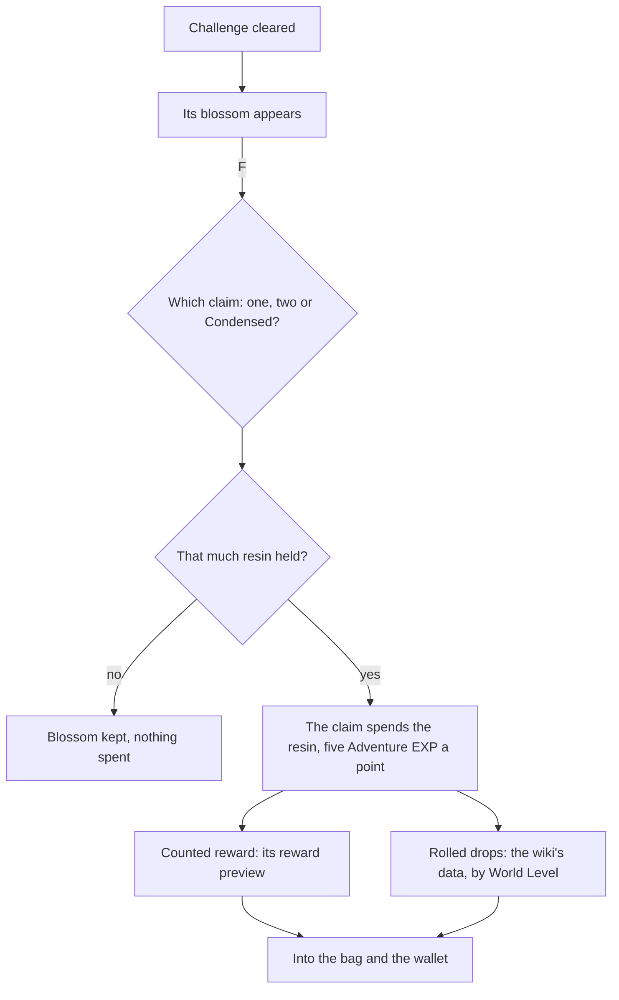

# Original Resin

The game lets anyone clear a ley line outcrop, a domain or a boss as often as they like, but the reward is claimed only by spending Original Resin. The resin, its regeneration, its refills and a claim's price and Adventure EXP are [built](/docs/genshin/original-resin). This proposal keeps what is unbuilt: the blossom each challenge leaves and its claim offer, the rewards a claim gives, and Condensed Resin. Each challenge's own page spawns the blossom, and the claim here spends the resin for it.

## Decisions

- **A cleared challenge leaves its blossom.** A [ley line outcrop](/docs/proposals/genshin/ley-line-outcrops)'s Ley Line Blossom, a [domain](/docs/proposals/genshin/domains)'s Petrified Tree or a [boss](/docs/proposals/genshin/bosses)'s Trounce Blossom. F on it offers the claim at the challenge's price: 20 resin for a ley line or a domain, 40 for two claims at once, or one Condensed Resin for three; 40 for a normal boss; and 30 for a weekly boss's first three claims a week, 60 after. A challenge cleared but not claimed gives nothing. The single-claim prices are built as `computeBlossomClaimResin`.
- **Condensed Resin holds 60.** It is crafted from 60 Original Resin at the crafting bench ([crafting](/docs/proposals/genshin/crafting)), at most five held, and claims three rewards at a ley line or a domain but never at a boss.
- **Previews are read, the rest of the roll is the wiki's.** What a claim rolls is drawn on a server whose drop tables the client never receives. A count its reward preview gives is read; one the preview leaves blank, such as a boss's artifacts and materials, is the wiki's drop data, as the [enemies](/docs/genshin/enemies)' drops already are. Both scale by the World Level or the domain's level the claim was made at.
- **A claim's rewards are its reward preview, drawn by the challenge that owns them.** The blossom tables name no reward id the reward table holds, but a ley line's refresh row lists one `RewardPreviewExcelConfigData` row per World Level, which matches the wiki's table at every level checked (Mondstadt's Blossom of Wealth pays 12,000 Mora at World Level 0 and 60,000 from World Level 6). A boss's preview rows name its items without counts, so its counts are the wiki's. The claim takes the challenge's draw as a function, so one rule pays a ley line's preview and a boss's wiki counts alike.
- **The resin pays the Adventure EXP, the grant the Companionship EXP.** A preview row lists Adventure EXP (item 102) and Companionship EXP (item 105) beside its items; the claim leaves both out of what it draws, since the resin already pays five Adventure EXP a point and the [companionship](/docs/genshin/companionship) grant pays the deployed team.
- **Fragile Resin is used from the bag.** Its use restores 60 Original Resin, the refill rule the [as-built page](/docs/genshin/original-resin) already has, and it waits on the [inventory](/docs/genshin/inventory)'s using of an item.

## How it works

## Scope and order

**Built:** the resin's count, its regeneration, its refills and a claim's price and Adventure EXP, on the [as-built page](/docs/genshin/original-resin). Also built: a blossom's ways to pay (`computeBlossomClaimOffers`) and a Condensed Resin's spend for three claims (`spendCondensedResin`).

**This still adds, in order:**

1. **A blossom's claim as one rule.** Move the draw of a reward's items to a count in its range out of `services/commission/takeCommissionClaim.ts` into `packages/genshin-world/src/services/reward/drawRewardItems.ts`, and use it there and in `services/expedition/claimExpedition.ts`, whose loop draws the same way. Add `packages/genshin-world/src/services/originalResin/claimBlossom.ts`: for a `BlossomClaimOffer` at a `BlossomKind`, it pays with `claimOriginalResin` where the offer takes resin or `spendCondensedResin` where it takes a Condensed Resin, then calls the challenge's `drawReward: () => ItemCount[]` once for each of the offer's `claimCount`, leaving out `ADVENTURE_EXP_ITEM_ID` and Companionship EXP (`COMPANIONSHIP_EXP_ITEM_ID`, 105, added to `services/originalResin/constants.ts`). Mora (`MORA_ITEM_ID`) goes into the wallet and every other item into the bag through `addInventoryItem`, and the whole claim is refused with nothing spent where the bag cannot take every item, as `claimExpedition` refuses. It returns the Adventure EXP, the bag and the wallet after the claim, or undefined where the offer is not paid. Test: `packages/genshin-world/src/services/originalResin/claimBlossom.test.ts`, asserting that a single 20-resin claim whose draw gives 12,000 Mora and 100 Adventure EXP adds the Mora and the resin's 100 Adventure EXP once, that a Condensed Resin offer takes one Condensed Resin and calls the draw three times, and that an offer the resin does not cover returns undefined.
2. **The claim's offer on F**, with the first blossom a challenge places ([ley line outcrops](/docs/proposals/genshin/ley-line-outcrops) or [bosses](/docs/proposals/genshin/bosses)): its prompt row through `computeInteractionPrompts`, its offers from `computeBlossomClaimOffers` shown to choose from, Condensed Resin's among them at a ley line or a domain, and `claimBlossom` on the one chosen.

## Data and measures

- **Read from the game's tables:** a ley line's claim by World Level from the `RewardPreviewExcelConfigData` rows its refresh row lists, which the dump holds. The blossoms' rows of `BlossomChestExcelConfigData` name each blossom's chest gadget, not a reward, so they are not read for it.
- **Read from the wiki:** each challenge's rolled drops by World Level, as the enemies' are read.
- **Measured:** nothing; the claim's dialog is laid out by the [recreation passes](/docs/proposals/genshin/recreation-passes).

## Key files

| File                                                                           | Role after the change                         |
| :----------------------------------------------------------------------------- | :-------------------------------------------- |
| `packages/genshin-world/src/services/interaction/computeInteractionPrompts.ts` | Lists a blossom in reach as a claim           |
| `packages/genshin-world/src/services/enemy/computeEnemyDrops.ts`               | Its bands, which a claim's rolled drops share |

## Sources

- [Original Resin](https://genshin-impact.fandom.com/wiki/Original_Resin), Genshin Impact Wiki: claims at ley line outcrops, domains and bosses and their prices.
- [Condensed Resin](https://genshin-impact.fandom.com/wiki/Condensed_Resin), Genshin Impact Wiki: three rewards at once, and never at a boss.
- [Normal Bosses](https://genshin-impact.fandom.com/wiki/Normal_Bosses) and [Weekly Bosses](https://genshin-impact.fandom.com/wiki/Weekly_Bosses), Genshin Impact Wiki: the Trounce Blossom, 40 resin, and 30 for the first three weekly claims.
- [AnimeGameData](https://github.com/DimbreathBot/AnimeGameData), the community's per-patch dump: the reward table, and no drop table, which stays on the game's servers.
