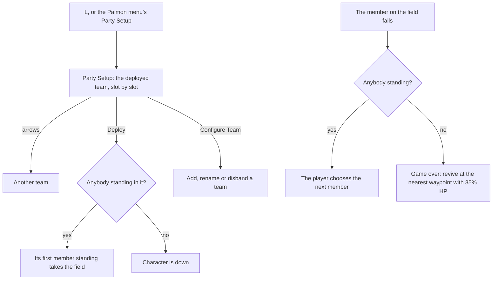

# Party

This page builds on the [party](/docs/genshin/party) as built: the teams, the deployed one and the member on the field, switched by `1` to `4` past the one second cooldown and never to a character who is down. It also builds on the [HUD](/docs/genshin/hud), whose portraits down the right show the deployed team, and on [combat](/docs/genshin/combat), whose damage makes a character fall.

## Decisions

- **Party Setup is a screen of its own on `L`.** It shows the deployed team, slot by slot, over the region's background, and arrows at its edges step between the teams. Configure Team lists every team with its name, members and elements, and adds or disbands one; Quick Setup picks members in order. The [screens](/docs/genshin/screens)' placeholder holds its shortcut until then.
- **Teams as the game keeps them.** The four default teams, Party 1 to 4, are renamed but never disbanded. A team added is named "Team Standing By" until renamed, at most fifteen are kept, and the deployed team is never disbanded. Disbanding a team before the deployed one keeps the deployed team deployed.
- **A burst on a switch.** `Left Alt` with a member's number switches to it and uses its Elemental Burst, as the game's controls bind it, once [combat](/docs/genshin/combat)'s bursts exist.
- **The choice of the next member and the game over screen.** The game plays the fall, lets nobody switch until it ends, then asks the player for the next member; once every member is down, the game over screen offers a revive at the nearest teleport waypoint with 35% HP. Until these screens are built, the world brings the next standing member in slot order onto the field and revives a fallen team at the nearest statue on its own, as the [party](/docs/genshin/party) page describes.
- **Elemental Resonance.** Two members of one element in a full team give that element's resonance, as the game's Team Bonus lists them; it is a party rule over the deployed team's elements, read by combat.
- **The party is kept between visits**, as the game keeps it on its server: the teams, the deployed one, the member on the field and who is down, beside the player's characters.

## How it works

## Scope

**Today:** the party's state and rules, switching on `1` to `4` and a pad's directions in play, the deployed team down the [HUD](/docs/genshin/hud)'s right, and the [character screen](/docs/genshin/character-screen) on `C`.

**This adds, in order:**

1. **Party Setup**, its screen and Configure Team, with the rules for adding, renaming and disbanding teams beside `deployPartyTeam` and `setPartyTeamCharacters`.
2. **The choice of the next member and the game over screen**, in place of the automatic next member and the statue's revive.
3. **Elemental Resonance**, once combat reads it.
4. **The party kept between visits**, in the browser as the [menu screens](/docs/proposals/genshin/menu-screens)' settings are, until an account keeps it.

## Key files

| File                                                                     | Role after the change                         |
| :----------------------------------------------------------------------- | :-------------------------------------------- |
| `packages/genshin-world/src/models/party/Party.ts`                       | The state Party Setup edits and the HUD reads |
| `packages/genshin-world/src/components/World/Screen/Index.vue`           | Fills Party Setup's screen slot               |
| `packages/genshin-world/src/services/screen/ScreenKindGameTextKeyMap.ts` | Party Setup's title, already the game's       |

## Sources

- [Party](https://genshin-impact.fandom.com/wiki/Party), Genshin Impact Wiki: Party Setup, Configure Team and Quick Setup, the four default teams, "Team Standing By", fifteen teams at most, the deployed team never disbanded, and the region's background.
- [Fallen Character](https://genshin-impact.fandom.com/wiki/Fallen_Character), Genshin Impact Wiki: the fall, nobody switching during it, the game over and the revive at the nearest waypoint with 35% HP.
- [Controls](https://genshin-impact.fandom.com/wiki/Controls), Genshin Impact Wiki: `Left Alt` with a member's number for a switch and a burst.
