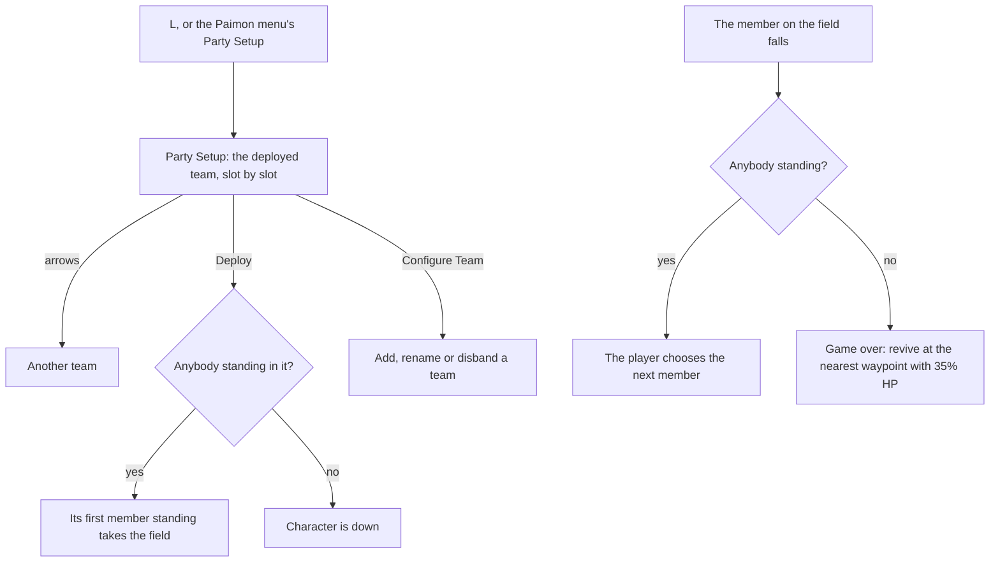

# Party

This page builds on the [party](/docs/genshin/party) as built: the teams, the deployed one and the member on the field, switched by `1` to `4` past the one second cooldown and never to a character who is down. It also builds on the [HUD](/docs/genshin/hud), whose portraits down the right show the deployed team, and on [combat](/docs/genshin/combat), whose damage makes a character fall.

## Decisions

- **Party Setup is a screen of its own on `L`.** It shows the deployed team, slot by slot, over the region's background, and arrows at its edges step between the teams. Configure Team lists every team with its name, members and elements, and adds or disbands one; Quick Setup picks members in order. The [screens](/docs/genshin/screens)' placeholder holds its shortcut until then.
- **Teams as the game keeps them.** The four default teams, Party 1 to 4, are renamed but never disbanded. A team added is named "Team Standing By" until renamed, at most fifteen are kept, and the deployed team is never disbanded. Disbanding a team before the deployed one keeps the deployed team deployed. Built as rules in `addPartyTeam`, `disbandPartyTeam` and `renamePartyTeam`.
- **The name of an added team is provisional.** "Team Standing By" is an English constant for now: the game's own words come from their text id in the decoded client ([game text](/docs/genshin/game-text)), and no text id for it is in the generated text yet.
- **A burst on a switch uses the burst once the member is on the field.** `Left Alt` with a member's number switches to it and uses its Elemental Burst, as the game's controls bind it, and a switch refused (a cooldown, a fallen member, an empty slot) uses none. The chord takes the press over from the plain number key, while `Left Alt` alone still shows the cursor. Built in the character's fixed step, which reads the press.
- **Elemental Resonance needs a full team.** Two members of one element in a full team give that element's resonance, as the game's Team Bonus lists them; `getElementalResonances` gives the list in the game's element order. The effects that change a stat, a hit, a reaction, a skill or the stamina spent are built, as the [party](/docs/genshin/party) page describes; the rest are listed under Elemental Resonance's effects in the scope.
- **The choice of the next member and the game over screen.** The game plays the fall, lets nobody switch until it ends, then asks the player for the next member; once every member is down, the game over screen offers a revive at the nearest teleport waypoint with 35% HP. Until these screens are built, the world brings the next standing member in slot order onto the field and revives a fallen team at the nearest statue on its own, as the [party](/docs/genshin/party) page describes.
- **The party is kept between visits**, as the game keeps it on its server: the teams, the deployed one, the member on the field and who is down, beside the player's characters.

## How it works

## Scope

**Today:** the party's state and rules, switching on `1` to `4` and a pad's directions in play, a burst on a switch with `Left Alt`, the teams added, renamed and disbanded as rules, Elemental Resonance as a rule with its built effects on the stats, the strikes, the reactions, the skills and the stamina, the deployed team down the [HUD](/docs/genshin/hud)'s right, and the [character screen](/docs/genshin/character-screen) on `C`.

**This adds, in order:**

1. **Party Setup's screen**, its Configure Team's screen over the rules above, and Quick Setup. The screen's layout is measured off the game's own Party Setup recording before its style is settled ([parity](/docs/genshin/parity)), and its approval is the user's.
2. **The choice of the next member and the game over screen**, in place of the automatic next member and the statue's revive.
3. **Elemental Resonance's effects that need a mechanism not built yet**, each one the party's or the combat's to add when the mechanism lands:
   - The affliction durations: Fervent Flames' Cryo, Soothing Water's Pyro, High Voltage's Hydro and Shattering Ice's Electro, each affecting the party member for 40% less time. The party members hold no elemental state and enemies' strikes apply none to them, so there is no duration to shorten. An aura's decay rate is set in `applyAura` with no party context, so the resonances must reach `applyElement` first.
   - High Voltage's Electro particle, 100% on Superconduct, Stellar-Conduct, Overloaded, Electro-Charged, Lunar-Charged, Quicken, Aggravate and Hyperbloom, on a 5 second cooldown. No reaction gives a particle yet, since an enemy drops energy only at its health thresholds, and no cooldown is kept for the team.
   - Enduring Rock's Moondrift clause. A Moondrift formed by Lunar-Crystallize nearby gives the same DMG and Geo RES as a shield does, and Moonsign is not built.
   - Sprawling Greenery's Lunar-Bloom, which is not a reaction here yet, and its Hyperbloom and Burgeon, which a Dendro Core's reactions give and no strike triggers yet.
4. **The party kept between visits**, in the browser as the [menu screens](/docs/proposals/genshin/menu-screens)' settings are, until an account keeps it.

## Key files

| File                                                                     | Role after the change                                |
| :----------------------------------------------------------------------- | :--------------------------------------------------- |
| `packages/genshin-world/src/models/party/Party.ts`                       | The state Party Setup edits and the HUD reads        |
| `packages/genshin-world/src/services/party/addPartyTeam.ts`              | The team rules Configure Team's add goes through     |
| `packages/genshin-world/src/services/party/disbandPartyTeam.ts`          | The team rules Configure Team's disband goes through |
| `packages/genshin-world/src/components/World/Screen/Index.vue`           | Fills Party Setup's screen slot                      |
| `packages/genshin-world/src/services/screen/ScreenKindGameTextKeyMap.ts` | Party Setup's title, already the game's              |

## Sources

- [Party](https://genshin-impact.fandom.com/wiki/Party), Genshin Impact Wiki: Party Setup, Configure Team and Quick Setup, the four default teams, "Team Standing By", fifteen teams at most, the deployed team never disbanded, and the region's background.
- [Fallen Character](https://genshin-impact.fandom.com/wiki/Fallen_Character), Genshin Impact Wiki: the fall, nobody switching during it, the game over and the revive at the nearest waypoint with 35% HP.
- [Controls](https://genshin-impact.fandom.com/wiki/Controls), Genshin Impact Wiki: `Left Alt` with a member's number for a switch and a burst.
- [Team Bonus](https://genshin-impact.fandom.com/wiki/Team_Bonus), Genshin Impact Wiki: each affliction duration, High Voltage's particle and its cooldown, and the Moondrift and Lunar-Bloom clauses.
