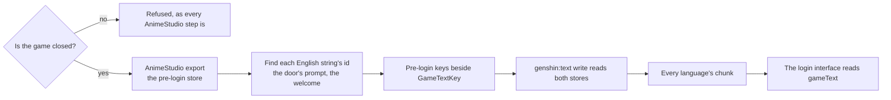

# Pre-login text

Built on [game text](/docs/genshin/game-text), which already serves the game's own words in fifteen languages by the id the game files them under. The opening reads nearly all of its words from it, the health notice, the login title, the account label and the status lines under the progress bar among them, since the text map carries them although the client shows them before it loads its data. Two do not appear in any text map: the door's prompt, "CLICK TO BEGIN", and the welcome card's "Welcome,". They live in a store of the client's own that no community dump carries, so `genshin-world` keeps them as the English client's words.

## How it would work

- **The store is read the way the derived assets are.** `runAnimeStudio` refuses while the game runs; the export lands under the parity directory with every other reference and is never committed.
- **The keys join the one inventory.** A pre-login string gets a `GameTextKey` member like any other, its value the store's own id, so a consumer cannot tell which store a string came from and the generator stays one command.
- **The words reach the interface the way the rest of its text does,** through the `gameText` prop the opening's host hands down.

## Scope

- The door's prompt and the welcome card's greeting, in every language the client ships.
- Not the splash logos: they are images, and stay traced.

## Key files

| File                                                              | Role after the change                               |
| :---------------------------------------------------------------- | :-------------------------------------------------- |
| `packages/genshin-world/src/services/login/constants.ts`          | Loses the prompt's and the welcome's English text   |
| `packages/genshin-world/src/components/Login/Interface/Index.vue` | Reads the prompt and the welcome from the game text |
| `packages/genshin-text/src/models/GameTextKey.ts`                 | Gains the pre-login strings                         |
| `scripts/src/services/genshinText/writeGameText.ts`               | Reads the pre-login store beside the text map       |
| `scripts/src/services/genshinAssets/runAnimeStudio.ts`            | Exports the store, refusing while the game runs     |
