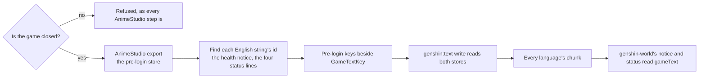

# Pre-login text

Built on [game text](/docs/genshin/game-text), which already serves the game's own words in fifteen languages by the id the game files them under. The opening's words are the exception today: the health notice and the four lines under the login screen's progress bar are shown before the client has loaded any data, so they live in a store of the client's own rather than the text map, and no community dump carries them. `genshin-world` keeps them as the English client's words.

## How it would work

- **The store is read the way the derived assets are.** `runAnimeStudio` refuses while the game runs; the export lands under the parity directory with every other reference and is never committed.
- **The keys join the one inventory.** A pre-login string gets a `GameTextKey` member like any other, its value the store's own id, so a consumer cannot tell which store a string came from and the generator stays one command.
- **The opening reads its language the way the page's status line does.** `genshin-world` takes the language its host resolves rather than resolving one of its own, so the opening, the page and the persona agree.

## Scope

- The health notice's title and paragraphs and the login screen's status lines, in every language the client ships.
- Not the splash logos: they are images, and stay traced.

## Key files

| File                                                                  | Role after the change                                                  |
| :-------------------------------------------------------------------- | :--------------------------------------------------------------------- |
| `packages/genshin-world/src/services/splash/constants.ts`             | Loses the health notice's English text; keeps the splash timings       |
| `packages/genshin-world/src/services/login/LoginStatusStepTextMap.ts` | Maps each status step to its `GameTextKey` rather than to English text |
| `packages/genshin-world/src/components/Splash/HealthNotice/Index.vue` | Reads its title and paragraphs from the game text                      |
| `packages/genshin-world/src/components/Login/Status/Index.vue`        | Reads its line from the game text                                      |
| `packages/genshin-text/src/models/GameTextKey.ts`                     | Gains the pre-login strings                                            |
| `scripts/src/services/genshinText/writeGameText.ts`                   | Reads the pre-login store beside the text map                          |
| `scripts/src/services/genshinAssets/runAnimeStudio.ts`                | Exports the store, refusing while the game runs                        |
