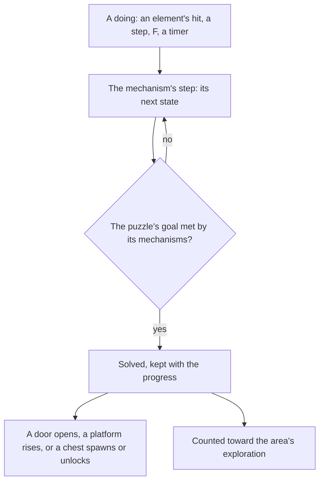

# Puzzles

Much of the game's exploration is puzzles: monuments lit by an element, Seelies led to their courts, timed challenges, sealed shrines, and every region's own devices. Solving one opens a door, raises a platform or spawns a chest. The mechanisms stand at the [spawned places](/docs/proposals/genshin/spawned-places), they are struck by the [character kits](/docs/proposals/genshin/character-kits), and they unlock the [chests](/docs/proposals/genshin/chests) beside them, so this page waits on all three.

## Decisions

- **A mechanism is a small state machine.** Each kind of mechanism is a deterministic step in the world, as an enemy's AI is, moved by the doings that reach it: a hit of an element through [combat](/docs/genshin/combat)'s rules, the character stepping on it, an interaction, or a timer on the fixed step. Its states are the wiki's description of the kind, and nothing else in the world knows its kind.
- **A puzzle is its mechanisms and its goal, written per puzzle.** Which mechanisms make one puzzle and what solving it does is the game's scene group, which runs on its servers, so each puzzle's wiring is written as data from the wiki's description of it and confirmed against a recording where the description leaves it open. A puzzle solved stays solved, kept with the player's progress, unless the wiki says it resets.
- **Elemental Monuments.** A monument lights when struck by its element, a reaction's included. Some stay lit once lit; others go out after their time. A puzzle of monuments is solved once all of them are lit together.
- **Seelies led home.** A Seelie moves along its route toward its court as the player follows it, and goes back to its start if it is not led home in time. Settled in its court it spawns its chest. Elemental Sight draws its trail ([Elemental Sight](/docs/proposals/genshin/elemental-sight)). Its route is the game's server path, so it is the walk on the ground between its fitted start and court until a recording measures its turns.
- **Time Trial Challenges.** Interacting with the challenge's marker starts its timer, and its targets, rings to pass, objects to strike or enemies to defeat, must all be done before it ends; done in time, it spawns its chest.
- **Shrines of Depths.** A shrine is opened with one of its region's Shrine of Depths keys, which the region's statues give ([Statues of The Seven](/docs/proposals/genshin/statues-of-the-seven)), and holds a Luxurious chest. Each region keeps its own keys.
- **A region's own mechanisms come with it.** Sumeru's ruins and Withering, Fontaine's devices, Natlan's and every other region's are each written on this framework by the page that builds the region.

## How it works

## Scope and order

**Today:** the world holds no mechanism.

**This adds, in order:**

1. **The framework**, with Elemental Monuments in Mondstadt.
2. **Seelies**, with Elemental Sight's trail.
3. **Time Trial Challenges.**
4. **Shrines of Depths**, with the keys the statues give.
5. **Each region's own mechanisms**, with its region.

## Data and measures

- **Read from the wiki:** each mechanism kind's states and each puzzle's wiring and effect.
- **Placed by the spawned places:** each mechanism's place, from the official map's marks of it.
- **Measured:** a Seelie's route and speed, a monument's time lit, and each challenge's limit where the wiki gives none, off recordings, provisional until then.

## Key files

| File                                                                           | Role after the change                           |
| :----------------------------------------------------------------------------- | :---------------------------------------------- |
| `packages/genshin-world/src/services/combat/aura/applyElement.ts`              | The element a hit lands on a mechanism with     |
| `packages/genshin-world/src/services/interaction/computeInteractionPrompts.ts` | A mechanism in reach to act on                  |
| `packages/genshin-world/src/models/world/RegionData.ts`                        | Gains each region's mechanisms and puzzles      |
| `packages/genshin-world/src/components/World/Screen/Index.vue`                 | Steps the mechanisms in reach on the fixed step |

## Sources

- [Puzzle](https://genshin-impact.fandom.com/wiki/Puzzle), Genshin Impact Wiki: the mechanisms of the open world and of each region, and what solving them does.
- [Elemental Monument](https://genshin-impact.fandom.com/wiki/Elemental_Monument), Genshin Impact Wiki: monuments lit by their element, reactions included, some for good and some for a time.
- [Seelie](https://genshin-impact.fandom.com/wiki/Seelie), Genshin Impact Wiki: Seelies led to their courts, returning if left, Elemental Sight's trail, and the chest a settled Seelie gives.
- [Time Trial Challenge](https://genshin-impact.fandom.com/wiki/Time_Trial_Challenge), Genshin Impact Wiki: the challenges, their limits and their rewards.
- [Shrine of Depths](https://genshin-impact.fandom.com/wiki/Shrine_of_Depths), Genshin Impact Wiki: shrines opened with their region's keys, each holding a Luxurious chest.
