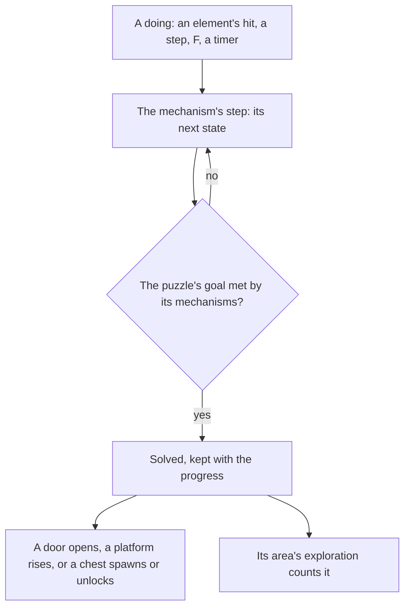

# Puzzles

Much of the game's exploration is puzzles: monuments lit by an element, Seelies led to their courts, timed challenges, sealed shrines, and every region's own devices. Solving one opens a door, raises a platform or spawns a chest. The mechanisms stand at the [spawned places](/docs/proposals/genshin/spawned-places), they are struck by the [character kits](/docs/proposals/genshin/character-kits), and they unlock the [chests](/docs/proposals/genshin/chests) beside them, so this page waits on all three. Its places and the state machines of the monument, the Seelie and the Time Trial Challenge are built, as the [as-built page](/docs/genshin/puzzles) records; what follows is what remains.

## Decisions

- **A mechanism is a small state machine.** Each kind of mechanism is a deterministic step in the world, as an enemy's AI is, moved by the doings that reach it: a hit of an element through [combat](/docs/genshin/combat)'s rules, the character stepping on it, an interaction, or a timer on the fixed step. Its states are the wiki's description of the kind, and nothing else in the world knows its kind.
- **A puzzle is its mechanisms and its goal, written per puzzle.** Which mechanisms make one puzzle and what solving it does is decided by its scene group, which the scene group export the other machine is making reads (`Lua/Scene/3`), so each puzzle's wiring is written as data from its group, the wiki's description confirming it where the group leaves it open. A puzzle solved stays solved, kept with the player's progress, unless the wiki says it resets.
- **The groups name what the map and the wiki do not.** A monument's element and a challenge's limit and targets are in no source the build holds: the official map's monument marks carry no element (only a third of them carry one other attribute, of three values), and the wiki's monument page names no element per place. Each is read from the mechanism's gadget in its group once the export lands; the recordings owed for them re-measure what the groups leave open.
- **Mondstadt's Seelie courts are the map's.** The official map marks thirty Seelie Courts (label 147, under its Experience category), all in Mondstadt, each 8 to 125 of the map's units from its nearest Seelie, and none in any other region. Each court is paired with one Seelie, closest pairs first, no court or Seelie taken twice, so thirty Seelies are led home and the rest rest where they stand until their groups name their courts. A Seelie is followed while the character stands within `SEELIE_FOLLOW_DISTANCE` of it, provisional until `seelie-led-home.mkv` measures it.
- **Elemental Monuments.** A monument lights when struck by its element, a reaction's included. Some stay lit once lit; others go out after their time. A puzzle of monuments is solved once all of them are lit together. Settled: the element that lights a monument is the strike's own or a reaction's, as the [puzzles page](/docs/genshin/puzzles) records; a timed monument counts its time from its last strike on its own clock. A puzzle whose monuments must be lit in a set order, such as the Minacious Isle sequence a Seelie shows on a pillar, is written with its own sequence as its goal, once its region's puzzles are wired.
- **Seelies led home.** A Seelie moves along its route toward its court as the player follows it, and goes back to its start if it is not led home in time. Settled in its court it spawns its chest. Elemental Sight draws its trail ([Elemental Sight](/docs/proposals/genshin/elemental-sight)). Its route is the game's server path, so it is the walk on the ground between its fitted start and court until a recording measures its turns.
- **Time Trial Challenges.** Interacting with the challenge's marker starts its timer, and its targets, rings to pass, objects to strike or enemies to defeat, must all be done before it ends; done in time, it spawns its chest.
- **Shrines of Depths.** A shrine is opened with one of its region's Shrine of Depths keys, which the region's statues give ([Statues of The Seven](/docs/proposals/genshin/statues-of-the-seven)), and holds a Luxurious chest. Each region keeps its own keys.
- **The map's labels settle each kind.** The official map gives each mark a label, and the label names the kind: the Seelie variants it names beside the Seelie (Electro and Warming) are Seelies, and each nation's shrine label is one Shrine of Depths kind. A mark's element, timing and wiring are not on the map, so those come from the wiki or a recording, never from the points.
- **A region's own mechanisms come with it.** Sumeru's ruins and Withering, Fontaine's devices, Natlan's and every other region's are each written on this framework by the page that builds the region.

## How it works



## Scope and order

**Today:** the [as-built page](/docs/genshin/puzzles) records what stands, and nothing is yet placed, drawn, struck or solved.

**This adds, in order:**

```text
scripts/src/services/genshinAssets/puzzles/toMonumentPlace.ts
```

1. **Mondstadt's Seelies led to their courts.** Add `SeelieCourt` to `PuzzleKind` (`packages/genshin-world/src/models/puzzle/PuzzleKind.ts`) and `SeelieCourt: [147]` to `PuzzleKindLabelIdsMap`, and run `pnpm -C scripts genshin:assets puzzles`, so the courts join the existing `generated/puzzles/mondstadt.json` through the same points pipeline. In the world, `services/puzzle/readMondstadtPuzzlePlaces.ts` imports that slice on demand as `services/gathering/readMondstadtGatheringPlaces.ts` does, and a new `services/puzzle/pairSeelieCourts.ts` pairs each court with one Seelie place, the closest pair first, none taken twice, giving a resting `Seelie` for each pair. `composables/useWorldPuzzles.ts` loads the places as `useGatheringPoints.ts` does, steps each Seelie through `stepSeelie` on the fixed step, reporting it followed while the character is within `SEELIE_FOLLOW_DISTANCE` (a provisional constant in `services/puzzle/constants.ts`), and `components/World/Puzzles/Index.vue` draws each Seelie at its point along its route as a small glowing stand-in and each court as a stand-in ring, queued for the user's eyes; it is mounted beside `World/Interactables` in `World/Session`. Test: `pairSeelieCourts.test.ts` (two courts and three Seelies pair closest first, the third Seelie left unpaired, and a court never taken twice).
2. **Elemental Monuments in Mondstadt, placed and struck**, once the scene group export lands. A new `toMonumentPlace.ts` joins each monument mark of the existing `generated/puzzles/mondstadt.json` to the nearest monument gadget of the Mondstadt groups, within the official map fit's residual for the region (`interactive-map/fit.json`), and `buildPuzzlePlaces.ts` builds the gadget's element, whether it is timed and its group id onto that place in the same slice; a mark with no gadget in reach is reported and left without one. In the world, `services/puzzle/readMondstadtPuzzlePlaces.ts` imports the slice on demand as `readMondstadtGatheringPlaces.ts` does, `composables/useWorldPuzzles.ts` makes each placed monument an `ElementalMonument` and steps it on the fixed step, and `components/World/Puzzles/Index.vue` draws each in a stand-in tint of its element, queued for the user's eyes. A kit's landed hit strikes the monuments within its area through `strikeElementalMonument`, and a group's monuments lit together solve it through `checkIsMonumentPuzzleSolved`. Test: `toMonumentPlace.test.ts` (a mark takes its nearest gadget's element and group, and a mark with none in reach is left without one).
3. **The other Seelies**: each court the map does not mark read from its group, once the export lands.
4. **Time Trial Challenges**: each challenge's limit and targets read from its group, then placed and started from its marker in the world. The chest a solve spawns is granted by the [chests](/docs/proposals/genshin/chests) opening.
5. **Shrines of Depths**, with the keys the statues give.
6. **Each region's own mechanisms**, with its region.

## Data and measures

- **Read from the wiki:** each mechanism kind's states, and each puzzle's effect where its group leaves it open.
- **Read from the scene groups:** each puzzle's wiring, each monument's element and whether it stays lit once lit, each Seelie's court and each challenge's limit and targets, once the export lands.
- **Placed by the spawned places:** built, the writer's slices by kind from the official map's marks ([as-built](/docs/genshin/puzzles)).
- **Measured:** a timed monument's time lit, a Seelie's route and speed, and each challenge's limit where the wiki gives none, off recordings, provisional until then. A timed monument's time lit is provisional at sixty seconds until a recording measures it.
- **Not in the map:** the map gives one point per Seelie and a court for thirty of Mondstadt's alone, and no target count for a challenge. The other courts and the targets are read from the mechanism's scene group before a Seelie or a challenge is placed.

## Key files

| File                                                                           | Role after the change                               |
| :----------------------------------------------------------------------------- | :-------------------------------------------------- |
| `packages/genshin-world/src/components/World/Character/Index.vue`              | The kit's landed hits strike the monuments in reach |
| `packages/genshin-world/src/services/interaction/computeInteractionPrompts.ts` | A mechanism in reach to act on                      |
| `packages/genshin-world/src/models/world/RegionData.ts`                        | Gains each region's mechanisms and puzzles          |
| `packages/genshin-world/src/components/World/Session/Index.vue`                | Steps the mechanisms in reach on the fixed step     |

## Sources

- [Puzzle](https://genshin-impact.fandom.com/wiki/Puzzle), Genshin Impact Wiki: the mechanisms of the open world and of each region, and what solving them does.
- The Elemental Monument and Minacious Isle sequence sources are the [puzzles](/docs/genshin/puzzles) page's, which the monument's state machine is built from.
- [Seelie](https://genshin-impact.fandom.com/wiki/Seelie), Genshin Impact Wiki: Seelies led to their courts, returning if left, Elemental Sight's trail, and the chest a settled Seelie gives.
- [Time Trial Challenge](https://genshin-impact.fandom.com/wiki/Time_Trial_Challenge), Genshin Impact Wiki: the challenges, their limits and their rewards.
- [Shrine of Depths](https://genshin-impact.fandom.com/wiki/Shrine_of_Depths), Genshin Impact Wiki: shrines opened with their region's keys, each holding a Luxurious chest.
