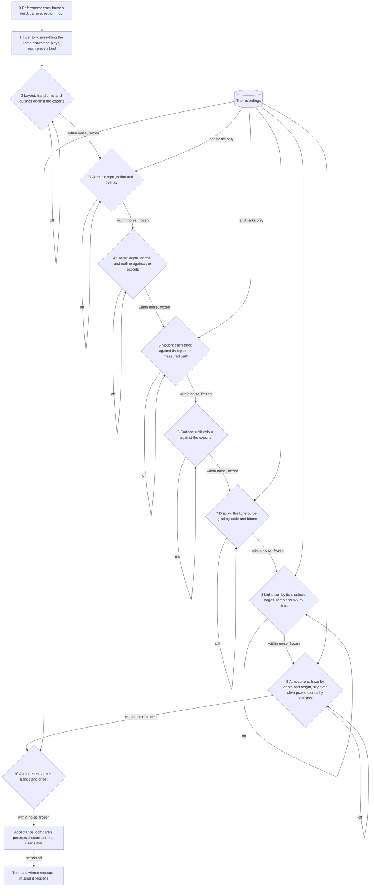

# Recreation passes

This page is the order a Genshin screen is rebuilt in, built on the [scene derivation](/docs/genshin/scene-derivation)'s three kinds of information and its witness render, and on the [parity](/docs/genshin/parity) loop's commands. The login scene has been worked for a long time by one loop: change something, shoot the whole frame, score it against a recording, rank every term of its error by the most it could recover, and work the largest. Each turn of that loop moves the frame by hundredths of its perceptual score, and the loop does not converge, because every unknown is judged through every other one:

- **A placement read as a haze.** By day the stone twenty metres up and some way out read twice as bright as the recording's, which the light and the haze were solved against pass after pass. The light map of `rank` found it on two towers standing where the recording shows sky: a placement that no light or haze could ever fix, absorbed by both.
- **A light traded for a haze.** Solved free, the light went below none to cancel a haze too bright over the far stone. Two unknowns landing in one score settled at whatever hid both.
- **Random content against a pixel score.** The game's cloud layer, ported from its own program and drawn over its own textures, scored the frame worse at every setting, as the particle clouds did before it: clouds the game scatters at random can never win a score comparing pixels, whatever their amount.

The interface did not have this problem. Its pieces are placed from the game's own rect tree, moved by its own clips, and compared over the recording's own frame with everything else held, so each difference points at the one piece that caused it, and it reached a few tenths of a percent in a handful of passes. This proposal runs every part of a screen the way the interface runs.

## Decisions

- **Passes in dependency order, each answering one kind of unknown.** An unknown is answered after everything it depends on and before anything that depends on it: what exists, where it stands, the camera that sees it, its shape, its motion, its surface, the transform from scene colour to the screen, the light on it, the air around it and the sounds it makes. A later pass's solve absorbs an earlier one's error, so a pass is never begun on a red pass before it.
- **Each pass has its own measure, in screen units at the references' cameras.** A placement is measured in metres against the exports' transforms and in pixels where it lands, a shape by its depth, normal and outline against the exports' drawn at the same camera, a surface by its unlit colour against theirs, a sound by its bands' envelopes against the game's own sound. No pass is judged by the frame's score, which every other pass moves too.
- **A pass is done when its measure is within the reference's own noise, and then it is frozen.** Its gate is a threshold its measure must meet on every reference, and what it produced is held by a test (as the arrangement's cross-ratios already are), so no later pass may move it to make its own numbers better. A later pass that finds an earlier one wrong reopens that pass, never compensates for it.
- **The recording's colour enters only for what exists at run time.** Layout, shape, motion a clip holds and surface are the game's own data, so they are judged against the game's own exports through the witness render, aligned to the pixel and free of any light. A recording's camera, and any motion no clip holds (a flight a script drives, the walkway's rise), live only in that recording, and are read off it through the frozen layout alone: its landmarks located in the frame and its outlines overlaid, with no colour of the recording in the reading. The display transform, the light, the atmosphere and the sounds are set at run time, and only for them is the recording's colour consulted, each pass over a mask where only its own unknown moves the reading.
- **Random content is judged by its statistics.** Clouds, wisps and anything else the game scatters is matched by its cover by height, its size and its colour spread, never by a pixel score.
- **The frame's perceptual score is acceptance.** Once every gate holds, `compare` scores each reference and the user's eye checks it. A frame that still stands off names a pass whose measure missed something, which is the measure's defect to fix.
- **Ceilings order the work inside a pass, never across passes.** Within one pass, the items are worked largest first by what they could recover, as `rank` prices them; a term in a later pass waits for every earlier gate however large it is.

## How it works

The interface runs beside these as a pass of its own, placed from the rect tree, moved by its clips and compared over the recording's frame, as [parity](/docs/genshin/parity) describes.

### The passes

| Pass       | Its source of truth                                     | Its measure                                                                           | Tools today                                  | Missing                                                      |
| :--------- | :------------------------------------------------------ | :------------------------------------------------------------------------------------ | :------------------------------------------- | :----------------------------------------------------------- |
| References | The wiki, the data dumps, recordings                    | Each frame's build, camera, region and hour, written down                             | `fetch`, `frames`                            | Nothing                                                      |
| Inventory  | `extract`, `tree`, `inventory`, `behaviours`            | Every renderer, material, shader, texture, clip, sound and spawn named with its kind  | `genshin:assets` commands, `passes`          | Effects, clips and sounds in its checklist                   |
| Layout     | Placements, spawns, anchors and the rows scripts scroll | Metres against the exports' transforms, then pixels where placeholders' outlines land | `parts`, `passes`                            | Projected pixels and an outline score per family             |
| Camera     | Landmarks on the frozen layout                          | Reprojection error and the overlay's edge distance                                    | `pose`, `track`, `overlay`, `passes`         | Nothing                                                      |
| Shape      | Each mesh                                               | Depth, normal and outline per family against the exports at the same camera           | `rank`'s second table, shaded, `passes`      | Nothing                                                      |
| Motion     | Decoded clips, the rows scripts move                    | Each animated part's track against its clip, and fieldless motion against its measure | `clips`, `glide`, `film`, `passes`           | The walkway's rise and the glide's easing against the script |
| Surface    | Textures and materials                                  | Unlit colour per family against the exports                                           | `gbuffer`, `plan`, `passes`                  | Nothing                                                      |
| Display    | The post program, the grading tables, the post profile  | Which table, which curve and what bloom, before any light                             | `passes`                                     | The game's bloom, its fields named                           |
| Light      | The recordings, everything before held                  | The sun's direction by its shadows' edges, the ramp and sky by bins                   | `calibrate`                                  | A shadow-edge solve                                          |
| Atmosphere | The recordings, the emitters' anchors, the cloud layer  | Haze by depth and height, sky over its clear pixels, clouds by statistics             | `calibrate --haze`, `sky`, `cover`, `clouds` | The cloud layer's settings solve                             |
| Audio      | The game's sound banks, recordings to find each sound   | Each sound's octave bands over time and its onset; the music by `listen`              | The music tools, `sounds`, `fitSoundEffect`  | Its measure in `passes`                                      |

### Why it converges

Judged through the frame, each of the scene's unknowns is confounded by every other one, and fixing one re-prices the rest, so the work grows with the square of the unknowns and the loop can stall forever on a pair of them trading error. Judged by its own measure, each unknown is solved once against data that only it moves, most of them in closed form from exact data, and frozen: the work grows with the number of unknowns, and every pass's result stays true as later passes land. The interface is the case that already runs this way.

## The first run: the login

The login runs through every pass from its inventory as its measures land, each gate holding before the next pass begins. What each pass has in question there, a row shifted by a fitted value, a camera the old recordings may not share, a rise read by eye, a transform left out, suns set by hand, a cloud layer waiting on its settings and the sounds still unmatched, is that pass's item on the [roadmap](/docs/genshin/roadmap), in the passes' order. Windrise starts at the references the same way once the login's gates hold.

## Scope

The method needs the measures each pass lacks, each joining `genshin:parity passes` ([parity](/docs/genshin/parity)) as it lands, and they are the base every later scene stands on, so they are built before any further world page, in this order:

1. **Layout's projected diff.** Our transforms against the exports' in pixels where they land at each reference's pose, before any render.
2. **Display's solve.** Built: the uber pass's tone curve read from its program and drawn by the engine, its contrast solved on the light's plane and held by `passes`. The game's bloom is left, its fields still unnamed.
3. **Light's shadow edges.** The sun's direction solved on its shadows' edges over flat receivers.
4. **Atmosphere's cloud statistics.** The cloud layer's settings solved on the clouds' cover, sizes and colour spread.

Everything the passes already have is reused as it is, and each measure, once built, retires its row's gap in the toolbox.

## Key files

| File                                                                     | Role after the change                                                    |
| :----------------------------------------------------------------------- | :----------------------------------------------------------------------- |
| `scripts/src/services/genshinParity/passes/ParityPassMeasureMap.ts`      | Gains each pass's measure as it is built                                 |
| `scripts/src/services/genshinParity/shared/ParityReferenceMap.ts`        | The references every pass is judged over                                 |
| `packages/genshin-world/parity/witness/renderWitnessTargets.ts`          | Draws our parts' albedo beside the exports', for the surface's diff      |
| `scripts/src/services/genshinParity/witness/rankReferenceGains.ts`       | Orders the work inside a pass, never across passes                       |
| `scripts/src/services/genshinAssets/scene/DerivedAssetArrangementMap.ts` | The layout pass's frozen invariants, grown to every placement it settles |
| `scripts/src/services/genshinAssets/fit/fitSoundEffect.ts`               | The fit every matched sound goes through                                 |
| `packages/genshin-engine/src/post/createPostPipeline.ts`                 | Draws the display transform the display pass finds                       |

## Notes

- **A measure that passes while the frame still stands off is the measure's defect.** Acceptance reopens the pass whose measure missed it, and that measure is fixed before the pass is run again, so the next screen is not caught the same way.
- **A gate is the reference's noise, not zero.** A recording's compression and softness, an export's texels, a clip's sampling: each sets how close a measure can read, and a pass worked past it is polishing what no frame can show.
