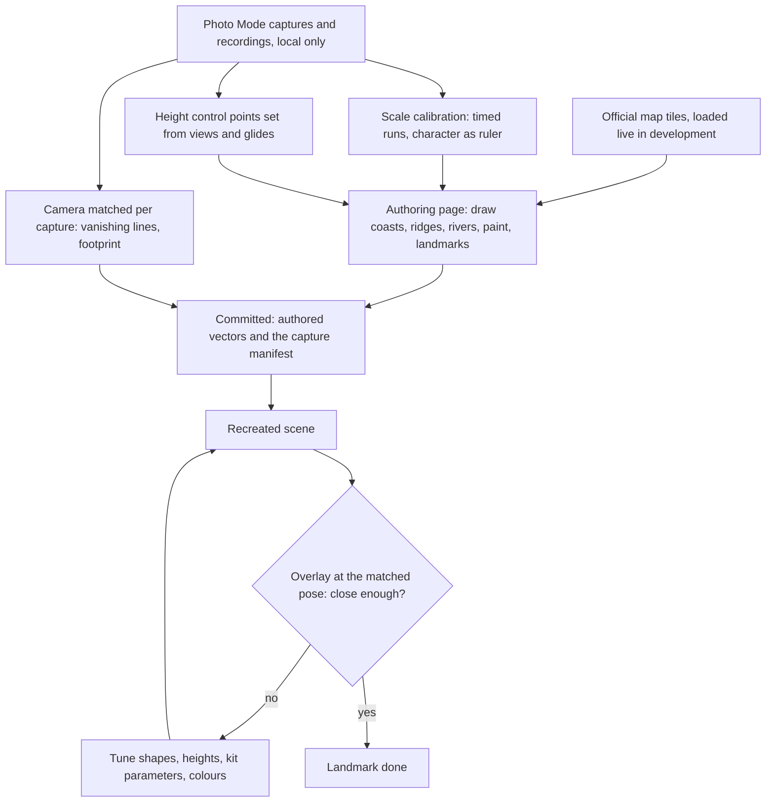

# Reference board

This page belongs to the [Genshin](/docs/proposals/genshin) program and is the method every region page follows. The recreation should look like the real region. That means the right coastline, the right hill in the right place at the right height, and a building whose roof pitch and window count match. That closeness does not come from the renderer. It comes from how carefully each place is referenced and checked. Fan recreations that got close share a method. The Liyue Harbor recreation in Unreal Engine 5 was scaled against the game's own measurements and built its trees and rocks procedurally. The full-continent builds laid their terrain out from the official map. Here that method becomes a repeatable routine for every region. The comparison step is borrowed from camera matching, where a scene is modelled from exactly the viewpoint a reference photograph was taken from.

## Decisions

- **The official map is the stencil.** A development-only authoring page loads the official interactive map's tiles live from HoYoLAB beneath a drawing layer. Over it, the author draws the [terrain's shapes](/docs/proposals/genshin/terrain-shapes) (coastlines, ridges, rivers, cliff bands and plateaus), the ground paint, and the position of every landmark and waypoint. Only the drawn vectors are saved into the [world map](/docs/genshin/world-map)'s data. The map's imagery is never downloaded into the repository, traced into a texture or served.
- **Scale is calibrated, not guessed.** The map's pixel scale is converted to metres once per region from in-game measurements: timed runs between two waypoints in a recording at a known movement speed, and a character's height used as a ruler in screenshots of doors, stairs and statues. The Liyue Harbor recreation scaled its city the same way. The calibration is kept with the region's data, together with how it was measured. The measurements check one affine transform from the official map's pixels to world metres for the whole continent, which this page adds to the [world map](/docs/genshin/world-map)'s catalogue, and any mismatch is resolved in that transform, never by moving one region.
- **Heights come from the reference.** The map shows relief as painted shading and gives no numbers, so each height control point is set from screenshots and recordings. The author looks along a ridge from a known waypoint, compares the heights of neighbouring peaks, and times a glide from a summit. Each point records which reference it was set from.
- **A fixed capture routine per landmark.** Each landmark is photographed in the game's Photo Mode with the UI and the character hidden, at noon with clear weather, and again at dusk. The shots are:
  - four views from the compass points at a middle distance
  - one high view from a nearby peak or a glide
  - close views of materials: roof, wall, ground and foliage
  - a recording of a slow walk around it, so its footprint can be paced out

  Areas get the same routine at their viewpoints and waypoints. The game saves Photo Mode shots in the `ScreenShot` folder beside the install.

- **The board lives outside the repository.** Captures are kept in a local folder, one directory per region, area and landmark, which the authoring page reads from disk in development. They are HoYoverse's images, so they are looked at and never committed, uploaded or served. The repository holds only a manifest: each capture's name, the landmark it shows, the hour and weather, and its matched camera pose.
- **Every capture gets a matched camera pose.** Before a landmark is modelled, each of its compass views is matched to a camera. Its vanishing lines give the orientation and field of view, as fSpy does for a photograph, and the position is solved against the landmark's already-placed footprint. The pose is saved to the manifest.
- **The recreation is judged as an overlay.** In development, choosing a capture puts the live camera at its matched pose, sets the clock and weather to the capture's, and lays the screenshot over the canvas at adjustable opacity, with a slider between the two. Silhouettes, proportions, the horizon and colours are then compared from the same viewpoint, and a mismatch is visible as misregistration. The user's eyes remain the final check, as for every visual change in the app.
- **Kits are procedural, tuned to the board.** Buildings, rocks and trees are generated from parameters (roof pitch, bay count, timber spacing, rock strata), and the parameters are tuned against the close-up captures. Colours are picked from the captures and then adjusted in the tuning panel under the region's grade.

## How it works



## Scope

**Today:** nothing in the app authors world data or compares a render with a reference.

**This adds:**

1. **The authoring page**, available only in development, with the map stencil and the drawing tools for every shape the terrain reads.
2. **The capture manifest** and its reader for the local folder.
3. **Pose matching** from vanishing lines, and **the overlay** on the live scene.
4. **The capture routine**, written in the region page for each region as its checklist of landmarks and areas.

## Key files

New files:

```text
apps/web/app/pages/genshin-author.vue          ← development only
apps/web/app/components/Genshin/Author/         ← map stencil, drawing tools, overlay
packages/genshin-engine/src/reference/        ← manifest schema, pose solving from vanishing lines
```

## Notes

- **The authoring page never ships.** It is excluded from the production build, so the official map is loaded only on the author's machine while they draw.
- **Fidelity is by landmark tier.** Statues of The Seven, city centres and the named landmarks the regions list are matched pose by pose. Open country between them is matched from the map and a handful of viewpoint captures, which is also how far any player's memory of it goes.

## Sources

- [Genshin Impact fan spends three years recreating Liyue Harbor in Unreal Engine 5](https://gamerant.com/genshin-impact-fan-creates-liyue-harbor-unreal-engine-5-three-years/), Game Rant: the city modelled from scratch and scaled with the game's own measurements.
- [Fan recreates Liyue Harbor from Genshin Impact in Unreal Engine 5](https://en.gamegpu.com/news/igry/fanat-vossozdal-gavan-li-yue-iz-genshin-impact-na-unreal-engine-5), GameGPU: the same project's trees and rocks generated procedurally in Houdini, with materials made from scratch and the game's art used as reference.
- [A Minecraft build recreating Genshin Impact's continent in full](https://screenrant.com/minecraft-genshin-impact-teyvat-continent-build/), reported by Screen Rant: a full-continent recreation, the scope this method has to serve.
- [fSpy](https://fspy.io/): open-source camera matching from a still image, and its Blender add-on setting a camera and background image. This is the overlay's method, rebuilt inside the authoring page.
- [Photo Mode](https://genshin-impact.fandom.com/wiki/Photo_Mode) and [Kamera](https://genshin-impact.fandom.com/wiki/Kamera), Genshin Impact Wiki: hiding the UI and the character, camera movement and zoom, and captures saved to the install's `ScreenShot` folder.
- [Sprinting](https://genshin-impact.fandom.com/wiki/Sprinting), Genshin Impact Wiki: the distance a sprint covers depends on the character's model type, so a timed run for calibration names the character that ran it.
- [The official interactive map](https://act.hoyolab.com/ys/app/interactive-map/index.html), HoYoLAB: the stencil.
