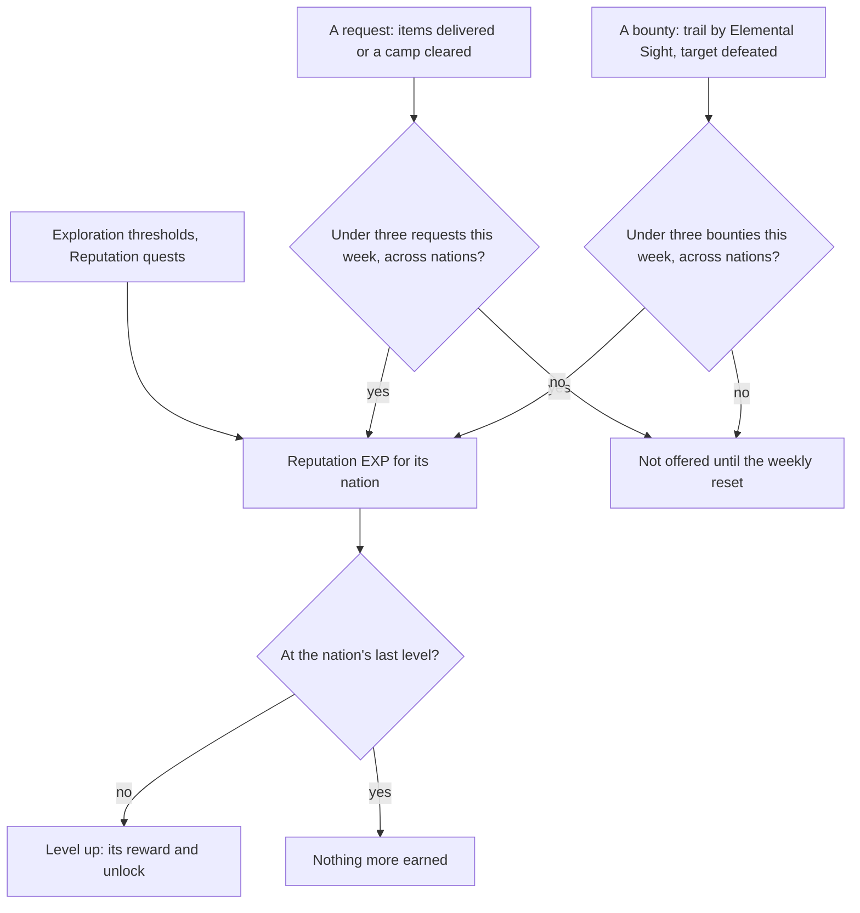

# Reputation

Each nation keeps a Reputation, raised by work done for its people. Its levels give the recipes, crafting and forging blueprints, namecards and wind gliders the rest of the game's pastimes start from, and unlock its shops' discounts and the search for mining outcrops. It waits on the [Adventure Rank](/docs/proposals/genshin/adventure-rank) that opens it at 25 beside each nation's own quest, and on the [exploration progress](/docs/proposals/genshin/exploration-progress) that feeds it.

## Decisions

- **Levels by the game's table.** Each nation's levels, the EXP each needs, its reward and what it unlocks are `ReputationLevelExcelConfigData`'s rows (`nextLevelExp`, `rewardId`, `functionId`), with each unlock's own row in `ReputationFunctionExcelConfigData`. At a nation's last level no more EXP is earned there and its bounties and requests are closed.
- **Weekly bounties, three a week across nations.** From level 2 (level 1 in Natlan), the nation's Reputation keeper offers bounties. The player goes to the place named, finds the target's trail with [Elemental Sight](/docs/proposals/genshin/elemental-sight), defeats it and claims the bounty back with the keeper. Three are claimed a week in all nations together, starting again at the weekly reset; finishing one deals the next set, so the highest can be taken each time.
- **Weekly requests, three a week across nations.** From level 2, requests are taken from the keeper and run as world quests: deliver the items asked for, or clear the camp named. Each gives 80 Reputation and 20,000 Mora, three a week across all nations.
- **Exploration and quests feed it.** Each nation's exploration progress, its chests, puzzles and statue offerings, raises its Reputation at the thresholds `ReputationExploreExcelConfigData` sets, and its Reputation quests give theirs once.
- **Natlan's tribes and supply notices.** Natlan keeps a Reputation per tribe, and its supply notices take donated items, three a week shared between tribes, each 160 to its tribe and a Sanctifying Unction, as the wiki gives them.
- **A discount is the shop's own.** A level's discount takes 10% off the named shops' prices, rounded to the nearest five Mora in the player's favour, applied by the [shops](/docs/proposals/genshin/shops).

## How it works

## Scope and order

**Today:** nothing counts a nation's standing.

**This adds, in order:**

1. **Mondstadt's Reputation**, its levels and rewards, with its keeper in region data.
2. **Requests**, as world quests the quest reader carries.
3. **Bounties**, once Elemental Sight draws a trail.
4. **Exploration's thresholds**, once exploration progress is counted.
5. **Each later nation**, and Natlan's tribes and supply notices, as their regions are built.

## Data and measures

- **Read from the game's tables:** `ReputationLevelExcelConfigData`, `ReputationCityExcelConfigData`, `ReputationFunctionExcelConfigData`, `ReputationQuestExcelConfigData`, `ReputationRequestExcelConfigData`, `ReputationExploreExcelConfigData` and the bounties' `HuntingRefreshExcelConfigData`, with each level's reward rows.
- **Read from the wiki:** which shops each discount covers, and each bounty's reward.

## Key files

| File                                                    | Role after the change                              |
| :------------------------------------------------------ | :------------------------------------------------- |
| `packages/genshin-world/src/models/world/Resident.ts`   | A nation's Reputation keeper, placed as a resident |
| `packages/genshin-world/src/models/quest/QuestKind.ts`  | Requests and Reputation quests as world quests     |
| `packages/genshin-world/src/models/enemy/EnemyCamp.ts`  | A bounty's target, spawned when it is taken        |
| `packages/genshin-world/src/models/inventory/Wallet.ts` | The Mora a request gives                           |

## Sources

- [Reputation](https://genshin-impact.fandom.com/wiki/Reputation), Genshin Impact Wiki: the nations' Reputation and its sources, the unlock at rank 25 with each nation's quests, bounties from level 2 tracked by Elemental Sight and three a week across nations, requests at 80 Reputation and 20,000 Mora three a week, Natlan's supply notices, exploration's share, the rewards, the last level's close, and the 10% discount rounded in the player's favour.
- [Daily Reset](https://genshin-impact.fandom.com/wiki/Daily_Reset), Genshin Impact Wiki: the weekly reset bounties and requests start again at.
- [AnimeGameData](https://github.com/DimbreathBot/AnimeGameData), the community's per-patch dump: the reputation tables and the bounties' refresh table.
