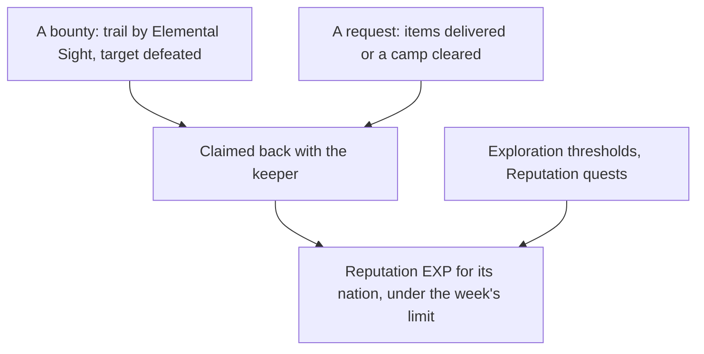

# Reputation

Each nation keeps a Reputation, raised by work done for its people. Mondstadt's levels and the three-a-week claim limit across nations are built: see the [Reputation](/docs/genshin/reputation) page. What remains is what puts them in the world, and the later nations.

## Decisions

- **Requests run as world quests.** From level 2, requests are taken from the nation's keeper and run as world quests: deliver the items asked for, or clear the camp named. Each pays its Reputation EXP and Mora, and the three-a-week limit already counts them across nations.
- **Bounties are hunted with Elemental Sight.** From level 2 (level 1 in Natlan), the keeper offers bounties. The player goes to the place named, finds the target's trail with [Elemental Sight](/docs/proposals/genshin/elemental-sight), defeats it and claims the bounty back with the keeper. The target is spawned when the bounty is taken.
- **Exploration and quests feed it.** Each nation's exploration progress, its chests, puzzles and statue offerings, raises its Reputation at the thresholds `ReputationExploreExcelConfigData` sets, and its Reputation quests give theirs once. A nation's exploration percentage is read off its areas as the [exploration progress](/docs/proposals/genshin/exploration-progress) proposal settles, which also pays Mondstadt's thresholds; a threshold pays once, when the percentage passes it.
- **Mondstadt's keeper is Hertha, NPC 1663.** The wiki names each nation's keeper (Hertha, Ms. Yu, Madarame Hyakubei, Effendi, Euphrasie), and `genshin:text find "^Hertha$"` with the NPC table gives her id. The dump's `SceneNpcBorn` records do not place her, so her place is read from the scene group export, as the blacksmith's is ([forging](/docs/proposals/genshin/forging)).
- **The Reputation screen is the keeper's.** Talking to the keeper opens the nation's Reputation screen: its level and EXP toward the next, each level's reward, and the four sources (bounties, requests, exploration and quests). It is built now from a public clip, opened by the keeper's talk once she stands; until then it is reached only through its fixture on the parity page.
- **A discount is the shop's own.** The rule is built. The shops apply it to a named shop's prices once they have a screen, and each discount's shops are the ones its function's text names, joined to the shops' ids then.
- **Natlan's tribes and supply notices.** Natlan keeps a Reputation per tribe, and its supply notices take donated items, three a week shared between tribes, each 160 to its tribe and a Sanctifying Unction, as the wiki gives them.

## How it works

## Scope and order

**Today:** Mondstadt's Reputation is data and rules. Nothing places the keeper, draws a bounty's trail, counts exploration or applies a discount.

**This adds, in order:**

1. **The Reputation screen, built now from the public clip.**
   - Frames: `pnpm -C scripts genshin:parity clip https://www.youtube.com/watch?v=1SqmdXbIhLs --from 0 --to 257 --name reputation-guide` (City Reputation Guide, 257 seconds), then `pnpm -C scripts genshin:parity frames <the path clip prints> 1` for one frame a second; the builder reads the frames and takes, with `pnpm -C scripts genshin:parity frame yt-1SqmdXbIhLs-reputation-guide.mp4 --at <second> --name reputation-screen`, the clearest of the level and rewards page and of each source's tab into `references/reputation-screen/`, each with its `SOURCE.txt`.
   - Code: `ScreenKind.Reputation` in `packages/genshin-world/src/models/screen/ScreenKind.ts`, with its title in `ScreenKindGameTextKeyMap`; `packages/genshin-interface/src/components/ReputationScreen/Index.vue` and `Index.fixture.ts` laid out on those frames inside `GameScreen`, as `InventoryScreen` is; and its world wrapper `packages/genshin-world/src/components/Reputation/Screen/Index.vue` with `Index.fixture.ts`, fed `readMondstadtReputation()`'s levels and a `ReputationProgress`.
   - Words: every label by `GameTextKey`, each found with `pnpm -C scripts genshin:text find` and written with `genshin:text write`.
   - Proof: the fixture renders on the parity page; the comparison against the frames is queued for the user's eyes under the roadmap's Awaiting the user, and nothing scores it yet.
2. **Mondstadt's keeper**, placed in region data, opening the screen and offering its requests from level 2. Waits on the scene group export the other machine is making, which places Hertha.
3. **Requests**, as world quests the quest reader carries.
4. **Bounties**, once Elemental Sight draws a trail and the target spawns.
5. **The discount at the shops**, once the shops page has a screen.
6. **Each later nation**, and Natlan's tribes and supply notices, as their regions are built.

## Data and measures

- **Read from the game's tables, still to read:** `ReputationQuestExcelConfigData`, the Reputation quests with their rewards, once the quest reader carries them. Its rows name a quest by `parentQuestId` and a reward, but not the quest that pays, so the binding is the quest reader's to settle.
- **Read from the wiki:** which shops each discount covers, as the ids of the shops its function's text names.

## Key files

| File                                                    | Role after the change                              |
| :------------------------------------------------------ | :------------------------------------------------- |
| `packages/genshin-world/src/models/world/Resident.ts`   | A nation's Reputation keeper, placed as a resident |
| `packages/genshin-world/src/models/quest/QuestKind.ts`  | Requests and Reputation quests as world quests     |
| `packages/genshin-world/src/models/enemy/EnemyCamp.ts`  | A bounty's target, spawned when it is taken        |
| `packages/genshin-world/src/models/inventory/Wallet.ts` | The Mora a request gives                           |

## Sources

- [Reputation](https://genshin-impact.fandom.com/wiki/Reputation), Genshin Impact Wiki: the unlock at rank 25 with each nation's quests, Natlan's supply notices, exploration's share and which shops each discount covers.
- [AnimeGameData](https://github.com/DimbreathBot/AnimeGameData), the community's per-patch dump: the Reputation quest and exploration tables still to read.
