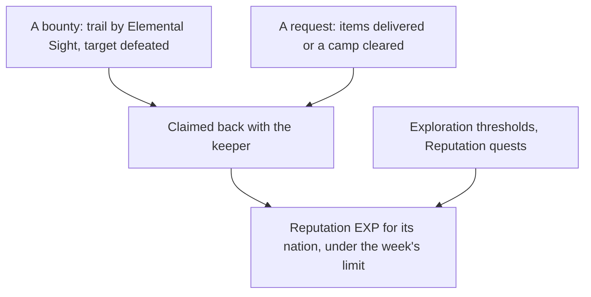

# Reputation

Each nation keeps a Reputation, raised by work done for its people. The [Reputation](/docs/genshin/reputation) page builds Mondstadt's as data and rules, the three-a-week claim limit across nations among them. What remains is what puts them in the world, and the later nations.

## Decisions

- **Requests run as world quests.** From level 2, requests are taken from the nation's keeper and run as world quests: deliver the items asked for, or clear the camp named. Each pays its Reputation EXP and Mora, and the three-a-week limit already counts them across nations.
- **Bounties are hunted with Elemental Sight.** From level 2 (level 1 in Natlan), the keeper offers bounties. The player goes to the place named, finds the target's trail with [Elemental Sight](/docs/proposals/genshin/elemental-sight), defeats it and claims the bounty back with the keeper. The target is spawned when the bounty is taken.
- **Exploration and quests feed it.** Each nation's exploration progress, its chests, puzzles and statue offerings, raises its Reputation at the thresholds `ReputationExploreExcelConfigData` sets, and its Reputation quests give theirs once.
- **A discount is the shop's own.** The rule is built. The shops apply it to a named shop's prices once they have a screen, and each discount's shops are the ones its function's text names, joined to the shops' ids then.
- **Natlan's tribes and supply notices.** Natlan keeps a Reputation per tribe, and its supply notices take donated items, three a week shared between tribes, each 160 to its tribe and a Sanctifying Unction, as the wiki gives them.

## How it works

## Scope and order

**Today:** Mondstadt's Reputation is data and rules. Nothing places the keeper, draws a bounty's trail, counts exploration or applies a discount.

**This adds, in order:**

1. **Mondstadt's keeper**, placed in region data, offering its requests from level 2.
2. **Requests**, as world quests the quest reader carries.
3. **Bounties**, once Elemental Sight draws a trail and the target spawns.
4. **Exploration's thresholds**, once exploration progress is counted for the nation.
5. **The discount at the shops**, once the shops page has a screen.
6. **Each later nation**, and Natlan's tribes and supply notices, as their regions are built.

## Data and measures

- **Read from the game's tables, still to read:** `ReputationQuestExcelConfigData`, the Reputation quests with their rewards, once the quest reader carries them, and `ReputationExploreExcelConfigData`, the thresholds, once exploration is counted.
- **Read from the wiki:** which shops each discount covers, as the ids of the shops its function's text names.

## Key files

| File                                                    | Role after the change                              |
| :------------------------------------------------------ | :------------------------------------------------- |
| `packages/genshin-world/src/models/world/Resident.ts`   | A nation's Reputation keeper, placed as a resident |
| `packages/genshin-world/src/models/quest/QuestKind.ts`  | Requests and Reputation quests as world quests     |
| `packages/genshin-world/src/models/enemy/EnemyCamp.ts`  | A bounty's target, spawned when it is taken        |
| `packages/genshin-world/src/models/inventory/Wallet.ts` | The Mora a request gives                           |

## Sources

- [Reputation](https://genshin-impact.fandom.com/wiki/Reputation), Genshin Impact Wiki: the unlock at rank 25 with each nation's quests, Natlan's supply notices, exploration's share and which shops each discount covers.
- [AnimeGameData](https://github.com/DimbreathBot/AnimeGameData), the community's per-patch dump: the Reputation quest and exploration tables still to read.
