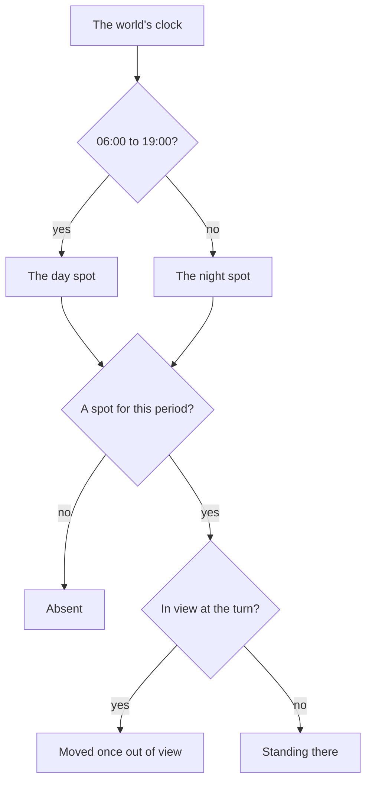

# Resident schedules

The game's people keep hours. A hunter sells meat in Springvale by day and goes home at night, a guard stands their post, and some people are found only in the evening. The [dialogue](/docs/genshin/dialogue)'s residents stand at one spot today, and the world already keeps the game's twenty-four-minute day ([sky and time](/docs/genshin/sky-and-time)). This page joins them: each resident where the game has them at the hour. It waits on nothing more than what is built.

## Decisions

- **Day and night, at the game's hours.** A resident's day runs from 06:00 to 19:00 and their night from 19:00 to 06:00, the hours the wiki's resident pages give, such as Draff selling in Springvale during the day. A resident has a spot for each, or for one only and is absent in the other.
- **Their spots are the game's own records.** `BinOutput/Scene/SceneNpcBorn/scene3_npcborn.json` places every open-world resident: its NPC id, its place, its turn, and the scene group and suites it belongs to. A resident placed twice has a day spot and a night spot. Which of the two is the day's is the server's, so it is matched to the wiki's daytime and nighttime location for that resident, and a resident the wiki shows at one time only is absent at the other.
- **Moved out of sight.** At the turn of the hour, a resident in view stays until out of view and then stands at their new spot, so nobody is seen to jump.
- **A vendor sells in their hours.** A resident who sells does so only in the hours their page gives, and offers no shop outside them, once the [shops](/docs/proposals/genshin/shops) sell.
- **Read by the world's clock.** Where a resident stands is read from the world's clock each time their region's data is in reach, so a jump in time from the Time screen moves them as the hours do.

## How it works

## Scope and order

**Today:** a resident stands at one spot, whatever the hour.

**This adds, in order:**

1. **Day and night spots**, read for Mondstadt's residents from the birth records and the wiki.
2. **Moving out of sight** at the turn of the hour.
3. **Vendors' hours**, once the shops sell.

## Data and measures

- **Read from the game's data:** each resident's placements in the open world's NPC birth records.
- **Read from the wiki:** each resident's day and night locations and their hours, matched to the placements.
- **Measured:** where the wiki shows neither, which placement is the day's, off a recording of the resident's spot at each.

## What this does not propose

- **The cities' crowds.** The passers-by the game draws for a busy city, who cannot be talked to, are their own system.

## Key files

| File                                                      | Role after the change                                |
| :-------------------------------------------------------- | :--------------------------------------------------- |
| `packages/genshin-world/src/models/world/Resident.ts`     | Gains a day and a night spot, either one optional    |
| `packages/genshin-engine/src/clock/advanceGameClock.ts`   | The clock a resident's spot is read from             |
| `packages/genshin-world/src/composables/useRegionData.ts` | The region data whose residents are read at the hour |

## Sources

- [NPC](https://genshin-impact.fandom.com/wiki/NPC), Genshin Impact Wiki: open-world residents with their daytime and nighttime locations.
- [Draff](https://genshin-impact.fandom.com/wiki/Draff), Genshin Impact Wiki: a vendor selling during the day, 06:00 to 19:00, with a daytime and a nighttime location.
- [Exploration](https://genshin-impact.fandom.com/wiki/Exploration), Genshin Impact Wiki: residents found only at certain times of day, or in other places.
- [AnimeGameData](https://gitlab.com/Dimbreath/AnimeGameData), the community's per-patch dump: the open world's NPC birth records with each resident's places, groups and suites.
