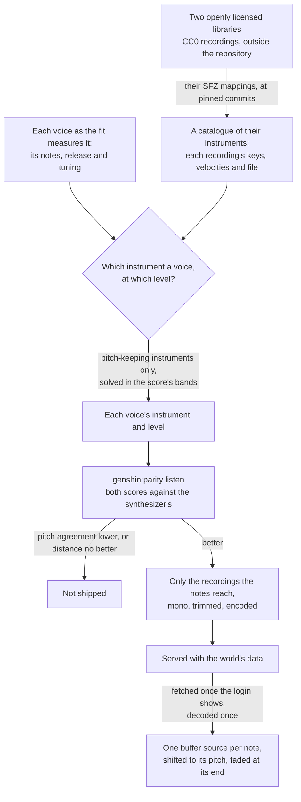

# Sampled instruments

The login's [music](/docs/genshin/music) plays the right notes in the wrong sound. Its listening score, read against the game's sound shifted against itself, names the notes closer than the game a quarter second off itself, while its octave bands, even swelling where the game's do, are as far from it as a recording between a quarter second and two seconds out of step would be. The synthesizer is why: each register plays one fixed spectrum of harmonics under one envelope, an organ's sound, where the game's is an orchestra recorded in a hall. A spectrum that changes through each note could close some of that, but the shortest route to a real instrument's sound is a recording of one. This proposal keeps everything the music already derives (the playlist, the notes, the voices, the score) and replaces only the sound each note is played with.

## How it would work



- **The library is CC0.** The Versilian Community Sample Library and the Versilian Chamber Orchestra 2 community edition it builds on are public-domain recordings of orchestral instruments: strings as sections and solo, harp, piano, woodwinds, brass and mallets, each sampled every tone or every few and in a few velocity layers, with their mappings in SFZ files. Nothing of the game's sound is in them, so the rule that nothing of the game's audio ships is unchanged. They are the one exception to the Genshin area's rule that every asset is authored here, made because no oscillator of ours sounds like a bowed string.
- **An instrument is chosen by a solve, never by ear.** The listening score has to confirm the solve's choice: a choice that does not lower the octave-band distance against the synthesizer does not ship, and a choice that lowers pitch agreement is a regression whatever it gains.
- **Two instruments in one register wait.** A voice is a register today. Where the game plays a string section and a piano in one register, the solve picks whichever is nearer, and splitting a register into instruments stays the pass the score ranks next, as it already is.
- **No reverb until a reading asks for one.** A reverb lengthens what a note already holds, so it is the remedy only where ours dies sooner than the game's. `genshin:parity decay` reads the opposite of the synthesizer, whose upper bands ring past the game's in the second piece ([music](/docs/genshin/music)), and the best sampled mixes' largest gaps hold level from a note's start to half a second into it. What the samples lack is spectrum rather than ring, so the room waits until a band's gap falls with a note's age.
- **The synthesizer is removed once the samples ship.** The oscillator's waveform, the noise buffers and the noise solve exist only to imitate an instrument; a sampled voice needs none of them, so they are deleted in the change that ships the samples, with their docs and their Settled lines, unless the route chosen for the first piece keeps the synthesizer playing (Scope, step 1).

## What is built

The catalogue and the solve are tooling in the scripts package, run by `pnpm -C scripts genshin:parity instruments`, which prints each source's best combinations with their levels and listening scores, and `genshin:parity solos`, which scores every instrument alone against each voice's notes.

- **The catalogue.** Each library is read at a pinned commit (`SampleLibraryCommitMap`), and only a mapping and the recordings a piece's notes reach are downloaded, into the scripts package's cache. `parseSfz` reads a mapping into the regions a note plays. Opcodes are inherited from `<control>`, `<global>`, `<master>` and `<group>` down to `<region>`, and a key may be a number or a note name. Release triggers, every round robin past the first, and a region whose key range is empty (a pedal noise a controller triggers) are skipped. A layer crossfaded in and out by velocity answers from the middle of its fade in to the middle of its fade out, since some instruments mark their layers only by their crossfades. A region's `volume` is carried as its gain, because each recording is normalised on its own. The amplitude envelope's opcodes are not read: the release comes from the game's voice. Velocity scales a note linearly rather than through the mapping's velocity curve.
- **The engine's half.** `selectMusicSample` picks the recording a note plays, the same choice in the solve and the sampler. It takes the region whose keys hold the note's pitch or lie nearest it, then of those the one whose velocities hold or lie nearest its velocity on MIDI's scale.
- **The pitch check.** `computeVoicePitchReference` reads the pitch classes a voice's notes name with no instrument in them, frame by frame in the listening score's own frames (`computeNoteChroma`), and the same notes rendered as pure tones at their fundamentals beside them. A render of the voice is scored by its pitch agreement with the notes, as it stands and at the lag within a fifth of a second that agrees best (`computeLaggedAgreement`). An instrument that matches or passes the pure tones keeps the voice's pitch. `scoreSampledSolos` scores every catalogued instrument this way, with the median onset of the recordings it plays and how far each note is shifted from its recording.
- **The solve.** `solveSampledVoices` renders every catalogued instrument through each voice's notes at level 1, the way the sampler would play them (`renderSampledVoice`): with the voice's fitted release and tuning, each recording read at its shifted rate. Only an instrument that keeps the voice's pitch is a candidate for it, or the one nearest that where none does, since the bands cannot hear pitch. The solve then reads each octave band's energy over the frames the score reads. For every combination of one candidate a voice, the powers come in closed form from nonnegative least squares on each band's share of the game's energy (`solveNonNegativeSystem`), from products taken once per pair of voices. The best combinations are refined against the score's band distance (`refineVoicePowers`), and each level is the square root of its power. The shipped music plays under a fitted expression, so each mix is given its own first: `scoreShapedMusic` fits the mix's expression to the game's swells as `genshin:parity expression` fits the synthesizer's, then scores the mix under it whole by the listening score. The mixes are ranked by that distance, and the report gives each one's distance with its expression held out across bands, its pitch agreement, the best's band biases and its gaps by the time since a note began.

## What the passes found

Every score is the listening score against the game's own sound, read against the synthesizer's on the same segments.

| Render                                                | First piece: pitch agreement, distance | Second piece: pitch agreement, distance |
| :---------------------------------------------------- | -------------------------------------: | --------------------------------------: |
| The synthesizer                                       |                          0.884, 8.0 dB |                           0.815, 7.0 dB |
| Pass 1, instruments ranked by fitted profile          |                          0.673, 9.4 dB |                           0.853, 7.2 dB |
| Pass 1 at the game's tuning                           |                          0.730, 9.2 dB |                           0.849, 7.2 dB |
| Pass 2, the band solve                                |                          0.709, 7.9 dB |                           0.668, 7.5 dB |
| Pass 3, pitch-keeping candidates                      |                          0.803, 8.8 dB |                           0.818, 7.2 dB |
| The synthesizer under its expression                  |                          0.884, 5.4 dB |                           0.815, 6.6 dB |
| Pass 4, each mix under its own expression             |                          0.861, 6.9 dB |                           0.819, 6.8 dB |
| The synthesizer, its decay fitted to the median curve |                          0.888, 5.4 dB |                           0.798, 6.5 dB |

- **Pass 1 ranked instruments by profile.** Each candidate was fitted through the voice's notes with `fitInstrument`, the way the game's voice is, and ranked by its distance from the game's voice over the harmonics and the envelope. Level and tuning were carried over as fit ratios. It chose a cello section, an upright piano and a cello spiccato for the first piece, and a folk harp, an upright piano and another upright for the second. The fit read the cello's tuning as half a semitone sharp, while the recordings sit within about ten cents of their mappings, so carrying that tuning split the pitch classes. At the game's own tuning, both pieces still sat further from the game than the synthesizer. The cello's second harmonic stands several decibels over the game's, and its sustain outlasts the game's quickly decaying bass, so the band at 125 Hz overfilled by about twelve decibels. A profile distance weighs a harmonic forty decibels down the same as the second, so it does not predict the score. Pass 1 settled two things: a voice plays at the game's fitted tuning, since the recordings are tuned by their mappings, and the instrument and level are solved together in the score's own measure.
- **Pass 2 solved in the score's bands, and the solve predicts the score.** Its own distance came within about two tenths of a decibel of what `listen` then measured, so the band measure is a faithful proxy, unlike the profile. It chose a dan tranh, an upright piano and a trombone for the first piece, and an upright piano, a pizzicato double bass and timpani for the second. The first piece's distance fell a tenth of a decibel and the second's rose half a decibel. Pitch agreement fell by about a sixth in both pieces, so the pass does not ship.
- **The bands do not hear pitch.** The solve's measure has no term for pitch, so nothing stops it filling the top voice's bands with timpani shifted far past their range, or the bass with a plucked zither at four times its recording's level.
- **The pitch loss was the instruments, never the render.** Every sampled render of the first piece had lost a fifth to a quarter of its pitch agreement, so the loss might have been common to the recordings. `genshin:parity solos` says it is not. Pianos, harps and plucked strings match or pass the pure tones in every voice of both pieces, so the render, the mappings' tuning and the recordings' onsets cost nothing common. The instruments chosen did: the dan tranh on the first piece's bass reads about a tenth under its pure tones, and the timpani on the second piece's top voice, shifted far past their range, about half under. Bowed and blown sustains take a tenth to a fifth of a second to speak, so they agree best read a frame or more late. A mapping's `offset` moves a note by a few milliseconds and is not the cause.
- **Pass 3 heard pitch.** Only instruments that keep a voice's pitch were candidates, and each refined mix was scored whole rather than by the band proxy. The second piece kept its pitch agreement, with a folk harp in each lower voice and hand chimes on top, at about two tenths of a decibel past the synthesizer's distance. The first piece lost both. Its best mix, a pizzicato violin section under a folk harp and a tuba, lies eight tenths of a decibel further than the synthesizer, and no mix among its best kept the synthesizer's pitch agreement. Neither piece ships.
- **The synthesizer moved first.** Between the third pass and the fourth the shipped music gained its expression, one gain a window over every voice fitted to the game's swells ([music](/docs/genshin/music)). It took the first piece from 8.0 dB to 5.4 dB and the second from 7.0 dB to 6.6 dB with pitch agreement unchanged, so that is the score a sampled mix now has to beat.
- **Pass 4 gave each mix an expression of its own.** As mixed, the best mixes read 9.2 dB to 10.2 dB on the first piece and 7.3 dB to 7.7 dB on the second. Under an expression fitted to each, the first piece's best, a pizzicato double bass under a grand piano and a tuba, reads 6.9 dB at 0.861, a decibel and a half and two hundredths of pitch agreement behind the synthesizer. The second piece's best, a folk harp in each lower voice under hand chimes, reads 6.8 dB at 0.819: its pitch agreement holds and its distance lies two tenths of a decibel behind, which is as far as the solve's distance has stood from what `listen` then measured. Held out across bands the expressions cost up to four tenths of a decibel more, so they are loudness, as the synthesizer's is. Neither piece beats the shipped score, so neither ships.
- **The synthesizer moved again.** After the fourth pass its decay was refitted to the notes' median curve, since its notes had died about twice as fast as the game's ([music](/docs/genshin/music)). The first piece rose to 0.888 at 5.4 dB. The second fell to 0.798 at 6.5 dB, through its top voice. So the score a mix has to beat is now 5.4 dB at 0.888 and 6.5 dB at 0.798: the fourth pass's second-piece mix, at 0.819 and 6.8 dB, holds more pitch agreement than the synthesizer and lies three tenths of a decibel further, and its first-piece mix is still behind on both.
- **A fixed equaliser closes the second piece and not the first.** A match equaliser was tried over each mix under its expression: one fixed gain an octave band, fitted exactly in the score's measure. On the synthesizer its gain does not survive being held out across time. On the sampled mixes it holds. Held out across time, the first piece's mixes fall from between 6.9 dB and 7.6 dB to between 6.5 dB and 6.8 dB, and the second piece's from about 7.1 dB to between 5.9 dB and 6.3 dB, in place within three tenths of that. The second piece's best would then pass the synthesizer's distance, then 6.6 dB and 6.5 dB since, with its pitch agreement kept. The first would not reach 5.4 dB, and no band's gain restores pitch agreement, so the equaliser moved no shipped score and its tool was deleted. It is the first remedy to bring back once a first-piece mix holds its pitch. The fit is the ratio of two long-term spectra, which reads a loud section more than a quiet one and assumes a piece's balance stays put, so it is always scored held out.
- **The first piece's pitch is past the catalogue's reach.** `genshin:parity solos` reads every voice of the first piece held alone by several recordings: pizzicato strings and an upright piano on the bass, pianos and a folk harp in the middle, and a vibraphone, the tuba and hand chimes on top, the tuba at or past pure tones though shifted most of an octave above its recordings. So no single voice loses the pitch, and the balance between voices or their timbre must. A scratch reader solved each mix's levels for pitch agreement alone, ignoring the bands, over every combination of pitch-keeping recordings. With one recording a voice the best mix reads 0.881 against the synthesizer's 0.888, so a level solve that heard pitch could lift the fourth pass's 0.861 no further than that. With up to two recordings layered on each voice, ranked by an estimate and the leaders measured exactly, the best reads 0.880, so a second recording adds nothing. A fixed octave-band equaliser on each voice, fitted in pitch agreement, lifts the best mix from 0.881 to 0.885 in place and drops it to 0.873 held out across time, so it fits the frames rather than the recordings' balance; on the fourth pass's instruments it lifts 0.863 to 0.866 held out. None nears 0.888. The second piece's best mix of one recording a voice reads 0.864 at levels solved for pitch, well past the synthesizer's 0.798. What the first piece is short of is each recording's harmonics, which fold into the pitch classes differently from the game's, where the synthesizer's are fitted to them.
- **What is left is the recordings' spectrum, not their decay.** Under its expression the first piece's best mix leaves 8 kHz about seven decibels short and overfills 63 Hz, 500 Hz and 1 kHz by three to four. The second piece's leaves 63 Hz about eight decibels short and 8 kHz about four. The largest of those gaps holds within a decibel or two from a note's start to half a second into it, where nearly every frame lies, and the second piece's top band wanders by a few decibels with no trend, so a longer ring would not close them. One level per voice cannot tilt a recording's spectrum, which is what the equaliser did.

## Scope

1. **Choose what plays the first piece.** No mix of the catalogue's recordings holds its pitch, by levels, layering or an equaliser per voice, so the catalogue alone cannot replace its synthesizer. Three routes are open: another openly licensed library whose recordings fold into the pitch classes as the game's do, read first through the same pitch ceiling; each recording layered over the synthesizer's fitted voice, which holds the synthesizer's pitch agreement at a recording's level of zero, so a solve that keeps that agreement can only improve on it; or the recordings on the second piece alone, where they hold its pitch and the fixed equaliser, fitted per mix and scored held out, closes its distance, with the synthesizer kept for the first. Whichever is taken, the fixed equaliser returns with it, since it is the one remedy measured to close the recordings' spectrum.
2. **The engine's sampler.** An instrument names its recordings rather than its harmonics. `scheduleMusicNote` plays the one `selectMusicSample` picks at the note's pitch, through a gain at the note's level that fades at its end, and `renderMusicSegment` renders it offline for the score. The login's music fetches its recordings once the screen shows, the app serves them from the world package's folder, and the parity page decodes them before it renders.
3. **Score it, then ship it.** `genshin:parity listen` against the synthesizer's committed score, `genshin:parity expression` refitted against the sampled render, the recordings encoded and served, the synthesizer deleted, and the user's ear the approval.

The engine and world half of step 2 was written for pass 2 and set aside unshipped, with the fit's shipping half. It adds these files:

```text
packages/genshin-engine/src/audio/
  MusicSample.ts               a recording as the sampler plays it: its file, key centre, tune and gain
  loadMusicSamples.ts          every recording a piece plays, fetched and decoded once, by file
scripts/src/services/genshinAssets/
  selectShippedSamples.ts      only the regions the shipped notes select, each cut where its longest note stops
  encodeMusicSample.ts         one recording as one channel of Opus in Ogg
  writeMusicRecordings.ts      the piece's recordings as the world package's data, rewritten whole
packages/genshin-world/src/data/login/samples/
```

## Key files

| File                                                                     | Role after the change                                          |
| :----------------------------------------------------------------------- | :------------------------------------------------------------- |
| `packages/genshin-engine/src/audio/scheduleMusicNote.ts`                 | One note played from its recording at its pitch                |
| `packages/genshin-engine/src/audio/Instrument.ts`                        | An instrument's recordings, release, level and tuning          |
| `packages/genshin-engine/src/audio/selectMusicSample.ts`                 | The recording a note plays, in the sampler and the solve alike |
| `scripts/src/services/genshinAssets/music/solveSampledVoices.ts`         | Each voice's instrument and level, solved with pitch heard     |
| `scripts/src/services/genshinParity/music/scoreShapedMusic.ts`           | A mix scored under an expression fitted to it                  |
| `scripts/src/services/genshinAssets/music/parseSfz.ts`                   | A mapping's regions                                            |
| `scripts/src/services/genshinAssets/music/computeVoicePitchReference.ts` | What a voice's render is scored against for pitch              |
| `scripts/src/services/genshinParity/commands/solosCommand.ts`            | Every instrument alone through each voice, scored for pitch    |
| `scripts/src/services/genshinAssets/shared/fitMusicVoices.ts`            | The release and tuning each voice plays at                     |
| `scripts/src/services/genshinAssets/fit/fitLoginMusic.ts`                | The login's voices, each with its solved instrument            |
| `scripts/src/services/genshinParity/commands/instrumentsCommand.ts`      | The solve's report                                             |
| `packages/genshin-world/src/data/login/music.json`                       | The login's notes and each voice's instrument                  |

## Sources

- [VCSL](https://github.com/sgossner/VCSL), Versilian Studios: the community sample library, CC0, its instruments sampled every tone where possible in two or three velocity layers, with SFZ mappings on its `sfz` branch.
- [VSCO 2 Community Edition](https://github.com/sgossner/VSCO-2-CE), Versilian Studios: the chamber orchestra library, CC0, with SFZ mappings on its `SFZ` branch.
- [SFZ format: headers](https://sfzformat.com/headers/): the global, master, group and region hierarchy whose opcodes define which samples play and when, a header's opcodes applying to every region under it, which is the order `parseSfz` inherits them in.
- [A Diffusion-Based Generative Equalizer for Music Restoration](https://arxiv.org/html/2403.18636), Moliner, Turunen, Elvander and Välimäki, section 3.4: the equaliser taken as the ratio of two long-term average spectra, with its limits, that a time average assumes the signal's balance holds throughout and louder sections weigh more, so it is a starting point rather than a remedy on its own.
- [DDSP: Differentiable Digital Signal Processing](https://arxiv.org/html/arXiv:2001.04643): the harmonic-plus-noise model our synthesizer is a static form of, whose harmonics and noise change through each note; the alternative this proposal takes the shorter route past.
- [Opus recommended settings](https://wiki.xiph.org/Opus_Recommended_Settings), Xiph.Org: 128 kbit/s variable bit rate as about transparent for stereo music, of which a mono recording takes a channel's half.
- [Opus Audio Codec: browser support](https://www.testmuai.com/learning-hub/opus-audio-codec-browser-support/): Opus in Ogg decoded by every current engine, Safari since 18.4.
