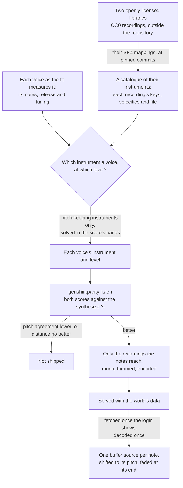

# Sampled instruments

The login's [music](/docs/genshin/music) plays the right notes in the wrong sound. Its listening score, read against the game's sound shifted against itself, names the notes closer than the game a quarter second off itself, while its octave bands are about as far from it as a recording one or two seconds out of step would be. The synthesizer is why: each register plays one fixed spectrum of harmonics under one envelope, an organ's sound, where the game's is an orchestra recorded in a hall. A spectrum that changes through each note could close some of that, but the shortest route to a real instrument's sound is a recording of one. This proposal keeps everything the music already derives (the playlist, the notes, the voices, the score) and replaces only the sound each note is played with.

## How it would work



- **The library is CC0.** The Versilian Community Sample Library and the Versilian Chamber Orchestra 2 community edition it builds on are public-domain recordings of orchestral instruments: strings as sections and solo, harp, piano, woodwinds, brass and mallets, each sampled every tone or every few and in a few velocity layers, with their mappings in SFZ files. Nothing of the game's sound is in them, so the rule that nothing of the game's audio ships is unchanged. They are the one exception to the Genshin area's rule that every asset is authored here, made because no oscillator of ours sounds like a bowed string.
- **An instrument is chosen by a solve, never by ear.** The listening score has to confirm the solve's choice: a choice that does not lower the octave-band distance against the synthesizer does not ship, and a choice that lowers pitch agreement is a regression whatever it gains.
- **Two instruments in one register wait.** A voice is a register today. Where the game plays a string section and a piano in one register, the solve picks whichever is nearer, and splitting a register into instruments stays the pass the score ranks next, as it already is.
- **The room comes from a reverb.** The game's sound carries the hall it was recorded in, and the library is recorded closer. One convolution reverb on the music's bus, its impulse response generated rather than recorded, with its decay and level fitted to the game's sound, adds the room every voice shares.
- **The synthesizer is removed once the samples ship.** The oscillator's waveform, the noise buffers and the noise solve exist only to imitate an instrument; a sampled voice needs none of them, so they are deleted in the change that ships the samples, with their docs and their Settled lines.

## What is built

The catalogue and the solve are tooling in the scripts package, run by `pnpm -C scripts genshin:parity instruments`, which prints each source's best combinations with their levels and listening scores, and `genshin:parity solos`, which scores every instrument alone against each voice's notes.

- **The catalogue.** Each library is read at a pinned commit (`SampleLibraryCommitMap`), and only a mapping and the recordings a piece's notes reach are downloaded, into the scripts package's cache. `parseSfz` reads a mapping into the regions a note plays. Opcodes are inherited from `<control>`, `<global>`, `<master>` and `<group>` down to `<region>`, and a key may be a number or a note name. Release triggers, every round robin past the first, and a region whose key range is empty (a pedal noise a controller triggers) are skipped. A layer crossfaded in and out by velocity answers from the middle of its fade in to the middle of its fade out, since some instruments mark their layers only by their crossfades. A region's `volume` is carried as its gain, because each recording is normalised on its own. The amplitude envelope's opcodes are not read: the release comes from the game's voice. Velocity scales a note linearly rather than through the mapping's velocity curve.
- **The engine's half.** `selectMusicSample` picks the recording a note plays, the same choice in the solve and the sampler. It takes the region whose keys hold the note's pitch or lie nearest it, then of those the one whose velocities hold or lie nearest its velocity on MIDI's scale.
- **The pitch check.** `readVoicePitchReference` reads the pitch classes a voice's notes name with no instrument in them, frame by frame in the listening score's own frames (`readNoteChroma`), and the same notes rendered as pure tones at their fundamentals beside them. A render of the voice is scored by its pitch agreement with the notes, as it stands and at the lag within a fifth of a second that agrees best (`readLaggedAgreement`). An instrument that matches or passes the pure tones keeps the voice's pitch. `scoreSampledSolos` scores every catalogued instrument this way, with the median onset of the recordings it plays and how far each note is shifted from its recording.
- **The solve.** `solveSampledVoices` renders every catalogued instrument through each voice's notes at level 1, the way the sampler would play them (`renderSampledVoice`): with the voice's fitted release and tuning, each recording read at its shifted rate. Only an instrument that keeps the voice's pitch is a candidate for it, or the one nearest that where none does, since the bands cannot hear pitch. The solve then reads each octave band's energy over the frames the score reads. For every combination of one candidate a voice, the powers come in closed form from nonnegative least squares on each band's share of the game's energy (`solveVoicePowers`), from products taken once per pair of voices. The best combinations are refined against the score's band distance (`refineVoicePowers`), each level is the square root of its power, and each mix is scored whole by the listening score and ranked by its distance.

## What the passes found

Every score is the listening score against the game's own sound, read against the synthesizer's on the same segments.

| Render                                       | First piece: pitch agreement, distance | Second piece: pitch agreement, distance |
| :------------------------------------------- | -------------------------------------: | --------------------------------------: |
| The synthesizer                              |                          0.884, 8.0 dB |                           0.815, 7.0 dB |
| Pass 1, instruments ranked by fitted profile |                          0.673, 9.4 dB |                           0.853, 7.2 dB |
| Pass 1 at the game's tuning                  |                          0.730, 9.2 dB |                           0.849, 7.2 dB |
| Pass 2, the band solve                       |                          0.709, 7.9 dB |                           0.668, 7.5 dB |
| Pass 3, pitch-keeping candidates             |                          0.803, 8.8 dB |                           0.818, 7.2 dB |

- **Pass 1 ranked instruments by profile.** Each candidate was fitted through the voice's notes with `fitInstrument`, the way the game's voice is, and ranked by its distance from the game's voice over the harmonics and the envelope. Level and tuning were carried over as fit ratios. It chose a cello section, an upright piano and a cello spiccato for the first piece, and a folk harp, an upright piano and another upright for the second. The fit read the cello's tuning as half a semitone sharp, while the recordings sit within about ten cents of their mappings, so carrying that tuning split the pitch classes. At the game's own tuning, both pieces still sat further from the game than the synthesizer. The cello's second harmonic stands several decibels over the game's, and its sustain outlasts the game's quickly decaying bass, so the band at 125 Hz overfilled by about twelve decibels. A profile distance weighs a harmonic forty decibels down the same as the second, so it does not predict the score. Pass 1 settled two things: a voice plays at the game's fitted tuning, since the recordings are tuned by their mappings, and the instrument and level are solved together in the score's own measure.
- **Pass 2 solved in the score's bands, and the solve predicts the score.** Its own distance came within about two tenths of a decibel of what `listen` then measured, so the band measure is a faithful proxy, unlike the profile. It chose a dan tranh, an upright piano and a trombone for the first piece, and an upright piano, a pizzicato double bass and timpani for the second. The first piece's distance fell a tenth of a decibel and the second's rose half a decibel. Pitch agreement fell by about a sixth in both pieces, so the pass does not ship.
- **The bands do not hear pitch.** The solve's measure has no term for pitch, so nothing stops it filling the top voice's bands with timpani shifted far past their range, or the bass with a plucked zither at four times its recording's level.
- **The pitch loss was the instruments, never the render.** Every sampled render of the first piece had lost a fifth to a quarter of its pitch agreement, so the loss might have been common to the recordings. `genshin:parity solos` says it is not. Pianos, harps and plucked strings match or pass the pure tones in every voice of both pieces, so the render, the mappings' tuning and the recordings' onsets cost nothing common. The instruments chosen did: the dan tranh on the first piece's bass reads about a tenth under its pure tones, and the timpani on the second piece's top voice, shifted far past their range, about half under. Bowed and blown sustains take a tenth to a fifth of a second to speak, so they agree best read a frame or more late. A mapping's `offset` moves a note by a few milliseconds and is not the cause.
- **Pass 3 heard pitch.** Only instruments that keep a voice's pitch were candidates, and each refined mix was scored whole rather than by the band proxy. The second piece kept its pitch agreement, with a folk harp in each lower voice and hand chimes on top, at about two tenths of a decibel past the synthesizer's distance. The first piece lost both. Its best mix, a pizzicato violin section under a folk harp and a tuba, lies eight tenths of a decibel further than the synthesizer, and no mix among its best kept the synthesizer's pitch agreement. Neither piece ships.
- **What the best mixes leave.** Their band biases rank the next pass. The first piece's best overfills 125 Hz to 1 kHz by three to five decibels and leaves 2 kHz to 8 kHz short by four to seven. The second piece's leaves 63 Hz short by seven decibels and 8 kHz by four. One level per voice cannot tilt a recording's spectrum, so what those bands lack is what the recordings do not hold. The game's top bands are noise-like, the bow, the breath and the hall around each voice ([music](/docs/genshin/music)), which a room's reverb or the voices' noise would supply, and `genshin:parity bands` decides which before either is tried.

## Scope

1. **Close what the best mixes leave.** Read `genshin:parity bands` over the bands the best pitch-keeping mixes leave short and overfill, supply what the recordings lack there (the room's reverb, fitted on the music's bus, or noise where a band is noise-like), and solve again. Splitting a register into two instruments is the pass after, when the score ranks it.
2. **The engine's sampler.** An instrument names its recordings rather than its harmonics. `scheduleMusicNote` plays the one `selectMusicSample` picks at the note's pitch, through a gain at the note's level that fades at its end, and `renderMusicSegment` renders it offline for the score. The login's music fetches its recordings once the screen shows, the app serves them from the world package's folder, and the parity page decodes them before it renders.
3. **Score it, then ship it.** `genshin:parity listen` against the synthesizer's committed score, the reverb fitted, the recordings encoded and served, the synthesizer deleted, and the user's ear the approval.

The engine and world half of step 2 was written for pass 2 and set aside unshipped, with the fit's shipping half. It adds these files:

```text
packages/genshin-engine/src/audio/
  MusicSample.ts               a recording as the sampler plays it: its file, key centre, tune and gain
  loadMusicSamples.ts          every recording a piece plays, fetched and decoded once, by file
scripts/src/services/genshinAssets/
  selectShippedSamples.ts      only the regions the shipped notes select, each cut where its longest note stops
  encodeMusicSample.ts         one recording as one channel of Opus in Ogg
  writeMusicRecordings.ts      the piece's recordings as the world package's data, rewritten whole
packages/genshin-world/src/data/login/samples/
```

## Key files

| File                                                                | Role after the change                                          |
| :------------------------------------------------------------------ | :------------------------------------------------------------- |
| `packages/genshin-engine/src/audio/scheduleMusicNote.ts`            | One note played from its recording at its pitch                |
| `packages/genshin-engine/src/audio/Instrument.ts`                   | An instrument's recordings, release, level and tuning          |
| `packages/genshin-engine/src/audio/selectMusicSample.ts`            | The recording a note plays, in the sampler and the solve alike |
| `scripts/src/services/genshinAssets/solveSampledVoices.ts`          | Each voice's instrument and level, solved with pitch heard     |
| `scripts/src/services/genshinAssets/parseSfz.ts`                    | A mapping's regions                                            |
| `scripts/src/services/genshinAssets/readVoicePitchReference.ts`     | What a voice's render is scored against for pitch              |
| `scripts/src/services/genshinParity/commands/solosCommand.ts`       | Every instrument alone through each voice, scored for pitch    |
| `scripts/src/services/genshinAssets/fitMusicVoices.ts`              | The release and tuning each voice plays at                     |
| `scripts/src/services/genshinAssets/fitLoginMusic.ts`               | The login's voices, each with its solved instrument            |
| `scripts/src/services/genshinParity/commands/instrumentsCommand.ts` | The solve's report                                             |
| `packages/genshin-world/src/data/login/music.json`                  | The login's notes and each voice's instrument                  |

## Sources

- [VCSL](https://github.com/sgossner/VCSL), Versilian Studios: the community sample library, CC0, its instruments sampled every tone where possible in two or three velocity layers, with SFZ mappings on its `sfz` branch.
- [VSCO 2 Community Edition](https://github.com/sgossner/VSCO-2-CE), Versilian Studios: the chamber orchestra library, CC0, with SFZ mappings on its `SFZ` branch.
- [SFZ format: headers](https://sfzformat.com/headers/): the global, master, group and region hierarchy whose opcodes define which samples play and when, a header's opcodes applying to every region under it, which is the order `parseSfz` inherits them in.
- [DDSP: Differentiable Digital Signal Processing](https://arxiv.org/html/arXiv:2001.04643): the harmonic-plus-noise model our synthesizer is a static form of, whose harmonics and noise change through each note; the alternative this proposal takes the shorter route past.
- [Opus recommended settings](https://wiki.xiph.org/Opus_Recommended_Settings), Xiph.Org: 128 kbit/s variable bit rate as about transparent for stereo music, of which a mono recording takes a channel's half.
- [Opus Audio Codec: browser support](https://www.testmuai.com/learning-hub/opus-audio-codec-browser-support/): Opus in Ogg decoded by every current engine, Safari since 18.4.
