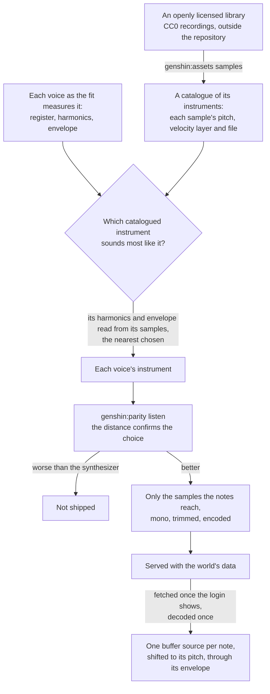

# Sampled instruments

The login's [music](/docs/genshin/music) plays the right notes in the wrong sound. Its listening score, read against the game's sound shifted against itself, names the notes closer than the game a quarter second off itself, while its octave bands are about as far from it as a recording one or two seconds out of step would be. The synthesizer is why: each register plays one fixed spectrum of harmonics under one envelope, an organ's sound, where the game's is an orchestra recorded in a hall. A spectrum that changes through each note could close some of that, but the shortest route to a real instrument's sound is a recording of one. This proposal keeps everything the music already derives (the playlist, the notes, the voices, the score) and replaces only the sound each note is played with.

## How it would work

- **The library is CC0.** The Versilian Community Sample Library and the Versilian Chamber Orchestra 2 community edition it builds on are public-domain recordings of orchestral instruments: strings as sections and solo, harp, piano, woodwinds, brass and mallets, each sampled every tone or every few and in a few velocity layers, with their mappings in SFZ files. Nothing of the game's sound is in them, so the rule that nothing of the game's audio ships is unchanged. They are the one exception to the Genshin area's rule that every asset is authored here, made because no oscillator of ours sounds like a bowed string.
- **An instrument is chosen by a solve, never by ear.** `genshin:assets samples` reads the library's mappings into a catalogue, and reads each sample's harmonic profile and envelope with the same measures the fit already takes of the game's voices (`fitInstrument`). Each voice takes the catalogued instrument whose profile and envelope lie nearest its own over its register. The listening score then has to confirm it: a choice that does not lower the octave-band distance against the synthesizer does not ship, and pitch agreement must hold.
- **Two instruments in one register wait.** A voice is a register today. Where the game plays a string section and a piano in one register, the solve picks whichever is nearer, and splitting a register into instruments stays the pass the score ranks next, as it already is.
- **The room comes from a reverb.** The game's sound carries the hall it was recorded in, and the library is recorded closer. One convolution reverb on the music's bus, its impulse response generated rather than recorded, with its decay and level fitted to the game's sound, adds the room every voice shares.
- **The synthesizer is removed once the samples ship.** The oscillator's waveform, the noise buffers and the noise solve exist only to imitate an instrument; a sampled voice needs none of them, so they are deleted in the change that ships the samples, with their docs and their Settled lines.

## Cost

- **Playback is the cheapest a note can be.** Each note is one buffer source, its playback rate shifting the nearest sample to the note's pitch, through one gain for its envelope: fewer nodes than today's oscillator, noise source and gain, and no audio worklet.
- **Only what the notes reach ships.** Each instrument keeps the samples nearest the pitches its voice plays, one or two velocity layers, as one channel, trimmed where its ring falls below hearing, and encoded as Opus in Ogg, which every current engine decodes. That is a few megabytes for a piece, against the library's gigabytes.
- **Fetched late, decoded once.** The samples are served with the world's other data and fetched once the login shows, while the title waits for its first click, and each is decoded once at the audio context's rate and kept for the session. The login's first frame waits on none of them.

## Scope

1. **Catalogue and solve.** `genshin:assets samples` downloads the library into the scripts' cache, reads its mappings and each sample's profile, and the music fit chooses each voice's instrument, its report printing each candidate's distance.
2. **The engine's sampler.** An instrument names its samples rather than its harmonics, and `scheduleMusicNote` plays the nearest at the note's pitch; `renderMusicSegment` renders it offline for the score.
3. **Score it, then ship it.** `genshin:parity listen` against the synthesizer's committed score, the reverb fitted, the samples encoded and served, the synthesizer deleted, and the user's ear the approval.

## Key files

| File                                                     | Role after the change                                          |
| :------------------------------------------------------- | :------------------------------------------------------------- |
| `packages/genshin-engine/src/audio/scheduleMusicNote.ts` | One note played from the nearest sample at its pitch           |
| `packages/genshin-engine/src/audio/Instrument.ts`        | An instrument's samples, envelope and level                    |
| `scripts/src/services/genshinAssets/fitInstrument.ts`    | The profile a voice and a catalogued instrument are matched by |
| `scripts/src/services/genshinAssets/fitLoginMusic.ts`    | The login's voices, each with its chosen instrument            |
| `packages/genshin-world/src/data/login/music.json`       | The login's notes and each voice's instrument                  |

## Sources

- [VCSL](https://github.com/sgossner/VCSL), Versilian Studios: the community sample library, CC0, its instruments sampled every tone where possible in two or three velocity layers.
- [VSCO 2 Community Edition](https://github.com/sgossner/VSCO-2-CE), Versilian Studios: the chamber orchestra library, CC0, with SFZ mappings.
- [DDSP: Differentiable Digital Signal Processing](https://arxiv.org/html/arXiv:2001.04643): the harmonic-plus-noise model our synthesizer is a static form of, whose harmonics and noise change through each note; the alternative this proposal takes the shorter route past.
- [Opus Audio Codec: browser support](https://www.testmuai.com/learning-hub/opus-audio-codec-browser-support/): Opus in Ogg decoded by every current engine, Safari since 18.4.
