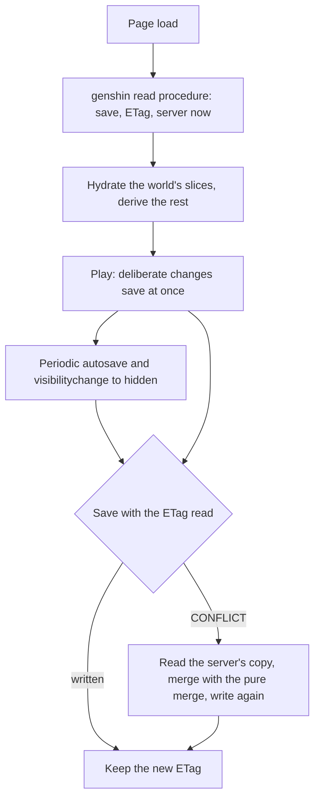

# Save Data

Everything the Genshin world holds, its bag and wallet, its quests, its unlocked waypoints and its characters' copies, is in memory in the world's screen and is lost on reload. The app already has one way to keep a game's state per user, the single-blob pattern that [Clicker](/docs/clicker/game-loop-and-saves) and [Dungeons](/docs/dungeons/saves-and-settings) use, and this proposal reuses it for the Genshin world rather than a second store. What is settled here is the design; the as-built page will be written when it ships.

## Decisions

- **One blob per signed-in player, in a Genshin container.** `GenshinAssets` joins `AzureContainer` beside `ClickerAssets` and `DungeonsAssets`, and the blob is `{userId}/save.json`, written by `writeJsonBlob` as zstd JSON. A new system adds a key to the save, never a table or a migration: no Postgres schema is touched, so nothing here needs `db:gen`.
- **The save stores only what the player did, as ids and counters.** Opened chest ids, unlocked waypoint ids, quest progress by quest id, item counts by item id, a character's copy count. Everything derived, such as a World Level, an Original Resin count or a daily reset, is recomputed on load by the world's pure rules, the way Clicker's `toClicker` resolves ids back to definitions. So a balance or content change reaches every existing save on its next load.
- **Each system owns its slice.** A system's slice schema is a Zod schema beside its model, and the game's save schema is the composition of those slices. A system that holds player state adds its slice in the same change; the [genshin-engine](/docs/genshin/engine-architecture) skill carries that rule. Persisted data is modelled as its latest shape only, so a shape change is a backfill, and a save that no longer parses resets to a new game as Clicker's does.
- **Conditional writes, through the shared pattern.** The read returns the blob's ETag and the server's now. The save sends the ETag it read (`If-Match`) and gets back the new one. A write over a changed blob fails with a conflict rather than overwriting it. This is written once in the blob-state procedures, so Clicker and Dungeons gain it too, each as its own commit.
- **A conflict is merged, then written again.** On a conflict the client reads the server's copy, merges its own state into it with a pure function per game, and writes once more with the new ETag. The merge rule is the same for every game: grow-only sets (opened, unlocked, collected) merge by union, monotonic counters and levels by maximum, and everything else takes the server's copy. Each game writes its own merge over these rules.
- **Time comes from the server.** The read returns the server's now, and the client keeps the offset between it and its own clock. Original Resin's regeneration, daily resets and respawn timers are stored as timestamps and computed on read, so a player's clock never decides them.
- **Bounded on the server.** The save's Zod schema caps every array's length and the document's serialized size, so a crafted save cannot grow the blob without limit. The caps are named constants.
- **Two save moments.** A deliberate change, a grant or a purchase, is saved at once, as Clicker splits its immediate save from its autosave. Everything else, such as a position or a counter that moves on its own, is saved on a periodic autosave, and the page's `visibilitychange` to hidden flushes it.
- **Guests keep a local save.** Signed out, the save is kept in localStorage under the same schema through `useSave`'s unauthenticated path. On sign-in, a guest's save is uploaded when the account has none, and merged by the same function when it has one.
- **The authority is the client, for now.** The client decides every grant and the server validates shape and bounds only. Rewards that a shared or competitive feature would need the server to grant are moved server-side when such a feature lands, which means running the world's pure rules there; the rules are kept pure so that move is a call, not a rewrite.

## How it works

## Left to build

Every part above is unbuilt. The first build takes the shared pattern (ETag writes, the server's now, the length caps) with Clicker and Dungeons kept green, then the Genshin container, the save schema with its first slices (the wallet and the unlocked waypoints), the hydration and autosave in the world, and the guest upload on sign-in. The rest of the slices follow as their systems are wired.
