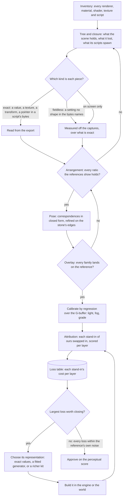

# Scene derivation

This page is the method every 3D scene of the [Genshin](/docs/proposals/genshin) program follows, built on the [derived assets](/docs/genshin/derived-assets) pipeline and the [parity](/docs/genshin/parity) loop; the tools each step uses are those pages' commands. The interface converges on the game within a few tenths of a percent, because its reference holds it exactly and every difference points at the piece that caused it. The login scene does not: it scores a shape of about a third and a tone difference of about a fifth. It is textureless grey stone in white fog next to the game's painted, warm-lit stone under a deep blue haze. The gap has four causes, and none of them is a tuning problem.

- **The unknowns were searched, not solved.** The arrangement, the camera, the materials, the light, the fog and the grade all land in one frame's score, and the only tool that moved them was a search over it. Its minimum is the one that masks every other mistake: camera grids of thousands of poses absorbed a wrong arrangement into plausible poses, and a light searched on the frame's mean stood in for a missing texture.
- **The fit throws the game's information away.** Each tower's exports are a mesh of thousands of vertices and a diffuse, a normal and a mask texture at 1024 texels square, with a material of several dozen values. The fits keep a lathe section per two-metre band and one median colour for all the stone, and read none of the material's values. A loop that can only move the few numbers a kit takes has a ceiling below the game.
- **The shading model was assumed, not read.** The environment is drawn on a toon ramp with outlines round every object. The login stone's material holds a normal map, parallax occlusion, a metallic and a gloss, a specular colour, a cube reflection, screen-space occlusion and a rim glow. That reads as a physically based shader with stylised terms, not a ramp. No tuning of a ramp reaches it.
- **The scores cannot say where the gap is.** `shape` and `tone` read the whole frame, and the tone is blurred past any texture. When a change moves them, nothing says whether the geometry, a material, the light, the sky or the grade moved them.

## Decisions

- **Lossless, re-derived.** The goal is that the browser shows what the game shows, pixel for pixel where the game's own frame allows. What ships is our own re-derivation: shaders written in TSL, geometry generated by our code, and data in our own formats written by our fits. No file, format or data of the game's passes through into the repository or a build, and that is the one line. Short of it, a re-derivation has no fidelity ceiling: a kit rich enough to rebuild a tower within a pixel of its mesh on screen, or a procedural stone that reproduces its texture's look, is the goal, not an overreach.
- **Solved in dependency order, never searched.** Each unknown is answered after the ones it depends on and before the ones that depend on it: the scene's contents, their arrangement, the camera, the frame-wide light, fog and grade, and last each material. Each is answered by the most exact query there is, the exact value, then a closed-form solve, then a local refinement from it. A global search over the frame's score is never the tool, since a later unknown's search absorbs an earlier one's error.
- **Nothing is built before it is inventoried.** A scene starts by listing everything the game draws it with: every renderer, its materials, each material's shader, values and texture slots, what each texture channel holds, and the lightmaps, reflection probes, grading tables and sky the scene reads. It also lists what the scene's scripts spawn and set. Each piece of information is sorted into one of three kinds, and the kind decides how it is derived (below).
- **Every loss is priced before it is closed.** The witness render draws the exports themselves, and each stand-in of ours is swapped in one at a time. The score each swap loses, per layer, is that stand-in's cost, and the work goes to the largest cost first.
- **The witness render is a diagnostic and never ships.** It runs only on the parity page in development, reads the exports from the references folder, and is never bundled, built or committed. It is not a second render path of the product: it is how the product's one render path is measured.
- **Each layer is scored on its own.** A reference is split into layers, sky, clouds, stone and walkway among them, by the witness render's part identifiers from the same camera, so each subsystem has its own shape, tone and detail score and a change is judged where it lands.
- **The game's shaders and its scripts' raw bytes are read; its code metadata is not decrypted.** A shader asset the exporter dumps is read as a reference, its maths rewritten in TSL as our own. A script's JSON export carries no fields, but its raw export keeps the serialized bytes, which are scanned for what their shapes name: a pointer to a path ID the scene holds, a colour, a curve. Nothing of the game's code metadata is decrypted and nothing touches the running game ([the Genshin proposal](/docs/proposals/genshin)). What neither holds is measured off the captures, as [derived assets](/docs/genshin/derived-assets) measures what a dump cannot hold.
- **Two passes without converging is a missing tool.** A step that has not met its gate in two passes gets the query that answers its unknown, built and tested as a tool, before a third pass, never a tweak or a wider search.

## How it works

### The three kinds of information

- **Exact.** The exports hold it as numbers or pixels: a material's values and colours, a mesh, a texture's channels, a transform, a grading table, a lightmap, a pointer or a colour in a script's raw bytes. It is re-derived to within the reference's own noise, and the fit that re-derives it prints the error it leaves.
- **Fieldless.** The game holds it, but nothing in the export's bytes names it: a setting whose shape the scanner cannot tell from its neighbours, a particle system's spread and rate. It is measured off the captures and written over an exact value, as the camera's height is written over the walkway's width.
- **On screen only.** Nothing exported holds it: a transition's timing, the running game's light. It is measured off the captures alone, by a solve over what is exact (a camera's path by the matchmove, a light by regression).

### The order of the unknowns

1. **What the scene holds.** The scene tree prints every root, every node and what each lost; the closure exports everything the roots reach. An empty anchor under a script's object is where that script spawns a prefab, which its raw bytes name.
2. **Where it stands.** Every proportion a reference shows between parts that meet, taken as the cross-ratio of the four ends their widths mark on the line where they meet, holds against the placements, in a unit test, before any render.
3. **The camera.** Solved from landmark correspondences in closed form, refined on the stone's silhouette edges, and tracked across a recording for a path no clip holds. The gate is a reprojection error of about a pixel, and an overlay on which every family lands.
4. **The frame.** With the pose fixed, the witness writes a G-buffer, and the light, the fog and the grade are fitted by least squares over the masks it gives, each holding the one before. A material tuned under the wrong tone curve is tuned twice, so no material is touched before this.
5. **The stand-ins.** The loss table per layer prices each of ours against the exports, and the largest is closed first.

### The witness render

The witness page loads a scene's exports from the references folder, draws them through the engine's own renderer at a reference's camera pose, and writes a part identifier, depth, normal and albedo beside the colour. Its layers come from the inventory: which object belongs to the sky, the clouds, the stone. Because the pose is the reference's, the identifier target is also a segmentation of the reference, which is where each layer's score gets its mask. While a tool drives it, the witness holds its clock and its anti-aliasing's jitter, so one render settles a view.

Attribution is a ladder of swaps. Each rung replaces one exported piece with the stand-in the scene ships, the real mesh with our kit's, the real texture with our material, the real sky with our sky, and prints the loss of each layer's score against the rung before. The swaps run one at a time and in combination, because two stand-ins can hide each other's error. The table is committed beside the scene's scores, as a bench's report is, so the change that closes a loss shows it closing.

### Choosing a representation

A loss is closed by the least representation that closes it, from this order:

1. **The exact value.** A material's specular colour, a rim's colour, an occlusion strength, a sky colour a script's bytes hold: a number the inventory already has, written into the scene's data.
2. **A fitted generator.** Our code generates the piece and a fit sets its parameters so its output matches the export: a stone material in TSL whose block layout, colour variation, wear and normal detail are fitted to the part's own textures, or a tower kit whose mouldings, windows and bands are fitted to its mesh. The fit prints its error on screen, in pixels at the reference's pose, not in texels or metres.
3. **A richer kit.** When no generator of ours can reach the export's look within the reference's noise, the kit grows the parameters that close it, and the fit is extended to set them.

A representation is judged by the loss table, never by how close it looks in isolation: a stone texture that is visibly different up close can cost nothing at the distance the scene shows it, and a tower silhouette that looks right can cost the most.

### Scores

- **Each layer is scored on its own**, over its mask, with the existing `shape` and `tone`.
- **A detail score reads what tone blurs away**: the difference in each band of spatial frequency between the reference and the shot over the layer, so a textureless stone scores a loss that its right mean colour hides.
- **A perceptual score over the whole frame**, FLIP's, as the one number a scene is approved by once every layer's loss is within the reference's noise.

## The first run: the login scene

The login scene is the first scene run through this method. What it has found so far sets where the rebuild starts:

- **The arrangement is spawned, not laid out.** The login's own root holds `SceneObj` at a tenth of its scale, and `SceneObj`'s children are `Atmosphere`, `ModelCamera` and three empty anchors, `SceneBeginNode`, `BridgeBeginNode` and `DoorNode`, all in the login's block. No block is missing: `MonoLoginScene` spawns the scene's prefabs into those anchors at run time. The character select's stage, which the fits use today, is another screen's arrangement; which prefab the login spawns is in the script's raw bytes. The walkway's lost parent, set by hand before as the door's scale and depth, is `BridgeBeginNode`, and the three spawns are now the component's, composed through their anchors.
- **Two poses were read by perspective and checked by one render each.** The flight's first pose, shared by the dawn, dusk and night skies, and its last, at the door, were read from the walkway's crossbars and the door's pixel widths and rows, after camera searches over grids of thousands of poses had each absorbed the wrong arrangement. The day sky has a pose of its own. The flight between them is a script's, with no clip, so its path is tracked across the recording.
- **The stone is a physically based material.** Its values are a specular colour, a metallic, a shininess, a rim glow and an occlusion strength, and its mask texture is smoothness in red and metal in green. Its diffuse is a near-neutral grey, so the reference's warm stone is its light. Its shader is one AnimeStudio cannot parse, so the witness draws it as a standard physically based material over those values.
- **The tone curve is baked into a grading table.** The uber pass's last program samples a 3D table, in PQ space for an HDR display and gamma-encoded otherwise, which another pass bakes. The blocks hold the game's grading tables, and the login's post-processing profile names one by a pointer in its raw bytes, or failing that the grade's regression scores each against the frame.
- **The clouds' shader reads cleanly.** A cloud samples its atlas through a curl-noise offset, dissolves its alpha with its age, is coloured between a dark and a light colour by the atlas's red with a rim, and fades toward the sky. It reads the Enviro sky's own terms: top and bottom colours front and back of the sun, a horizon halo and a sun halo, which `EnviroSky`'s raw bytes hold by hour.

## Scope

The method's tools are built: `genshin:assets tree`, the closure `extract`, `behaviours`, `spawns`, `arrangement`, `shaders` writing each program as HLSL, `inventory` and `witness` ([derived assets](/docs/genshin/derived-assets)), and the deterministic witness with its G-buffer, `gbuffer`, `overlay`, `pose`, `track`, `compare --witness` with its layers and FLIP, `attribute` with its committed loss table per layer, and `calibrate` fitting the light, fog and grade by regression ([parity](/docs/genshin/parity)). The toon ramp, the outlines and the kits stay until the loss table says what replaces them.

## Key files

| File                                                             | Role after the change                                                       |
| :--------------------------------------------------------------- | :-------------------------------------------------------------------------- |
| `scripts/src/services/genshinAssets/DerivedAssetComponentMap.ts` | Each component's roots, spawns and landmarks, grown to its shader and grade |
| `scripts/src/services/genshinAssets/fitLoginScene.ts`            | The login screen's fits, each printing the error it leaves on screen        |
| `scripts/src/services/genshinAssets/fitAlbedo.ts`                | Replaced by a fitted stone material once the loss table ranks it            |
| `scripts/src/services/genshinParity/compareScreen.ts`            | Scores each layer, and the detail and perceptual scores                     |
| `scripts/src/services/genshinParity/attributeScene.ts`           | The loss table, per layer, committed only from a solved pose                |
| `packages/genshin-world/parity/screens.ts`                       | The page the witness render is mounted beside                               |
| `packages/genshin-world/src/components/Login/Scene/Index.vue`    | The first scene run through the method                                      |
| `packages/genshin-engine/src/nodes/createToonMaterial.ts`        | The environment material the witness render judges                          |

## Notes

- **The witness render measures the renderer first.** It reaches the reference only as far as our engine renders the game's own data the way the game does, so what it still misses is the renderer's: the shader, the light and the grade. That remainder is the first work, since every stand-in is measured against it.
- **An exact value is not a finished part.** A material's values are written in the first rung, but a value names a term of the game's shader, and the term is only right once the shader that reads it is.

## Sources

- [AnimeStudio](https://github.com/Escartem/AnimeStudio): the exporter the inventory reads, and the shader, texture and raw script assets it can dump.
- [FLIP](https://github.com/NVlabs/flip), NVIDIA: the perceptual difference between a rendered image and its reference, as an error map and a mean, the score a scene is approved by.
- Zhenzhong Yi's [Console platform development in Genshin Impact](https://docswell.com/s/UnityJapan/KWRPQ5-210617-unity-dojo20211mihoyozhenzhongyi) (miHoYo, Unity Dojo 2021): the game's own account of its shadows, fog and god rays, read before the frame is calibrated.
