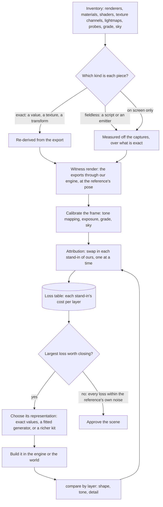

# Scene derivation

This page is the method every 3D scene of the [Genshin](/docs/proposals/genshin) program follows, built on the [derived assets](/docs/genshin/derived-assets) pipeline and the [parity](/docs/genshin/parity) loop. The interface converges on the game within a few tenths of a percent, because its reference holds it exactly and every difference points at the piece that caused it. The login scene does not: it scores a shape of about a third and a tone difference of about a fifth. It is textureless grey stone in white fog next to the game's painted, warm-lit stone under a deep blue haze. The gap has three causes, and none of them is a tuning problem.

- **The fit throws the game's information away.** Each tower's exports are a mesh of thousands of vertices and a diffuse, a normal and a mask texture at 1024 texels square, with a material of several dozen values. The fits keep a lathe section per two-metre band and one median colour for all the stone, and read none of the material's values. A loop that can only move the few numbers a kit takes has a ceiling below the game.
- **The shading model was assumed, not read.** The environment is drawn on a toon ramp with outlines round every object. The login stone's material holds a normal map, parallax occlusion, a metallic and a gloss, a specular colour, a cube reflection, screen-space occlusion and a rim glow. That reads as a physically based shader with stylised terms, not a ramp. No tuning of a ramp reaches it.
- **The scores cannot say where the gap is.** `shape` and `tone` read the whole frame, and the tone is blurred past any texture. When a change moves them, nothing says whether the geometry, a material, the light, the sky or the grade moved them. A search on the frame's mean then tunes a light to stand in for a missing texture.

## Decisions

- **Lossless, re-derived.** The goal is that the browser shows what the game shows, pixel for pixel where the game's own frame allows. What ships is our own re-derivation: shaders written in TSL, geometry generated by our code, and data in our own formats written by our fits. No file, format or data of the game's passes through into the repository or a build, and that is the one line. Short of it, a re-derivation has no fidelity ceiling: a kit rich enough to rebuild a tower within a pixel of its mesh on screen, or a procedural stone that reproduces its texture's look, is the goal, not an overreach.
- **Nothing is built before it is inventoried.** A scene starts by listing everything the game draws it with: every renderer, its materials, each material's shader, values and texture slots, what each texture channel holds, and the lightmaps, reflection probes, grading tables and sky the scene reads. Each piece of information is sorted into one of three kinds, and the kind decides how it is derived (below).
- **Every loss is priced before it is tuned.** The witness render draws the exports themselves, and each stand-in of ours is swapped in one at a time. The score each swap loses is that stand-in's cost, and the work goes to the largest cost first. A scalar is never searched over the frame to make up for a layer that is missing.
- **The witness render is a diagnostic and never ships.** It runs only on the parity page in development, reads the exports from the references folder, and is never bundled, built or committed. It is not a second render path of the product: it is how the product's one render path is measured.
- **The frame is calibrated before the scene.** The tone mapping, the exposure, the grade and the sky are matched first, against what the game holds exactly (its grading table, its sky gradient) and against the reference's pixels the scene cannot change. A material tuned under the wrong tone curve is tuned twice.
- **Each layer is scored on its own.** A reference is split into layers, sky, clouds, stone and walkway among them, by the witness render's own identifiers from the same camera, so each subsystem has its own shape, tone and detail score and a change is judged where it lands.
- **The game's shaders are read; its scripts are not decrypted.** A shader asset the exporter can dump is read as a reference, its maths rewritten in TSL as our own. A script's fields, such as the post-processing volume's or the sky controller's, need the game's code metadata decrypted, which this does not do, any more than it touches the running game ([the Genshin proposal](/docs/proposals/genshin)). What they hold is measured off the captures, as [derived assets](/docs/genshin/derived-assets) measures what a dump cannot hold.

## How it works



### The three kinds of information

- **Exact.** The exports hold it as numbers or pixels: a material's values and colours, a mesh, a texture's channels, a transform, a grading table, a lightmap. It is re-derived to within the reference's own noise, and the fit that re-derives it prints the error it leaves.
- **Fieldless.** The game holds it, but the export drops its fields: a script's settings, a particle system's spread and rate, a light's strength. It is measured off the captures and written over an exact value, as the camera's height is written over the walkway's width.
- **On screen only.** Nothing exported holds it: the camera's path, a transition's timing, the running game's light. It is measured off the captures alone.

### The witness render

The witness page loads a scene's exports from the references folder, draws them through the engine's own renderer at a reference's camera pose, and gives every object an identifier in a second target. Its layers come from the inventory: which object belongs to the sky, the clouds, the stone. Because the pose is the reference's, the identifier target is also a segmentation of the reference, which is where each layer's score gets its mask.

Attribution is a ladder of swaps. Each rung replaces one exported piece with the stand-in the scene ships, the real mesh with our kit's, the real texture with our material, the real sky with our sky, and prints the loss of each layer's score against the rung before. The swaps run one at a time and in combination, because two stand-ins can hide each other's error. The table is committed beside the scene's scores, as a bench's report is, so the change that closes a loss shows it closing.

### Choosing a representation

A loss is closed by the least representation that closes it, from this order:

1. **The exact value.** A material's specular colour, a rim's colour, an occlusion strength: a number the inventory already holds, written into the scene's data.
2. **A fitted generator.** Our code generates the piece and a fit sets its parameters so its output matches the export: a stone material in TSL whose block layout, colour variation, wear and normal detail are fitted to the part's own textures, or a tower kit whose mouldings, windows and bands are fitted to its mesh. The fit prints its error on screen, in pixels at the reference's pose, not in texels or metres.
3. **A richer kit.** When no generator of ours can reach the export's look within the reference's noise, the kit grows the parameters that close it, and the fit is extended to set them.

A representation is judged by the loss table, never by how close it looks in isolation: a stone texture that is visibly different up close can cost nothing at the distance the scene shows it, and a tower silhouette that looks right can cost the most.

### Scores

- **Each layer is scored on its own**, over its mask, with the existing `shape` and `tone`.
- **A detail score reads what tone blurs away**: the difference in each band of spatial frequency between the reference and the shot over the layer, so a textureless stone scores a loss that its right mean colour hides.
- **A perceptual score over the whole frame**, FLIP's, as the one number a scene is approved by once every layer's loss is within the reference's noise.

## The first run: the login scene

The login scene is the first scene run through this method. Its inventory and witness have already moved the order of work:

- **The camera and the arrangement are the first loss.** The exports drawn from the scene's current pose score the same shape as our kits do, so no stand-in is priced until the pose is. The fitted arrangement, the character select's stage at 0.4 scale, stands no tower where the reference does; its blocks hold `Cam_CharSelect_*` clips, which makes it the character select's. `LoginScene_Build_All` at full scale matches the reference's towers, several hundred metres tall with their feet at the walkway's height, where the reference's cloud sea lies just under the walkway. The login's flight is not a clip: `Start` and `End` only hold a 50-metre lift, so the path is in a fieldless script and the pose is solved.
- **The camera needs a cost clouds cannot fool.** The reference's clouds are most of its edges, and the witness drawn alone has none, so edge distance rewards the most cluttered pose. The next cost is the stone alone: the reference's stone told from its sky and cloud, or the towers' own features.
- **The stone is a physically based material.** Its values are a specular colour, a metallic, a shininess, a rim glow and an occlusion strength, and its mask texture is smoothness in red and metal in green. Its diffuse is a near-neutral grey, so the reference's warm stone is its light. Its shader is one AnimeStudio cannot parse, so the witness draws it as a standard physically based material over those values.
- **The tone curve is baked into a grading table.** The uber pass's last program samples a 3D table, in PQ space for an HDR display and gamma-encoded otherwise, which another pass bakes. The blocks hold the game's grading tables, but the login's profile does not say which it uses, so the frame is calibrated against the witness.
- **The clouds' shader reads cleanly.** A cloud samples its atlas through a curl-noise offset, dissolves its alpha with its age, is coloured between a dark and a light colour by the atlas's red with a rim, and fades toward the sky. It reads the Enviro sky's own terms: top and bottom colours front and back of the sun, a horizon halo and a sun halo.

## Scope

The first steps are built: `genshin:assets shaders`, `inventory` and `witness` ([derived assets](/docs/genshin/derived-assets)), the witness render on the parity page, and `genshin:parity compare --witness` and `solve-camera` ([parity](/docs/genshin/parity)). This proposal still adds the scores by layer, the detail and perceptual scores, and the loss table:

```text
scripts/src/services/genshinParity/
  scoreDetail.ts                 ← the difference per band of spatial frequency over a mask
  scoreLayers.ts                 ← shape, tone and detail over each layer's mask
  writeAttribution.ts            ← the loss table, committed beside the scores
packages/genshin-world/parity/witness/
  swapWitnessParts.ts            ← each stand-in of ours swapped in for its exported part, one family at a time
```

The toon ramp, the outlines and the kits stay until the loss table says what replaces them.

## Key files

| File                                                             | Role after the change                                                         |
| :--------------------------------------------------------------- | :---------------------------------------------------------------------------- |
| `scripts/src/services/genshinAssets/DerivedAssetComponentMap.ts` | Each component's name patterns, grown to its shader, lightmaps, probes, grade |
| `scripts/src/services/genshinAssets/fitLoginScene.ts`            | The login screen's fits, each printing the error it leaves on screen          |
| `scripts/src/services/genshinAssets/fitAlbedo.ts`                | Replaced by a fitted stone material once the loss table ranks it              |
| `scripts/src/services/genshinParity/compareScreen.ts`            | Scores each layer, and the detail and perceptual scores                       |
| `scripts/src/services/genshinParity/writeParityScores.ts`        | Writes each layer's row beside the frame's                                    |
| `packages/genshin-world/parity/screens.ts`                       | The page the witness render is mounted beside                                 |
| `packages/genshin-world/src/components/Login/Scene/Index.vue`    | The first scene run through the method                                        |
| `packages/genshin-engine/src/nodes/createToonMaterial.ts`        | The environment material the witness render judges                            |

## Notes

- **The witness render measures the renderer first.** It reaches the reference only as far as our engine renders the game's own data the way the game does, so what it still misses is the renderer's: the shader, the light and the grade. That remainder is the first work, since every stand-in is measured against it.
- **An exact value is not a finished part.** A material's values are written in the first rung, but a value names a term of the game's shader, and the term is only right once the shader that reads it is.

## Sources

- [AnimeStudio](https://github.com/Escartem/AnimeStudio): the exporter the inventory reads, and the shader and texture assets it can dump.
- [FLIP](https://github.com/NVlabs/flip), NVIDIA: the perceptual difference between a rendered image and its reference, as an error map and a mean, the score a scene is approved by.
- Zhenzhong Yi's [Console platform development in Genshin Impact](https://docswell.com/s/UnityJapan/KWRPQ5-210617-unity-dojo20211mihoyozhenzhongyi) (miHoYo, Unity Dojo 2021): the game's own account of its shadows, fog and god rays, read before the frame is calibrated.
