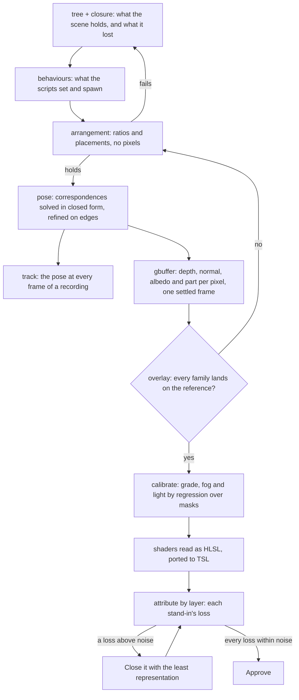

# Scene toolbox

The [scene derivation](/docs/proposals/genshin/scene-derivation) is the method a 3D scene of the [Genshin](/docs/proposals/genshin) program is re-derived by. This page is the tools the method needs. The interface converges in a pass or two because every one of its unknowns can be answered on its own: the recording drawn behind the screen leaves only the piece under test able to differ, the game's anchors translate one for one into CSS positions, and the per-cell grid points at whichever piece is wrong. The login scene has not converged after many guided passes, and every stall had the cause the [scene derivation](/docs/proposals/genshin/scene-derivation) names first: its unknowns were searched together on one score rather than answered apart.

The arrangement itself is the plainest case. The login's towers were thought to hang in a block not yet read. They do not: the login's own `SceneObj` holds three empty anchor nodes, and a script spawns the scene's prefabs into them at run time. A printed tree of the scene shows that in one command. Each tool below answers one unknown with the most exact query the data allows, in the order the unknowns depend on each other, and the protocol for finding the next missing one is the repository's recreation-tooling skill.

## Decisions

- **One unknown, one query.** Every tool answers a single unknown under conditions where nothing else can move its number: one layer's pixels alone, a proportion that holds from any viewpoint, or a render in which every other unknown is fixed at its exported value. A tool whose number several unknowns can move is not a finished tool.
- **Exact, then closed form, then local refinement.** A tool reads a value the exports hold before it solves for one, solves in closed form from known quantities before it refines, and refines locally from that solve. No tool runs a global search over a frame's score, and the camera's grid search is deleted.
- **A script's raw bytes are read**, as the scene derivation decides. A value read this way is exact data, and each reading a scene uses is held by a test on its bytes' offsets.
- **Every tool prints a number with its residual.** An image a tool writes is there to check that number: a pose's error in pixels when its points are projected back, a fit's distance on screen from the export it copies, a regression's leftover over the pixels it was fitted on.
- **Instrumentation lives on the parity page and never ships.** The G-buffer, the frozen clock and the read-back canvas are the witness render's, reached through the page's own hooks, as the witness itself is.
- **A superseded tool is deleted in the change that supersedes it**, as the parity loop's benchmark rule requires, and the domain's toolbox page moves the unknown's row to the new tool in the same commit.

## How it works



## The tools

### 1. The scene graph

**The scene tree.** `genshin:assets tree <component> [--root <name>] [--block <block>]` prints the hierarchy the layout dumps hold, every block's roots and each node beneath: its block, its local position, rotation and scale, its composed world scale, what it draws, and its child count. It flags what the arrangement questions turn on: an empty anchor (no children, no renderer), a father or a child no dump holds, a root dumped at the origin, a script's object, and a mesh laid out under several roots. It reads `readSceneLayout` as `fit` does, and the interface tree's printer and this one share one tree formatter, since the interface's is already one (`formatInterfaceTree`). It replaces reading the dumps by hand, which is how the login's lost-block theory survived several sessions.

**Closure extraction.** `extract` today finds blocks by name pattern, which misses anything named otherwise and reaches every block that reuses a shared name. A component instead names its roots, and `extract` follows every reference from them by path ID, father and children, each object's components, each renderer's materials and mesh, each material's textures and shader, through the asset index to the blocks holding them, exporting until nothing new is reached. A reference into another file (`m_FileID` not zero) is resolved through the index by its path ID. Name patterns stay only for what no pointer reaches, such as a shared sky whose owner is a script. The closure prints every reference it could not resolve, which is the tree's dangling flag at the level of blocks.

**Raw behaviours.** `genshin:assets behaviours <component>` exports each of the component's MonoBehaviours raw, beside its JSON, and `scanSerializedFields` reads the bytes after the header the JSON already names. A MonoBehaviour's fields are serialized in declaration order, aligned to four bytes, with no names, so the scanner reports what the bytes' shapes identify rather than fields by name. The shapes:

- **Pointers.** A 32-bit file index followed by a 64-bit path ID that the component's index or layout holds, printed with what it points at.
- **Colours.** Four floats, each within a colour's range.
- **Curves.** An array length followed by keyframes of seven values (time, value, the two slopes, the weighted mode and the two weights), then the curve's wrap modes.
- **Arrays.** A length followed by that many records of one shape.
- **Scalars.** Every other finite float in a plausible range, with its offset.

A reading the scene uses is kept as its offset and shape in the component's reference, with a test on the bytes that holds it. `MonoLoginScene`'s pointers answer what it spawns into its anchors. `EnviroSky`'s colours and curves are the sky's gradients by hour. The post-processing profile's pointer names its grading table.

**Spawns.** What a script places at run time becomes the component map's `spawns`: a prefab's root placed at an anchor node, composed as Unity composes a Transform. It replaces `rootParents`, which set a parent's place and scale by hand where the anchor already holds both.

**The Unity transform module.** Transform composition (a parent's position, rotation and scale over a child's) and RectTransform layout (`offsetMin = anchoredPosition − sizeDelta × pivot`, anchors as shares of the parent, a stretched axis's pivot) are written once, to Unity's documented semantics, with tests on its documented cases. Every placement read, the witness layout, the fits and `toCanvasRectStyle`'s inputs go through it, so no screen re-derives them. The build string that hid behind a stretched axis's pivot was one such re-derivation.

### 2. The arrangement

`genshin:assets arrangement <component>` checks the arrangement with no pixels. Each proportion a reference shows between two parts standing side by side (the door's width over the walkway's at its foot, a tower's over the next) is declared in a ratio map beside the fitted data, citing its reference, and the command prints each against the placements. A unit test holds the same map, so a change of arrangement that breaks one fails before any render. It also diffs the scene's own placements against the witness layout's, family by family, so a fit that drifts from the exports shows as a number. The walkway that stood 2.5 times too wide beside the door would have failed its ratio at once.

### 3. The camera

**Pose from correspondences.** `genshin:parity pose <reference> --witness <component>` solves the camera from points whose places are known. A component names its landmarks in three dimensions: a part's bounding-box corners, a named vertex, a door's top and foot. The reference's matching pixels are given roughly, and each one snaps to the strongest corner within a small radius of it. With six or more points, a direct linear transform gives the projection in closed form, including the focal length. With fewer, a perspective-n-point solve at a focal length read from two widths does. A Gauss–Newton refinement then minimises the reprojection error, which is printed per point and in total, with an image of each landmark's projection over the reference. It replaces the perspective reading done by hand for the login's two poses, and `solve-camera`'s grid.

**Edge refinement.** From a solved pose, a few Gauss–Newton or simplex steps minimise the chamfer distance between the witness's silhouette edges, taken from its part identifiers rather than its shading, and the reference's edges, over the stone's layer alone, using the existing `computeDistanceTransform`. Clouds draw no silhouette in the identifier target, so they cannot pull the pose.

**The matchmove.** `genshin:parity track <capture> <start> <seconds> [fps]` solves the pose at each sampled frame of a recording, each from the frame before by edge refinement, and writes the track: position, heading, pitch and field of view over time. The login's flight is a script's and has no clip, so its path is read this way and fitted by our own curve, in place of two poses and a straight line between them.

`solve-camera`'s grid, its simplex over the line distance, and the line scorer (`createLineDistanceScorer`, `readVerticalLines`) are deleted once `pose` and the refinement answer every reference they served.

### 4. The instrumented render

**The deterministic witness.** While a tool drives the page, the witness holds the scene's clock, turns off the temporal anti-aliasing's jitter, and settles each view in one frame rather than eight. A shot is read back from the renderer's own target instead of screenshotting the page, so a pose costs one render.

**The witness G-buffer.** `genshin:parity gbuffer <reference> --witness <component>` renders, at the reference's pose, a second set of targets beside the colour: linear depth, the world normal, the unlit albedo, and a part identifier (the family, then the part within it). They are dumped as float buffers with a JSON header naming each part's identifier. Every later tool reads them: the identifier is the segmentation of the reference that each layer's score masks by, and depth, normal and albedo make the light, the fog and the grade linear problems.

**The overlay.** `genshin:parity overlay <reference> --witness <component>` draws the witness's part boundaries over the reference, coloured by family and labelled, with a map of how far each reference edge sits from the nearest boundary. Misregistration shows per part in one image, where the side-by-side comparison shows only that two images differ.

### 5. The scores

**Scores by layer.** `scoreLayers` scores shape, tone and detail over each layer's mask from the identifier target, and `compare --witness` and `attribute` print a row per layer beside the frame's, into their committed reports. A change is then judged where it lands.

**The perceptual score.** An implementation of FLIP's standard-dynamic-range metric in TypeScript, tested against the values the reference implementation publishes for its example images, is the approval number the method ends on.

### 6. Calibration by regression

`genshin:parity calibrate <reference> --witness <component>` fits each frame-wide term by least squares over the pixels its mask selects, in the order light meets the eye, holding each fitted term for the next:

- **Light.** Over the stone, a pixel's linear colour is its albedo times the sun's colour times its lit share plus the ambient light by its normal. Given the sun's direction, the sun's and the ambient's colours are linear in the pixels. The direction is the one outer solve, over two angles, seeded by what the scene's placements of `Sun`, `Moon` and `MainLight` give.
- **Fog.** Over every masked pixel, the reference's colour is the lit colour blended toward the fog's colour by a factor of depth and height, so the fog's colour, density and height falloff follow from the pixels against the G-buffer's depth.
- **Grade.** Over pixels whose linear colour the steps above predict, the display transform from linear to the reference's pixels is fitted, and each of the game's grading tables (`Stages_*_LUT`) is scored against it, which names the table the login's fieldless profile uses where its raw bytes do not.

Each term prints its values and its residual, and a scene writes them as constants citing the reference they were fitted on. This replaces measuring light over a hand-picked patch and searching a strength until the frame's mean drops.

### 7. Shader reading

The `shaders` step already disassembles each program. It also writes each program as HLSL beside its assembly, through 3Dmigoto's command-line decompiler, fetched as a pinned release checked by SHA-256 the way FFmpeg is, with the constant names `annotateProgramConstants` recovers substituted in. The atmosphere, the cloud layer, the cloud particles and the uber pass are then ported to TSL from readable code instead of from assembly. If no pinned release of the decompiler is published, it is built from its source into the same cache, and failing that the annotated assembly stays the source.

### 8. The loss table

`attribute` keeps its ladder of swaps, each family handed back to the scene's own kit in turn, and scores it per layer from the identifier target. Its table is committed only from a pose `pose` has solved within its reprojection gate.

## Scope

```text
scripts/src/services/genshinAssets/
  formatSceneTree.ts            ← the tree, on the interface tree's formatter
  readAssetClosure.ts           ← every reference from a component's roots, by path ID
  scanSerializedFields.ts       ← pointers, colours, curves, arrays and scalars in a script's raw bytes
  composeUnityTransform.ts      ← Transform composition to Unity's semantics
  checkArrangement.ts           ← ratios and the placement diff
  commands/treeCommand.ts, behavioursCommand.ts, arrangementCommand.ts
scripts/src/services/genshinParity/
  solveCameraPose.ts            ← DLT and PnP from correspondences, then Gauss–Newton
  refineCameraPose.ts           ← the chamfer over the identifier edges
  trackCamera.ts                ← the pose at every sampled frame
  readWitnessGbuffer.ts         ← the targets, read back as float buffers
  writeOverlay.ts               ← part boundaries over the reference
  scoreLayers.ts                ← shape, tone and detail per mask
  scoreFlip.ts                  ← FLIP, standard dynamic range
  calibrateScene.ts             ← light, fog and grade by least squares
  commands/poseCommand.ts, trackCommand.ts, gbufferCommand.ts, overlayCommand.ts, calibrateCommand.ts
packages/genshin-world/parity/witness/
  renderWitnessTargets.ts       ← depth, normal, albedo and identifier in one settled frame
```

Deleted as each is superseded: `solveWitnessCamera.ts` with its command, `createLineDistanceScorer.ts`, `readVerticalLines.ts` and `minimizeNelderMead.ts` if nothing else reads them, `DerivedAssetComponentMap`'s `rootParents`, and `fitAlbedo.ts` once the stone's material is fitted.

## Key files

| File                                                             | Role after the change                                                     |
| :--------------------------------------------------------------- | :------------------------------------------------------------------------ |
| `scripts/src/services/genshinAssets/readSceneLayout.ts`          | The layout dumps read once for the tree, the closure, the fits and spawns |
| `scripts/src/services/genshinAssets/formatInterfaceTree.ts`      | Folded into the one tree formatter both trees print through               |
| `scripts/src/services/genshinAssets/extractComponent.ts`         | Exports a component's closure from its roots                              |
| `scripts/src/services/genshinAssets/readComponentPlacements.ts`  | Composes spawns through the transform module                              |
| `scripts/src/services/genshinAssets/DerivedAssetComponentMap.ts` | A component's roots, spawns and landmarks                                 |
| `scripts/src/services/genshinAssets/extractComponentShaders.ts`  | Writes each program's HLSL beside its assembly                            |
| `scripts/src/services/genshinParity/computeDistanceTransform.ts` | The chamfer the pose refinement minimises                                 |
| `scripts/src/services/genshinParity/attributeScene.ts`           | The loss table, per layer                                                 |
| `scripts/src/services/genshinParity/compareScreen.ts`            | Prints a row per layer and the perceptual score                           |
| `packages/genshin-world/parity/witness/setWitnessView.ts`        | One settled frame under a held clock, read back from the renderer         |
| `packages/genshin-world/parity/witness/loadWitness.ts`           | Tags every drawn part with its identifier                                 |
| `packages/genshin-engine/src/post/createPostPipeline.ts`         | The anti-aliasing's jitter held while the witness is driven               |
| `packages/genshin-ui/src/services/toCanvasRectStyle.ts`          | Reads RectTransform layout through the transform module                   |

## Notes

- **The order is the unknowns' dependency order.** A later tool's solve absorbs an earlier unknown's error, so a pose is not solved on an unchecked arrangement and a light is not fitted at an unsolved pose; each tool refuses to commit a score whose earlier gate has not passed.
- **The scanner reads shapes, not names.** A float run it reports is a candidate until a scene's use of it is checked against the captures once; the test that holds the reading then pins the offset, so a patch that moves the script's fields fails there rather than in the frame.

## Sources

- [AnimeStudio](https://github.com/Escartem/AnimeStudio): the exporter, its raw export of any asset and its path-ID references.
- [3Dmigoto](https://github.com/bo3b/3Dmigoto): the DXBC decompiler to HLSL, `cmd_Decompiler`.
- [FLIP](https://github.com/NVlabs/flip), NVIDIA: the perceptual difference and the reference values its port is tested against.
- [Camera calibration and 3D reconstruction](https://docs.opencv.org/4.x/d9/d0c/group__calib3d.html), OpenCV: the perspective-n-point solve and the reprojection error it minimises.
- [RectTransform](https://docs.unity3d.com/Manual/class-RectTransform.html) and [Transform](https://docs.unity3d.com/Manual/class-Transform.html), Unity Manual: the anchors, pivot and size delta, and the parent's composition, the transform module is written to.
- [Script serialization](https://docs.unity3d.com/Manual/script-serialization.html), Unity Manual: which fields are serialized and in what order, which the scanner's shapes rest on.
