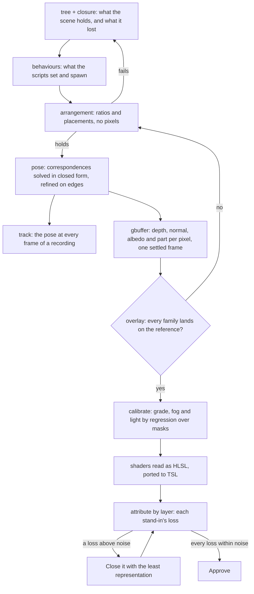

# Scene toolbox

The [scene derivation](/docs/proposals/genshin/scene-derivation) is the method a 3D scene of the [Genshin](/docs/proposals/genshin) program is re-derived by. This page is the tools the method needs. The interface converges in a pass or two because every one of its unknowns can be answered on its own: the recording drawn behind the screen leaves only the piece under test able to differ, the game's anchors translate one for one into CSS positions, and the per-cell grid points at whichever piece is wrong. The login scene has not converged after many guided passes, and every stall had the cause the [scene derivation](/docs/proposals/genshin/scene-derivation) names first: its unknowns were searched together on one score rather than answered apart.

The arrangement itself is the plainest case. The login's towers were thought to hang in a block not yet read. They do not: the login's own `SceneObj` holds three empty anchor nodes, and a script spawns the scene's prefabs into them at run time. The printed tree (`genshin:assets tree`, [derived assets](/docs/genshin/derived-assets)) shows that in one command. Each tool below answers one unknown with the most exact query the data allows, in the order the unknowns depend on each other, and the protocol for finding the next missing one is the repository's recreation-tooling skill.

## Decisions

- **One unknown, one query.** Every tool answers a single unknown under conditions where nothing else can move its number: one layer's pixels alone, a proportion that holds from any viewpoint, or a render in which every other unknown is fixed at its exported value. A tool whose number several unknowns can move is not a finished tool.
- **Exact, then closed form, then local refinement.** A tool reads a value the exports hold before it solves for one, solves in closed form from known quantities before it refines, and refines locally from that solve. No tool runs a global search over a frame's score, and the camera's grid search is deleted.
- **A script's raw bytes are read**, as the scene derivation decides. A value read this way is exact data, and each reading a scene uses is held by a test on its bytes' offsets.
- **Every tool prints a number with its residual.** An image a tool writes is there to check that number: a pose's error in pixels when its points are projected back, a fit's distance on screen from the export it copies, a regression's leftover over the pixels it was fitted on.
- **Instrumentation lives on the parity page and never ships.** The G-buffer, the frozen clock and the read-back canvas are the witness render's, reached through the page's own hooks, as the witness itself is.
- **A superseded tool is deleted in the change that supersedes it**, as the parity loop's benchmark rule requires, and the domain's toolbox page moves the unknown's row to the new tool in the same commit.

## How it works



## The tools

### 1. Shader reading

The `shaders` step already disassembles each program. It also writes each program as HLSL beside its assembly, through 3Dmigoto's command-line decompiler, fetched as a pinned release checked by SHA-256 the way FFmpeg is, with the constant names `annotateProgramConstants` recovers substituted in. The atmosphere, the cloud layer, the cloud particles and the uber pass are then ported to TSL from readable code instead of from assembly. If no pinned release of the decompiler is published, it is built from its source into the same cache, and failing that the annotated assembly stays the source.

## Scope

```text
scripts/src/services/genshinAssets/
  extractComponentShaders.ts    ← each program's HLSL beside its assembly
```

Deleted once superseded: `fitAlbedo.ts`, once the stone's material is fitted.

## Key files

| File                                                             | Role after the change                               |
| :--------------------------------------------------------------- | :-------------------------------------------------- |
| `scripts/src/services/genshinAssets/DerivedAssetComponentMap.ts` | A component's landmarks beside its roots and spawns |
| `scripts/src/services/genshinAssets/extractComponentShaders.ts`  | Writes each program's HLSL beside its assembly      |
| `scripts/src/services/genshinParity/computeDistanceTransform.ts` | The chamfer the pose refinement minimises           |

## Notes

- **The order is the unknowns' dependency order.** A later tool's solve absorbs an earlier unknown's error, so a pose is not solved on an unchecked arrangement and a light is not fitted at an unsolved pose; each tool refuses to commit a score whose earlier gate has not passed.

## Sources

- [AnimeStudio](https://github.com/Escartem/AnimeStudio): the exporter, its raw export of any asset and its path-ID references.
- [3Dmigoto](https://github.com/bo3b/3Dmigoto): the DXBC decompiler to HLSL, `cmd_Decompiler`.
- [FLIP](https://github.com/NVlabs/flip), NVIDIA: the perceptual difference and the reference values its port is tested against.
- [Camera calibration and 3D reconstruction](https://docs.opencv.org/4.x/d9/d0c/group__calib3d.html), OpenCV: the perspective-n-point solve and the reprojection error it minimises.
- [RectTransform](https://docs.unity3d.com/Manual/class-RectTransform.html) and [Transform](https://docs.unity3d.com/Manual/class-Transform.html), Unity Manual: the anchors, pivot and size delta, and the parent's composition, the transform module is written to.
