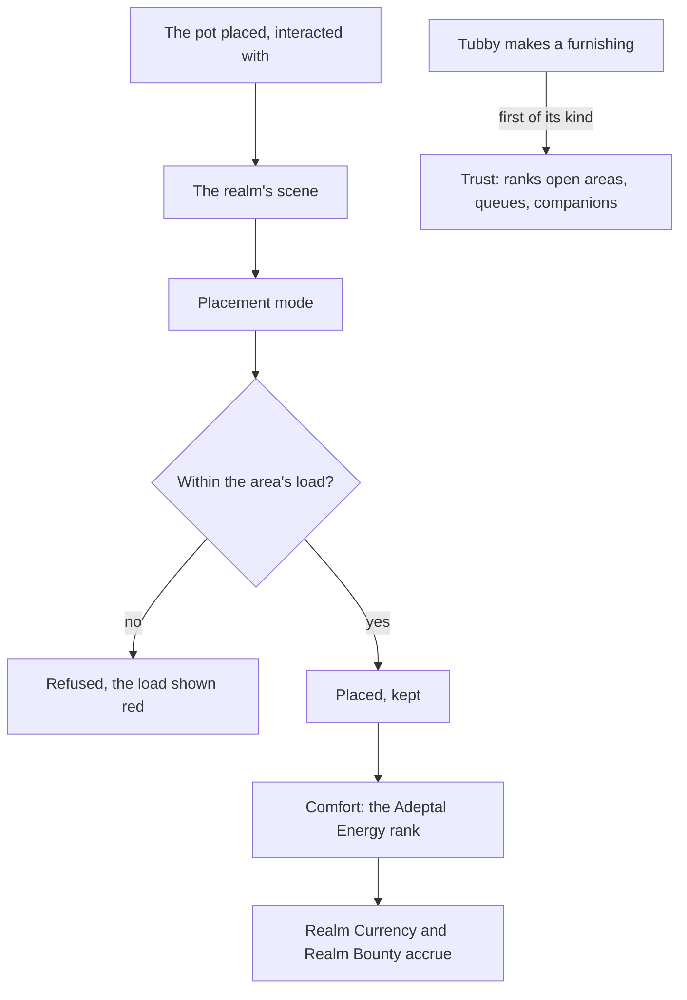

# Serenitea Pot

The Serenitea Pot is a realm the player owns and furnishes: an island, a mansion and its grounds, decorated with furnishings made from blueprints and materials, lived in by the player's characters. Its spirit, Tubby, makes furnishings, keeps the Trust Rank and sells from the Realm Depot. It is a world of its own beside the open world, entered through a gadget ([gadgets](/docs/proposals/genshin/gadgets)), and its companions earn [companionship](/docs/proposals/genshin/companionship), so this page waits on both.

## Decisions

- **A realm is a scene of its own.** Each realm layout, the Floating Abode, Emerald Peak, Cool Isle, Silken Courtyard and the rest, is the game's own scene, laid out from its data and derived as a region is ([scene derivation](/docs/genshin/scene-derivation)), its mansion one of the game's own. Placing the Serenitea Pot gadget on a valid surface and interacting with it fades into the realm; the gadget or any teleport in the open world fades back out to where the player went in.
- **The editor places furnishings.** In the realm, the furnishing placement mode places, moves, turns and stacks furnishings on the ground, on each other and in the mansion's rooms, by the pointer and the keys. Each area has a load, every furnishing, animal and companion counting its own, and the editor refuses a placement past it, showing green, orange and red as the game does. A layout's placements are kept with the player's progress.
- **Furnishings are the game's own rows.** `HomeWorldFurnitureExcelConfigData` and the furniture tables beside it give each furnishing, its load, its comfort and its type; `FurnitureMakeExcelConfigData` each blueprint's materials and time; the sets and gift sets their own tables. Each furnishing is drawn by its own generated kit at the measures of its export, as every building is ([derived assets](/docs/genshin/derived-assets)).
- **Tubby makes them in real time.** A furnishing is made from its blueprint and its materials, wood cut from the world's trees, ores, plants, fabric and dye, in queues the Trust Rank opens, kept with its start time, so it is done while the page is closed.
- **Trust Rank, Adeptal Energy and Realm Currency by the game's tables.** Making a furnishing for the first time gives Trust, whose ranks open the realm's areas, layouts, queues, companions and the most Realm Currency and Realm Bounty stored. The comfort of what is placed sets the Adeptal Energy, whose rank sets how fast Realm Currency and the companions' Companionship EXP accrue, each read forward from when it was last claimed. `HomeworldLevelExcelConfigData` and `HomeWorldComfortLevelExcelConfigData` hold the ranks.
- **Companions live there.** From its quest on, characters other than the Traveler are invited to live in the realm, up to eight at the highest Trust Rank. They earn Companionship EXP as Realm Bounty, and a character invited to a gift set they favour speaks its dialogue and gives its one-time rewards.
- **The Realm Depot and the Adeptal Mirror.** Tubby's depot sells blueprints, furnishings and materials for Realm Currency from the game's shop rows, and the Adeptal Mirror's missions reward blueprints as the handbook rewards its chapters.
- **Gardens and ponds.** A garden's fields grow seeds over real time and a pond holds fish, by `HomeWorldFarmFieldExcelConfigData`, `HomeWorldPlantExcelConfigData` and `HomeWorldRaiseFishExcelConfigData`.
- **Opened at Adventure Rank 28** with its quests.

## How it works

## Scope and order

**Today:** the world holds no realm.

**This adds, in order:**

1. **The gadget and one realm layout**, entered and left.
2. **The placement editor and its load.**
3. **Furnishings made by Tubby**, Trust Rank and the Realm Depot.
4. **Adeptal Energy, Realm Currency and companions.**
5. **Gardens, ponds, the other layouts and the Adeptal Mirror.**

## Data and measures

- **Read from the game's data:** the `HomeWorld*` and `Homeworld*` tables, `FurnitureMakeExcelConfigData` and `FurnitureSuiteExcelConfigData`, and each layout's scene data.
- **Measured:** each furnishing's shape against its export, as every building's is, and the editor's movement and snapping off a recording of placement mode, provisional until then.

## What this does not propose

- **Visiting another player's realm.** It needs other players, which [co-op](/docs/genshin/deferred/co-op) defers.

## Key files

| File                                                           | Role after the change                                    |
| :------------------------------------------------------------- | :------------------------------------------------------- |
| `packages/genshin-world/src/components/World/Screen/Index.vue` | Enters a realm's scene and returns to the world          |
| `packages/genshin-world/src/models/world/BuildingKit.ts`       | The kits a furnishing is drawn by                        |
| `packages/genshin-world/src/models/inventory/Currency.ts`      | Gains Realm Currency                                     |
| `packages/genshin-world/src/models/inventory/Inventory.ts`     | Furnishings and blueprints, in the bag's Furnishings tab |

## Sources

- [Serenitea Pot](https://genshin-impact.fandom.com/wiki/Serenitea_Pot), Genshin Impact Wiki: the unlock at rank 28, the gadget and entering and leaving, the realm layouts, furnishings and their sources, blueprints made by Tubby from wood, ores, plants, fabric and dye, furnishing sets and gift sets, companions up to eight, the load's traffic light, the Adeptal Mirror, and the Trust Rank's bonuses.
- [Companionship EXP](https://genshin-impact.fandom.com/wiki/Companionship_EXP), Genshin Impact Wiki: Realm Bounty's rate by Adeptal Energy and its store by Trust Rank.
- [AnimeGameData](https://github.com/DimbreathBot/AnimeGameData), the community's per-patch dump: the realm, furniture, comfort, farm, plant, fish-raising and furniture-making tables.
