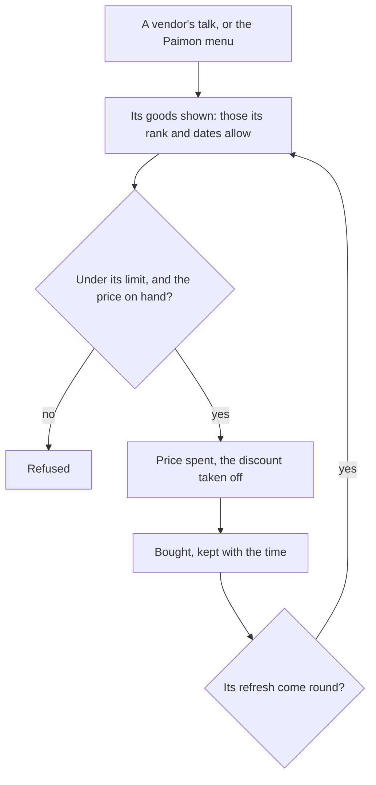

# Shops

The game's shops are its vendors in the cities, the Souvenir Shops that take each region's Sigils, the Fishing Associations, and the shops in the Paimon menu, Paimon's Bargains among them. They turn Mora, Sigils, Starglitter and Stardust into ingredients, recipes, materials, Fates and characters. They spend from the [inventory](/docs/genshin/inventory)'s wallet and stand at the vendors placed in region data, so this page waits only on what is built.

## Decisions

- **Every shop's goods are the game's.** `ShopGoodsExcelConfigData` holds each good: the shop it belongs to, the item and how many, its price in Mora or in items, its buy limit, its refresh, the Adventure Rank it shows from and the dates it sells between. `ShopExcelConfigData` names the shop, and `ShopRotateExcelConfigData` a rotation's order.
- **Restocked by its refresh.** What was bought is kept with when it was bought, and a good's limit comes back when its refresh comes round: daily at the reset, every two or three days for some goods, weekly, or monthly, each good by its own row.
- **Paimon's Bargains.** It is opened from the Paimon menu or the wish. It takes Masterless Starglitter for Fates, a monthly two of the game's twelve rotating four-star characters, the monthly weapons and top materials, and Masterless Stardust for Fates and materials with monthly limits, all resetting on the first of each month, as the wiki gives them. A character whose constellations are full cannot be bought. Fates for Primogems are the [inventory](/docs/proposals/genshin/inventory) proposal's.
- **Souvenir Shops take Sigils.** Each region's main city trades its own Sigils for materials, blueprints and Mora, never restocking. Since 2.0 a region's shop opens only once its region's offering is at its last level, as Sumeru's waits on Vanarana's Favor ([offering systems](/docs/proposals/genshin/offering-systems)).
- **Nothing for Genesis Crystals.** The Gift Shop and the outfit shop sell only for Genesis Crystals, which the world never sells, so their goods are never offered, as the [Genshin](/docs/proposals/genshin) proposal rules out any payment.
- **A Reputation discount is the price's.** A nation's discount takes 10% off its named shops, rounded in the player's favour to a multiple of five Mora ([reputation](/docs/proposals/genshin/reputation)).
- **A vendor is a resident.** A city's vendor is placed as a resident, and their shop opens from their talk, as the game opens it.

## How it works

## Scope and order

**Today:** the wallet holds the currencies, and nothing sells.

**This adds, in order:**

1. **The rule over the goods table**, with Mondstadt's general goods vendor.
2. **Paimon's Bargains**, Starglitter and Stardust first, its rotation after.
3. **Each city's vendors and Souvenir Shop**, as its region is built.
4. **The Fishing Associations**, with fishing.

## Data and measures

- **Read from the game's tables:** `ShopExcelConfigData`, `ShopGoodsExcelConfigData`, `ShopRotateExcelConfigData` and `ShopSheetExcelConfigData`, the goods' item rows, and which resident runs which shop.
- **Read from the wiki:** Paimon's Bargains' rotation where the rotation table leaves its months open.

## Key files

| File                                                          | Role after the change                                |
| :------------------------------------------------------------ | :--------------------------------------------------- |
| `packages/genshin-world/src/models/inventory/Wallet.ts`       | The Mora, Starglitter and Stardust a purchase spends |
| `packages/genshin-world/src/models/inventory/Currency.ts`     | Gains each region's Sigils                           |
| `packages/genshin-world/src/models/screen/ScreenKind.ts`      | `Shop`, filled in                                    |
| `packages/genshin-world/src/models/world/Resident.ts`         | A vendor, whose talk opens their shop                |
| `packages/genshin-world/src/components/Wish/Screen/Index.vue` | Opens Paimon's Bargains, as the game's wish does     |

## Sources

- [Shop](https://genshin-impact.fandom.com/wiki/Shop), Genshin Impact Wiki: the kinds of shop, daily and weekly restocks, the special shops for Genesis Crystals and for Starglitter, Stardust and Primogems, Souvenir Shops for Sigils, and the Fishing Associations.
- [Paimon's Bargains](https://genshin-impact.fandom.com/wiki/Paimon%27s_Bargains), Genshin Impact Wiki: the monthly reset, two characters a month from a rotation, the weapons' rotation, Stardust's monthly limits, and no character past its full constellations.
- [Souvenir Shop](https://genshin-impact.fandom.com/wiki/Souvenir_Shop), Genshin Impact Wiki: Sigils for materials, blueprints and Mora, no restock, and the region's offering at its last level since 2.0.
- [Daily Reset](https://genshin-impact.fandom.com/wiki/Daily_Reset), Genshin Impact Wiki: shops restocking daily, or every two or three days, by item.
- [AnimeGameData](https://github.com/DimbreathBot/AnimeGameData), the community's per-patch dump: the shop, goods, rotation and sheet tables.
