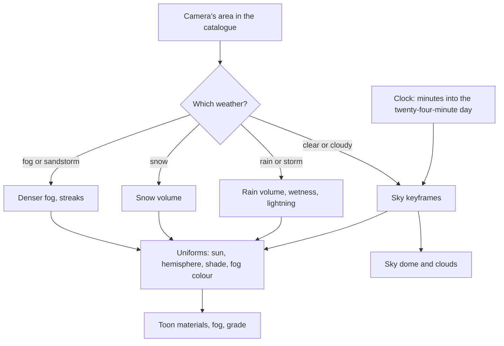

# Sky and time

This page builds on [rendering style](/docs/genshin/rendering-style), whose materials take their light, shade and fog colours from the sky. It gives the sky an hour and a weather. Genshin's landscapes are as much sky as ground. The dawn is apricot, the afternoon a high clear blue, the dusk violet and gold, and the night deep blue with a large moon. The whole world is lit to match, so the sky is the one source of every colour the other pages read.

## Decisions

- **The game's clock.** One in-game minute passes per real second, so a day lasts twenty-four minutes: dawn at six, noon at twelve, dusk at eighteen and midnight at twenty-four, each phase six minutes long. A load starts at the hour the [reference board](/docs/proposals/genshin/reference-board)'s screenshots were taken, so a region first appears as its reference does. The clock can be set, as the game's time menu allows.
- **A painted dome, not a physical atmosphere.** The sky is a gradient in TSL over a dome: a zenith colour, a horizon colour and a band where they meet, each a keyframed curve over the day. A glow around the sun and moon stretches along the horizon at dusk and dawn. A physical scattering model is not used, since the game's skies are art-directed and a physical model would drift away from them.
- **Clouds are stepped, not smooth.** A layer of two-dimensional noise on the dome is shaped into cumulus and passed through the same kind of ramp the ground uses, so clouds have a lit top, a shade band and a soft rim against the sun. They drift with the [vegetation](/docs/proposals/genshin/vegetation) page's wind. A region may add hand-placed cloud cards on its horizon, such as a thunderhead over Inazuma or a sea of clouds over Liyue's peaks.
- **The sky drives the world's light.** At each hour the sky yields the sun's direction and colour, the hemisphere's sky and ground colours, the shade colour, and the fog colour at the horizon. The toon material, the fog and the grade read these as uniforms, so time of day costs one uniform update a frame and rebuilds nothing.
- **Weather belongs to an area, as in the game.** Each area in the [world map](/docs/proposals/genshin/world-map)'s catalogue names the weather it can have, and only the weather where the camera stands is drawn:
  - clear, cloudy, rain and thunderstorm for most areas
  - snow and snowstorms on Dragonspine
  - fog on Tsurumi Island
  - sandstorms in the Desert of Hadramaveth
  - no rain in cities or deserts
  - Inazuma's permanent storm available as an area setting
- **Weather is particles, tint and a ramp shift.** Rain is instanced streaks in a volume that follows the camera, with splashes where they meet the ground. Snow uses the same volume with slower, drifting flakes. Wet surfaces darken and gain specular through one wetness uniform. Lightning is a brief flash through the sky and the light, followed by a bolt drawn as a mesh. A sandstorm is a thick fog colour and a streak layer driven by the wind.

## How it works



## Scope

**Today:** the [rendering style](/docs/genshin/rendering-style) scene is lit at one fixed afternoon hour.

**This adds:**

1. **The clock and the dome.** Gradient keyframes for dawn, day, dusk and night, the sun and moon crossing opposite each other, and stars at night.
2. **Clouds.** The stepped noise layer, with region cloud cards as an option.
3. **Lighting from the sky.** The uniforms, replacing the scene's fixed light.
4. **Weather.** Rain and storms first, since Mondstadt and Liyue need them. Then snow, fog and sandstorm as their regions arrive.

## What this does not propose

- **Weather's effect on play.** Rain putting out fires or making characters wet is play, and it waits for the phase-three pages that bring a character.
- **Special skies.** A quest's sky, or an area's permanently changed sky, belongs to that region's page when the region calls for it.

## Key files

| File                                                   | Role after the change                                                               |
| :----------------------------------------------------- | :---------------------------------------------------------------------------------- |
| `apps/web/app/composables/visual/useFluidSimulator.ts` | Its `SkyMesh` setup, read as the pattern and not reused, since that sky is physical |

New files:

```text
packages/genshin-engine/src/nodes/        ← sky gradient, clouds, rain and snow node graphs
packages/genshin-engine/src/sky/          ← day keyframes, clock, the uniforms derived from them
apps/web/app/components/Genshin/Sky.vue
apps/web/app/components/Genshin/Weather.vue
```

## Notes

- **A fast-forwarded hour is a cut, not a sweep.** Setting the clock jumps the keyframes. Only the running clock blends, so reduced motion needs nothing extra.

## Sources

- [Time](https://genshin-impact.fandom.com/wiki/Time), Genshin Impact Wiki: one in-game minute per real second, dawn, midday, dusk and midnight at six-hour marks, and the twenty-four-minute cycle.
- [Weather](https://genshin-impact.fandom.com/wiki/Weather), Genshin Impact Wiki: weather tied to areas with only the current location's drawn, rain and thunderstorms, no rain in cities or deserts, snow on Dragonspine, fog on Tsurumi Island, and sandstorms in the Desert of Hadramaveth.
- [Console platform development in Genshin Impact](https://docswell.com/s/UnityJapan/KWRPQ5-210617-unity-dojo20211mihoyozhenzhongyi), Zhenzhong Yi, Unity Dojo 2021: ambient light from spherical harmonics probes, which the hemisphere colours simplify.
- [SkyMesh](https://threejs.org/docs/pages/SkyMesh.html), three.js: the physical sky this page chooses not to use.
