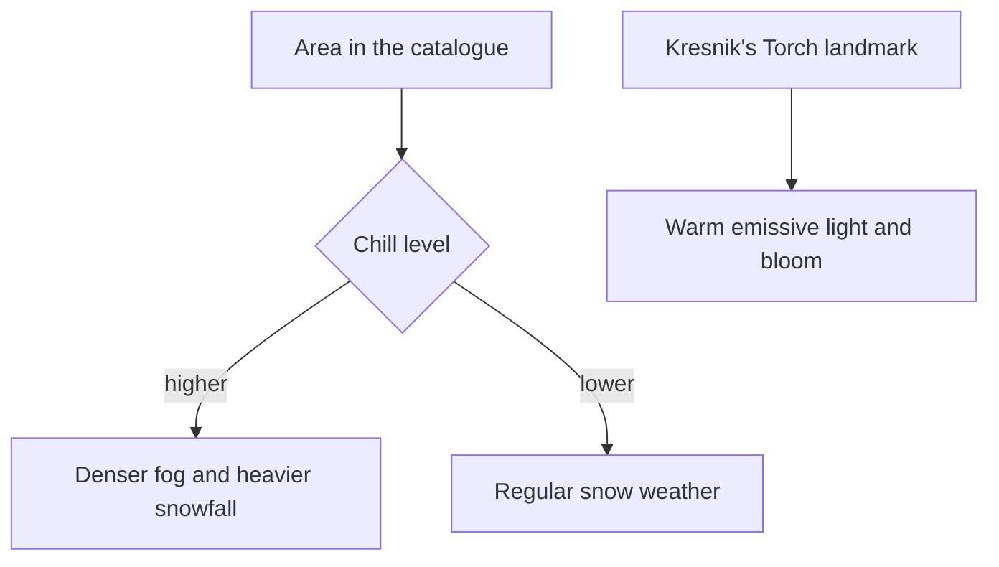

# Snezhnaya

This region is built on [terrain](/docs/genshin/terrain) and its [shapes](/docs/proposals/genshin/terrain-shapes), [vegetation](/docs/genshin/vegetation) and its [trees and scatter](/docs/proposals/genshin/trees-and-scatter), [water](/docs/genshin/water) and its [flow](/docs/proposals/genshin/flowing-water), [sky and time](/docs/genshin/sky-and-time) and [weather](/docs/proposals/genshin/weather), re-derived by the [scene derivation](/docs/genshin/scene-derivation)'s method, each scene in its [recreation passes](/docs/proposals/genshin/recreation-passes). Snezhnaya is the nation of the Cryo Archon, its culture drawn from Russia. Technologically it is the most advanced of the nations, with massive factories and the Fatui's military. Every settlement keeps a Kresnik's Torch burning against the cold. It is the newest nation in the game, released in August 2026. Like Nod-Krai, its kits are fitted against their own exports rather than carried over from an earlier region.

## Decisions

- **Cold is the standing weather.** Snow ground and ice cover most of the region, and snow and snowstorms are its regular weather, as on Dragonspine but across a nation. The game's chill zones are play, so here they only thicken fog and snowfall by level.
- **Warm light against the cold.** Each settlement's Kresnik's Torch is a landmark with warm emissive light and bloom, the brightest point in a pale scene. The region's shade colour is the coldest of any, which makes every torch, window and furnace stand out.
- **Birch and tundra.** The vegetation species are white birch, which dominates White Birch Snowgrave, dark conifers on the peaks, and sparse tundra grass that shows through the snow in Volkodlak Tundra.

## How it works

## Areas

The catalogue holds Snezhnaya's areas as the game names them: Everfrozen Earth, Volkodlak Tundra, White Birch Snowgrave, Fellfrost Peak and Flamefeather Valley. Subareas include Snezhnograd, the Zapolyarny Palace, the Pale Crown Palace, The Korolevskiy Theater, Central Station, Druzhna HQ, Jack Frost Village, Morepesok, Okurov, Glupov, Sretomorozsk, Svetloledovka, the House of Hesperides, the Huntsman's Cabin, the Sanctuary of Grief, Tidesong Cavern and the Teeming Mire.

## Build order

1. **Everfrozen Earth** with Snezhnograd and its palace.
2. **Volkodlak Tundra** and **White Birch Snowgrave**.
3. **Fellfrost Peak** and **Flamefeather Valley**.

## Reference checklist

Snezhnograd's main street, the Zapolyarny Palace, The Korolevskiy Theater, Central Station, a factory, a village with its Kresnik's Torch at night, a birch forest in snow, Volkodlak Tundra, and a snowstorm on Fellfrost Peak.

## Key files

| File                                                      | Role after the change                        |
| :-------------------------------------------------------- | :------------------------------------------- |
| `packages/genshin-engine/src/noise/createSimplexNoise.ts` | The detail noise of the tundra and the peaks |

The industrial and capital kits and the Kresnik's Torch are built, as [its as-built page](/docs/genshin/snezhnaya) describes.

**Still to build, in order:**

1. **Everfrozen Earth's witness claims**, which the roadmap's `snezhnaya-every-renderer` waits on, in the per-capital shape [Inazuma](/docs/proposals/genshin/inazuma)'s Decisions give; if no region has put `witnessComponents` on `ScreenFixture` yet, this step does first, by Inazuma's first step.
   - `models/snezhnaya/SnezhnayaPartFamily.ts` with `Ground` alone, and `services/snezhnaya/SnezhnayaPartFamilyMeshRegexMap.ts` matching it to `/^BigWorldTerrain_/u`. Snezhnograd is not in the game's data the export reads, so no house of the region's own is there for the capital kit to stand in for, and the family for its buildings waits on the city's meshes and their code.
   - `services/snezhnaya/SnezhnayaUndrawnMeshRegexMap.ts` for the rest of `~/Esposter/genshin-parity/extracted/snezhnaya/`: `commonBuildings` `/^Area_Common_(?:Build|Stairs)_/u`, `stagePlanes` `/^Stages_Plane_/u` and `effects` `/^Eff_/u`, which cover each mesh it names.
   - `snezhnaya` goes into the fixture's `witnessComponents` with the two.
   - Proof: `pnpm -C scripts genshin:parity passes snezhnaya --pass Inventory` leaves 0 renderers unclaimed.
2. **Snezhnograd, its torches and its birches**, once the `snezhnaya-capital` re-extraction finds the city in the game's data.

## Sources

- [Snezhnaya](https://genshin-impact.fandom.com/wiki/Snezhnaya), Genshin Impact Wiki: the Cryo nation, Snezhnograd its capital, the Zapolyarny Palace, Kresnik's Torch in every settlement, its technology and factories, its areas and subareas, and its release on the twelfth of August 2026.
- [Weather](https://genshin-impact.fandom.com/wiki/Weather), Genshin Impact Wiki: Snezhnaya's chill zones at three levels of cold.
- [The setting of Genshin Impact](https://en.wikipedia.org/wiki/Teyvat), Wikipedia: Snezhnaya drawn from Russia, and the Fatui's headquarters.
