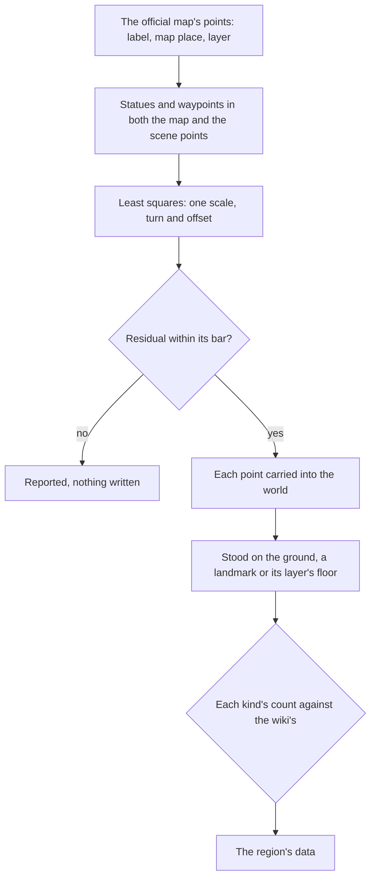

# Spawned places

The world is laid out from the game's own data: the ground from its terrain tiles, its buildings and trees from its streaming records, its statues, waypoints and domain entrances from its scene points, and its residents from its NPC placements ([scene derivation](/docs/genshin/scene-derivation), [game data formats](/docs/genshin/game-data-formats)). What the game's servers spawn is not among them. Chests, Oculi, puzzle mechanisms, gathering points, enemy camps, ley line outcrop places and a commission's camp are spawned by scene groups that run on HoYoverse's servers, whose scripts the client never receives. Nearly every system after this one stands on such a place, so this page comes before them, and it waits on the [exploring](/docs/proposals/genshin/exploring) proposal's waypoints, which it fits on.

## Decisions

- **Read from the official interactive map.** HoYoverse's Teyvat Interactive Map serves its points as public data: each point a label (a chest's kind, an Oculus, a local specialty, a waypoint), a place in the map's own coordinates, a layer for what lies underground, and its area. A run of `genshin:assets` reads the label tree and the point list into the references folder outside the repository, where every other reference is kept.
- **Fitted, not drawn.** The map's coordinates are carried into the world's by one similarity transform per map (a scale, a turn and an offset), solved by least squares on the statues and waypoints that both the map and the scene points place, the way a recording's camera is solved on landmarks. Each fit prints its residual, and a fit whose residual is over its bar writes nothing. Nothing is placed by eye, which is what the [rejected reference board](/docs/genshin/rejected/reference-board) did.
- **Stood on what is beneath.** A map point has no height, so a fitted place stands on the ground under it, or on the top of a landmark whose collision holds it; an underground layer's points stand on that layer's own floor. A place whose height the ground cannot give is reported, never guessed.
- **Checked against the wiki's counts.** The map's points are contributed by its users, so a region's count of each kind is held to the wiki's, such as Mondstadt's 66 Anemoculi, and a shortfall or a surplus is reported per kind.
- **Only fitted places ship.** The map's data stays a reference; what enters the repository is each place's kind and its fitted position and facing in the region's data, as every landmark's is.

## How it works

## Scope and order

**Today:** region data holds what the client's data places, and the enemy camps written into it.

**This adds, in order:**

1. **The read**, the label tree and point list kept as a reference.
2. **The fit**, Mondstadt's first, with its residual.
3. **Each kind's places** written into region data as the page that uses it lands: Oculi, chests, gathering points, camps.

## Data and measures

- **Read:** the official interactive map's label tree and point list, and the scene points the fit pairs them with.
- **Measured:** each region's fit residual, and each kind's count against the wiki's.

## Key files

| File                                                           | Role after the change                         |
| :------------------------------------------------------------- | :-------------------------------------------- |
| `scripts/src/services/genshinAssets/fit/fitRegionLandmarks.ts` | Fits the map's points beside the scene points |
| `packages/genshin-world/src/models/world/RegionData.ts`        | Gains the spawned places by kind              |
| `packages/genshin-world/src/models/world/LandmarkKind.ts`      | Gains each spawned kind the world draws       |
| `packages/genshin-world/src/services/world/getWorldHeight.ts`  | The ground a fitted place stands on           |

## Sources

- [Teyvat Interactive Map](https://act.hoyolab.com/ys/app/interactive-map/index.html), HoYoLAB: the official map, which draws its points in the browser alone, and [its label tree](https://sg-public-api-static.hoyolab.com/common/map_user/ys_obc/v1/map/label/tree?map_id=2&app_sn=ys_obc&lang=en-us), the public data it serves: every label, the statues, waypoints, Oculi and chests among them. Its point list beside it gives each point's label, map place, layer, area and contributor.
- [Oculus](https://genshin-impact.fandom.com/wiki/Oculus), Genshin Impact Wiki: each region's count of Oculi, one of the counts a fit is held to.
- [Chest](https://genshin-impact.fandom.com/wiki/Chest), Genshin Impact Wiki: the chests and their kinds the map marks.
