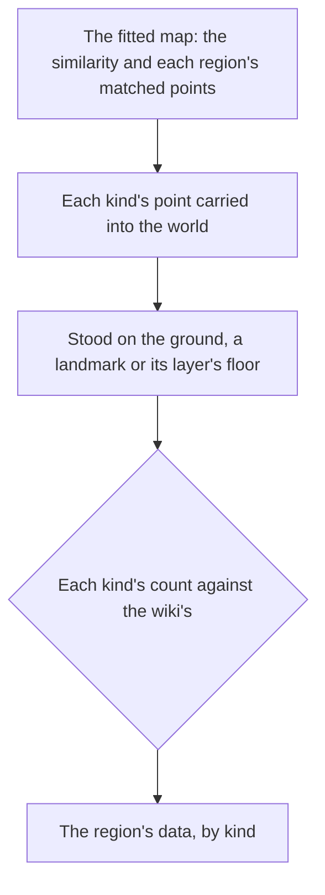

# Spawned places

The servers' spawned places are not in the client's data, so the world holds none of them yet. The official map's public points stand in for them. Its points are read and fitted onto the scene's transport points as the [as-built page](/docs/genshin/spawned-places) describes, one similarity over the whole map with its residual reported, Mondstadt checked first. What is left is writing each kind's places into region data, and standing each on the ground that holds it. Nearly every system after this one stands on such a place, so this proposal comes before them.

## Decisions

- **The fit needs no waypoint landmark.** The map's statues and waypoints are fitted against the scene's transport points, which the dump holds for every nation but Snezhnaya, so the fit does not wait on [exploring](/docs/proposals/genshin/exploring) placing the waypoints into region data. The fit's own calls are on the [as-built page](/docs/genshin/spawned-places).
- **Only fitted places ship.** The map's data stays a reference; what enters the repository is each place's kind and its fitted position in the region's slice, as the chests' and the Oculi's are.
- **Stood on what is beneath.** A map point has no height, so a fitted place stands on the ground under it, or on the top of a landmark whose collision holds it. An underground layer's points stand on that layer's own floor. A place whose height the ground cannot give is reported, never guessed.
- **Oculi are written by kind, one slice per region.** The map labels each region's Oculi as its own kind, so a kind is the label and a region's slice holds its kind's points. Each kind's places are written into the world's generated folder like the chests', and a place's height is read where it stands.
- **Camps come from the scene groups, not from the map's enemy marks.** The map marks each enemy by a family label (its Hilichurl label alone covers every kind of hilichurl), with no level and no camp, so grouping its points would guess both. The game's scene groups hold each camp's monsters with their monster ids, levels and places, so the camps are read from the scene group export the other machine is making, and the map's enemy marks only check them.
- **Each kind is checked against the wiki's count.** The map's points are contributed by its users, so each kind's count in a region is held to the wiki's, and a shortfall or a surplus is reported per kind. The Oculi are checked already; the other kinds take their wiki counts as their pages land.

## How it works

## Scope and order

**Today:** the map's points are read and fitted, the chests are published into their slices by [chests](/docs/genshin/chests), the Oculi into theirs by the [spawned places](/docs/genshin/spawned-places) page, and region data holds what the client's data places, beside one stand-in enemy camp in Mondstadt, written by hand with the enemies.

**Still to add:**

1. **The camps**, for [enemies](/docs/genshin/enemies): each scene group's monsters written into its region's `enemyCamps` as camps, replacing Mondstadt's stand-in camp, each member with its monster id as `EnemyKindId`, its level at World Level 0 and its place, through the same region-axes step `placeMapPoints` takes. Waits on the scene group export the other machine is making; nothing else on this page is left to build before it. The gathering points are placed by the [gathering](/docs/genshin/gathering) page.

## Data and measures

- **Measured:** each kind's count in each region against the wiki's, and each kind's height against the ground the place stands on.

## Key files

| File                                                            | Role after the change                               |
| :-------------------------------------------------------------- | :-------------------------------------------------- |
| `scripts/src/services/genshinAssets/points/placeMapPoints.ts`   | Carries each kind's points into its region          |
| `scripts/src/services/genshinAssets/oculi/buildOculusPlaces.ts` | Builds the Oculi slices from the points and the fit |
| `packages/genshin-world/src/generated/`                         | One slice per kind and region, imported on demand   |
| `packages/genshin-world/src/services/world/getWorldHeight.ts`   | The ground a fitted place stands on                 |

## Sources

- [Teyvat Interactive Map](https://act.hoyolab.com/ys/app/interactive-map/index.html), HoYoLAB: the official map, whose points the fit reads, and the label tree the points are labelled by.
- [Oculus](https://genshin-impact.fandom.com/wiki/Oculus), Genshin Impact Wiki: each region's count of Oculi, one of the counts a fit is held to.
- [Chest](https://genshin-impact.fandom.com/wiki/Chest), Genshin Impact Wiki: the chests and their kinds the map marks.
