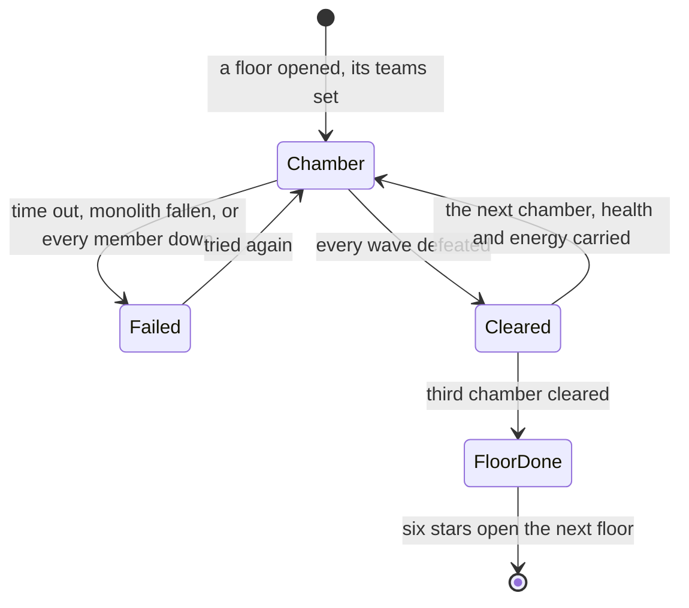

# Spiral Abyss

The Spiral Abyss is the game's standing combat challenge: a domain at Musk Reef, reached through the wormhole off Cape Oath, of twelve floors with three chambers each, cleared against the clock for stars and Primogems. Its first eight floors, the Abyss Corridor, are cleared once; its last four, the Abyssal Moon Spire, change their enemies and reset every month. Every floor, chamber and condition is in the game's own tables, so it can be rebuilt as it is. It is fought with the [character kits](/docs/proposals/genshin/character-kits) and the [party](/docs/proposals/genshin/party)'s teams, entered as a [domain](/docs/proposals/genshin/domains) is, so this page waits on all three.

## Decisions

- **Floors and chambers are the game's.** `TowerFloorExcelConfigData` gives each floor its chambers, its enemies' level, its teams (one, or two for a chamber's two halves) and the stars that open the next. `TowerLevelExcelConfigData` gives each chamber its enemies in waves, its domain and its three star conditions, such as time left above 90, 150 and 210 seconds, or a Ley Line Monolith's health above its marks.
- **Against the clock.** Floors 1 to 4 give each chamber 300 seconds and the rest 600; a chamber of two halves starts its second with the first's time or monolith left. Running out of time, or the monolith falling, fails the chamber.
- **Stars are the best kept.** A chamber's stars are the conditions met when it was cleared, and the most earned in any attempt is kept. A floor opens once the one below has all three chambers cleared and six stars.
- **The chamber's end is recorded.** Each character's health and energy at the moment a chamber is cleared are what they start the next chamber with, as the game records them.
- **The Corridor once, the Moon Spire every month.** Floors 1 to 8 give their rewards once, and clearing all eight opens floors 9 to 12 for good. The Moon Spire resets on the 16th of each month, giving its rewards again.
- **The Moon Spire's period is the latest begun.** `TowerScheduleExcelConfigData` lists the game's periods, each with its floors, its Blessing of the Abyssal Moon and its dates. The Spire runs the period whose start is the latest before today, so a dump read some months ago keeps its last period rather than none. Its blessing is written as a module over the kits' shared effects.
- **Opened at Adventure Rank 20**, as the wiki gives it.

## How it works

## Scope and order

**Today:** domains are proposed, and nothing keeps a challenge's stars.

**This adds, in order:**

1. **The Abyss Corridor's floors**, their chambers, clock and stars.
2. **Two-team chambers and the monolith.**
3. **The Abyssal Moon Spire**, its period, its blessing and its monthly reset.
4. **The wormhole at Cape Oath**, once Musk Reef's scene is derived.

## Data and measures

- **Read from the game's tables:** `TowerScheduleExcelConfigData`, `TowerFloorExcelConfigData`, `TowerLevelExcelConfigData`, `TowerBuffExcelConfigData` and `TowerRewardExcelConfigData`, and each chamber's domain scene.
- **Read from the wiki:** what each period's blessing does, where its description leaves it open.

## Key files

| File                                                           | Role after the change                              |
| :------------------------------------------------------------- | :------------------------------------------------- |
| `packages/genshin-world/src/models/party/Party.ts`             | The teams a floor sets, two for a two-half chamber |
| `packages/genshin-world/src/models/enemy/EnemyCamp.ts`         | A chamber's waves, as camps of its scene           |
| `packages/genshin-world/src/components/World/Screen/Index.vue` | Enters the Abyss's scene and returns to the world  |
| `packages/genshin-world/src/models/inventory/Wallet.ts`        | The Primogems the stars give                       |

## Sources

- [Spiral Abyss](https://genshin-impact.fandom.com/wiki/Spiral_Abyss), Genshin Impact Wiki: Musk Reef and its wormhole, the unlock at rank 20, the Corridor and the Moon Spire, twelve floors of three chambers, 300 and 600 seconds, the monolith, two teams sharing a chamber's time, six stars to go on, stars kept as the best, health and energy recorded at a chamber's end, the reset on the 16th, and the enemies changing by version.
- [AnimeGameData](https://gitlab.com/Dimbreath/AnimeGameData), the community's per-patch dump: the tower's schedule, floor, chamber, blessing and reward tables.
