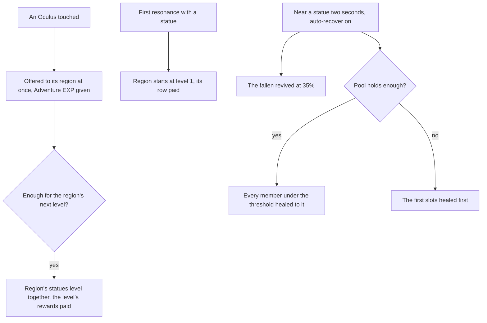

# Statues of The Seven

Each region's statues stand for its Archon, and they are the game's anchor for exploring it: a statue fills in its area of the map ([map unlocking](/docs/proposals/genshin/map-unlocking)) and is a jump. The level rules, the maximum stamina they raise and the pool's heal are built and tested as rules, on the [Statues of The Seven](/docs/genshin/statues-of-the-seven) page. What is left is the Oculi, the screen, the world's state those rules read, and the Traveler's element.

## Decisions

- **Oculi are found once.** Each region's Oculi, Anemoculi in Mondstadt, Geoculi in Liyue and so on, stand where the [spawned places](/docs/proposals/genshin/spawned-places) fit them, since the game's servers spawn them. They are collected by touching them and never come back. Each gives one of its kind and Adventure EXP. Within a short distance one shows on the minimap with a sound, as the game signals it.
- **A found Oculus is offered at once.** It joins its region's held count as it is found, and the levels it completes are reached there and then, so no held stack shows in the bag. The levels a region reaches are paid in the order the offer reaches them.
- **A region starts at its first resonance.** Resonating with a statue starts its region at level 1 and pays level 1's row once, which takes no Oculi. An Oculus found in a region not yet started is held until that first resonance starts it.
- **Levels pay the game's rewards by region.** Adventure EXP, Primogems and Sigils everywhere, and each later region's own items, Liyue's Stones of Remembrance, the Shrine of Depths keys and the Traveler's Memories of Inazuma, Sumeru, Fontaine and Snezhnaya, and Natlan's Acquaint Fates, as the wiki lists them, each joining with that region's page.
- **The Traveler resonates with its element.** Interacting with a statue as the Traveler changes their element to the statue's region's, Natlan's after the quest step the wiki names, and the Traveler's [constellations](/docs/proposals/genshin/constellations) for that element come with its levels.
- **F on a resonated statue opens the Statue's Blessing.** Its screen holds the pool, the party's portraits and the auto-recover's switch and threshold. This entry is an assumption about the game's menu, provisional until the screen is recorded.
- **The threshold's steps are the game's.** Auto-recover's threshold is set on the screen in steps the game offers, which no source here lists, so the steps are provisional until a recording shows them.
- **Auto-recover near a statue.** With it on and a threshold set, standing by a statue's base for two seconds revives the fallen and heals the members under the threshold from the pool, as the built rule does. The two seconds are the wiki's.

## How it works

## Scope and order

**Today:** the levels, the stamina maximum and the pool's heal and auto-recover are built as rules and tested. No screen or world state calls them, and every statue is a jump at the start stamina.

**This still adds, in order:**

1. **Oculi**, placed from the spawned places' fit of the official map, and the offer wired to them, so a found Oculus reaches its region.
2. **The world's state**: each region's level and held count, the pool, and the auto-recover setting, held where the unlocked statues are, with a first resonance starting its region and the maximum fed to the character's stamina.
3. **The Statue's Blessing screen** and auto-recover's two-second dwell, once the party has its health.
4. **The Traveler's resonance**, once the Traveler's kit follows its element.
5. **Each later region's Oculi and levels**, with that region.

## Data and measures

- **Read from the game's tables:** `CityLevelupConfigData` and `RewardExcelConfigData` for the levels, their Oculi, rewards and stamina actions, which are built for Mondstadt. The Oculi's places come from the spawned places' fit.
- **Measured:** how near an Oculus shows on the minimap, read off a recording of one being found, and the Blessing's threshold steps, read off a recording of the screen. Both are listed on the [roadmap](/docs/genshin/roadmap).

## Key files

| File                                                            | Role after the change                                 |
| :-------------------------------------------------------------- | :---------------------------------------------------- |
| `packages/genshin-world/src/models/world/StatueLandmark.ts`     | A statue, its region's level read from the progress   |
| `scripts/src/services/genshinAssets/fit/fitRegionLandmarks.ts`  | Fits the Oculi from the official map's points         |
| `packages/genshin-world/src/components/Hud/Minimap/Index.vue`   | Marks a near Oculus                                   |
| `packages/genshin-world/src/components/World/Session/Index.vue` | Holds the regions' state and the pool, and wires them |

## Sources

- [Statue of The Seven](https://genshin-impact.fandom.com/wiki/Statue_of_The_Seven), Genshin Impact Wiki: filling in the map, reviving and healing, the Traveler's element, the region's shared levels and their rewards by region, and the Restorative Power pool.
- [Oculus](https://genshin-impact.fandom.com/wiki/Oculus), Genshin Impact Wiki: Oculi offered to their statue, one and Adventure EXP each, never respawning, and the minimap's mark with its sound.
- [AnimeGameData](https://github.com/DimbreathBot/AnimeGameData), the community's per-patch dump: the statues' rows, their Oculi, rewards and stamina actions.
