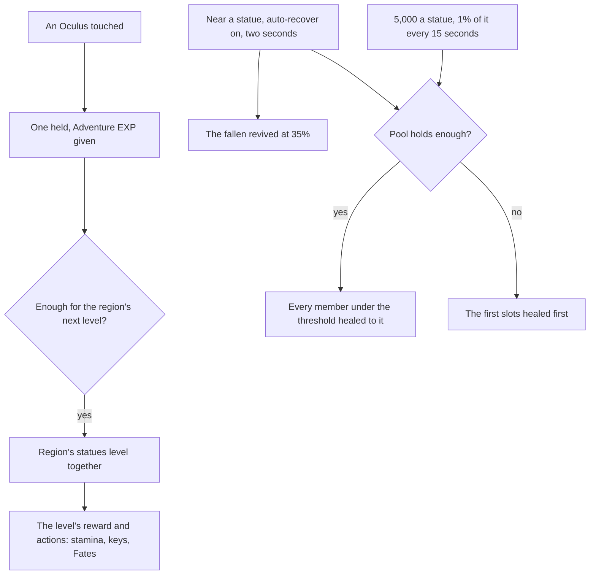

# Statues of The Seven

Each region's statues stand for its Archon, and they are the game's anchor for exploring it: a statue fills in its area of the map ([map unlocking](/docs/proposals/genshin/map-unlocking)), takes the region's Oculi as offerings for its rewards, heals the party, and revives the fallen. The statues stand in the world today and are jumps; this page is everything else they do, so it waits on the map's unlocking.

## Decisions

- **Oculi are found once.** Each region's Oculi, Anemoculi in Mondstadt, Geoculi in Liyue and so on, stand where the [spawned places](/docs/proposals/genshin/spawned-places) fit them, since the game's servers spawn them, and are collected by touching them, and never come back. Each gives one of its kind and Adventure EXP. Within a short distance one shows on the minimap with a sound, as the game signals it.
- **Offered to their region's statues, which level together.** The region's statues share one level, from 1 to 10. Each level is `CityLevelupConfigData`'s row: the Oculi it takes, the reward it gives (`rewardID`), and its actions, the maximum stamina it adds among them (`WORLD_AREA_ACTION_IMPROVE_STAMINA`). A level's other rewards differ by region: Adventure EXP, Primogems and Sigils everywhere, and Liyue's Stones of Remembrance, the Shrine of Depths keys and the Traveler's Memories of Inazuma, Sumeru, Fontaine and Snezhnaya, and Natlan's Acquaint Fates, as the wiki lists them.
- **Maximum stamina rises to 240.** The stamina the controller starts at, `STAMINA_MAX`, becomes the player's maximum, raised by each statue level's share until it reaches 240 in all.
- **The Statue's Blessing is one pool.** Every statue heals from one pool of Restorative Power, 5,000 for each statue unlocked, the Statues of the New Moon among them. It refills by 1% of its maximum every 15 seconds, while the world is paused too, so it is kept as its amount and when it last changed and read forward as resin is ([Original Resin](/docs/proposals/genshin/original-resin)). On the Blessing's screen, each click on a character heals them 10% of their maximum HP from the pool.
- **Auto-recover near a statue.** With it on and a threshold set, standing by a statue's base for two seconds revives every fallen member at 35% HP, which costs the pool nothing, and heals every member under the threshold from the pool up to it, the first slots first when the pool runs short.
- **The Traveler resonates with its element.** Interacting with a statue as the Traveler changes their element to the statue's region's, Natlan's after the quest step the wiki names, and the Traveler's [constellations](/docs/proposals/genshin/constellations) for that element come with its levels.

## How it works

## Scope and order

**Today:** every statue stands in its area and is a jump; the stamina's maximum is one fixed constant.

**This adds, in order:**

1. **Oculi**, placed from the streaming records, and Mondstadt's statue levels with their rewards.
2. **The maximum stamina**, raised by the levels.
3. **The Statue's Blessing**, its pool and auto-recover, once the party has health.
4. **The Traveler's resonance**, once the Traveler's kit follows its element.
5. **Each later region's Oculi and levels**, as the region is built.

## Data and measures

- **Read from the game's tables:** `CityLevelupConfigData` and `CityConfigData` for the levels, their Oculi, rewards and actions, and the levels' reward rows; the Oculi's places from the spawned places' fit.
- **Measured:** how near an Oculus shows on the minimap, off a recording, provisional until then.

## Key files

| File                                                           | Role after the change                               |
| :------------------------------------------------------------- | :-------------------------------------------------- |
| `packages/genshin-world/src/models/world/StatueLandmark.ts`    | A statue, its region's level read from the progress |
| `packages/genshin-engine/src/locomotion/constants.ts`          | `STAMINA_MAX`, the start the statues raise from     |
| `packages/genshin-engine/src/locomotion/createStamina.ts`      | Takes the player's maximum in place of the constant |
| `scripts/src/services/genshinAssets/fit/fitRegionLandmarks.ts` | Fits the Oculi from the official map's points       |
| `packages/genshin-world/src/components/Hud/Minimap/Index.vue`  | Marks a near Oculus                                 |
| `packages/genshin-world/src/models/party/Party.ts`             | The members the Blessing heals and revives          |

## Sources

- [Statue of The Seven](https://genshin-impact.fandom.com/wiki/Statue_of_The_Seven), Genshin Impact Wiki: filling in the map, reviving and healing, the Traveler's element, the region's shared levels and their rewards by region, maximum stamina to 240, the Restorative Power pool of 5,000 a statue refilling 1% every 15 seconds, the 10% heal, and auto-recover's revive at 35% and its two seconds.
- [Oculus](https://genshin-impact.fandom.com/wiki/Oculus), Genshin Impact Wiki: Oculi offered to their statue, one and Adventure EXP each, never respawning, and the minimap's mark with its sound.
- [AnimeGameData](https://gitlab.com/Dimbreath/AnimeGameData), the community's per-patch dump: the city level-up table with its Oculi, rewards and stamina actions.
